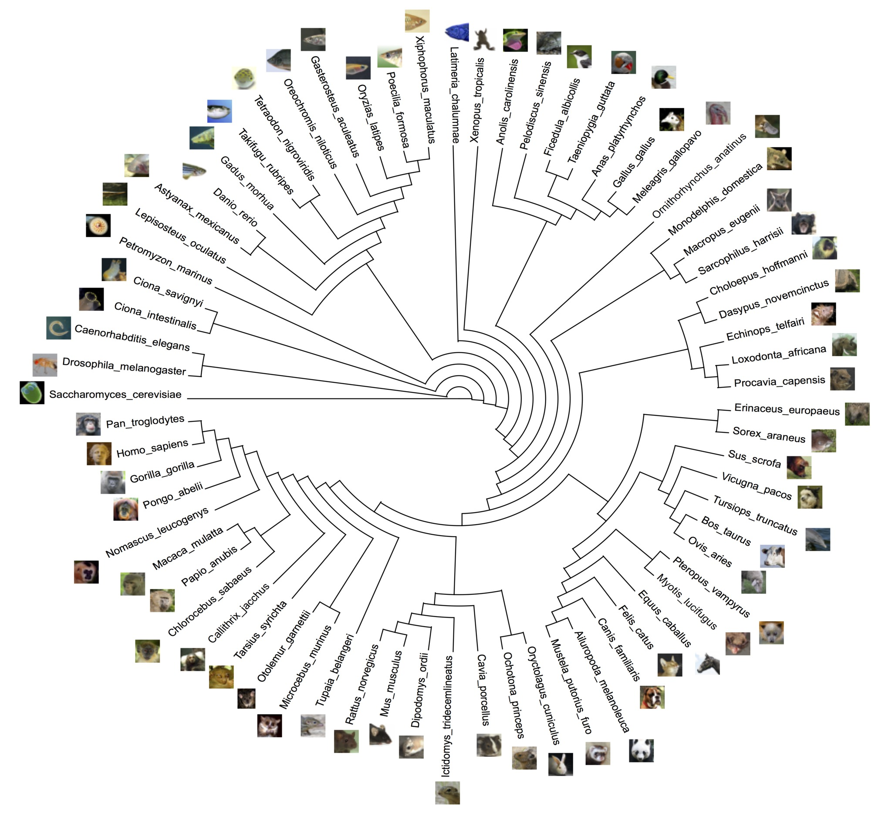
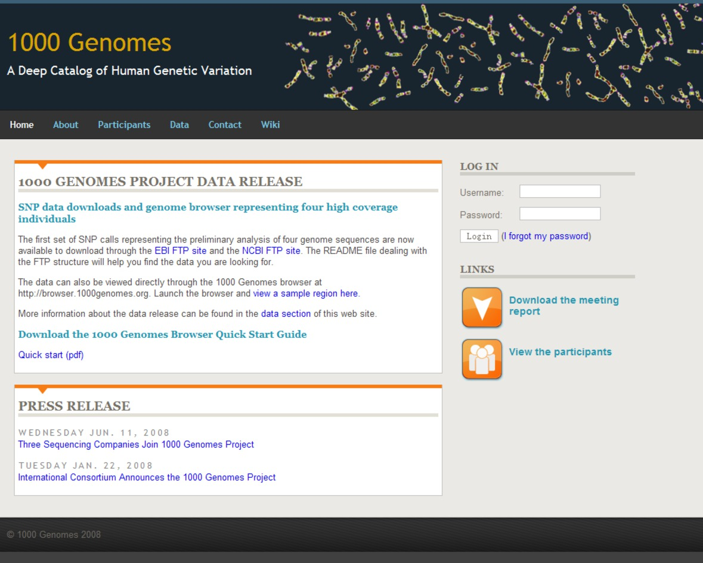
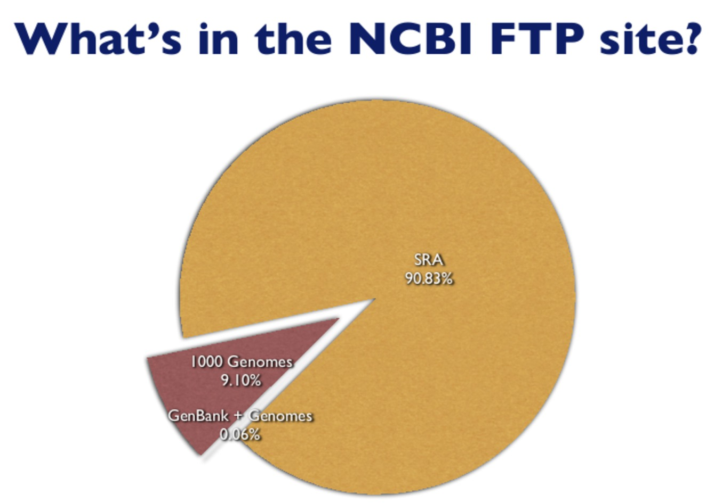
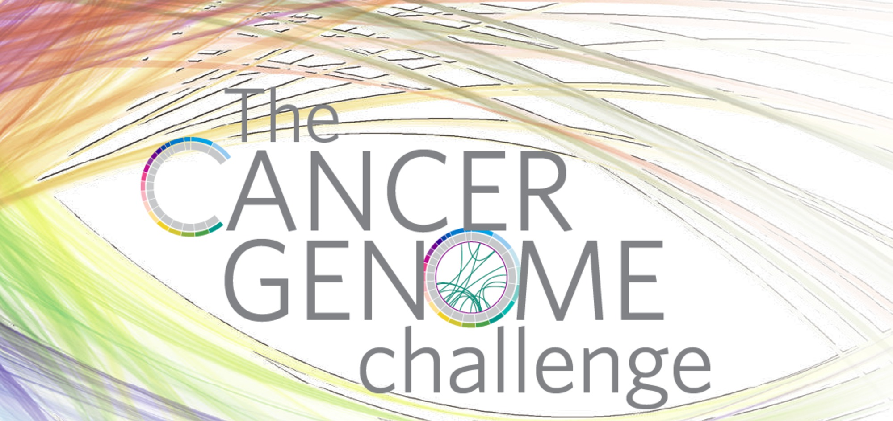
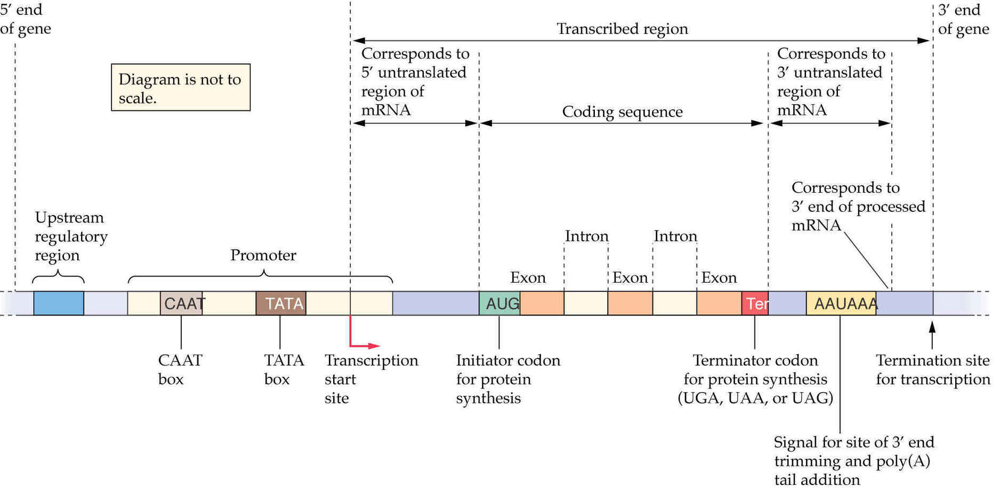
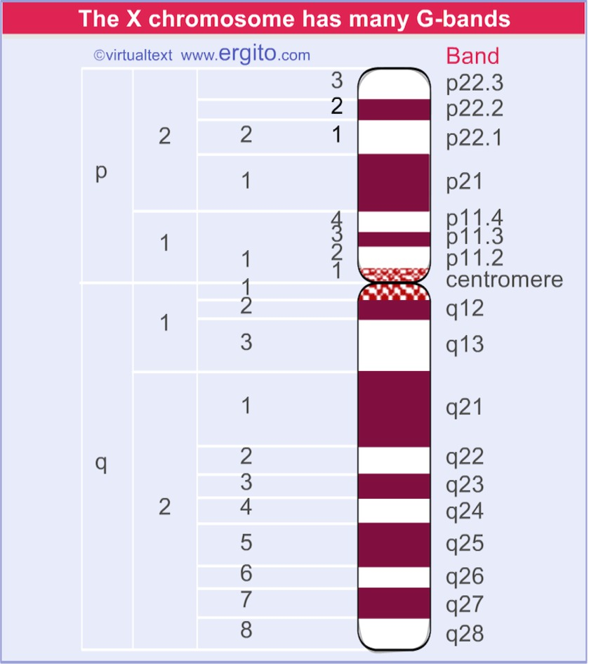
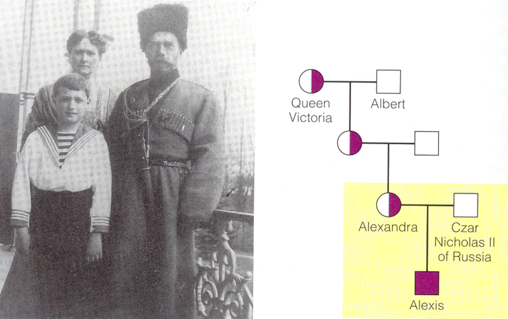

---

+ 基因组学
    - 研究生物体的基因和基因组的结构组成, 稳定性和功能.
    - 结构基因组学: 研究基因和基因组的结构, 各种元件的序列特征, 基因定位和基因组作图等.
    - 功能基因组学: 在基因组水平上阐明DNA序列的功能, 着重研究不同的序列结构所具有的不同功能,
    基因的表达与调控, 基因和环境之间的相互作用等.
    - 多种生物和病毒的基因组全序列测定.

## 24.1.2 人类基因组计划

* 1985年 美国能源部正式提出人类基因组测序.
* 1990年 正式启动人类基因组测序.

1. 绘制人类基因组连锁图
2. 绘制物理图
3. 人类基因组测序
4. 其他物种基因组分析

---

---

---

---

---

---

## 基因专利

* Myriad genetics公司拥有*BRCA1*和*BRCA2*基因的国际专利, 乳腺癌与卵巢癌的相关基因.
* Myriad的测试费为\$869.
* 现在有更便宜的方法, 只要\$100, 但都侵犯了Myriad的专利.

---

\begin{figure}
    \begin{minipage}[b]{.48\linewidth}
        \includegraphics{ch-24.images/image15.jpg}
    \end{minipage}
    \hfill
    \begin{minipage}[b]{.48\linewidth}
        \includegraphics{ch-24.images/image16.jpg}
    \end{minipage}
    \caption{J. Craig Venter (文特尔)}
\end{figure}

---

---

---

\note{
Then order scaffolds on the chromosomes using the HGP clone map and other publicly available maps.

}

## 基因组草图, 2001

* International Human Genome Sequencing Consortium
    + **Public project**
    + \fullcite{Lander2001}
* Celera Genomics – Venter JC et al.
    + **Private project**
    + \fullcite{Venter2001}

---

\begin{figure}
    \begin{minipage}[b]{.48\linewidth}
        \includegraphics{ch-24.images/image18.jpg}
        \subcaption{Nature}
    \end{minipage}
    \hfill
    \begin{minipage}[b]{.48\linewidth}
        \includegraphics{ch-24.images/image19.jpg}
        \subcaption{Science}
    \end{minipage}
    \caption{基因组草图, 2001}
\end{figure}

---

## 24.1.3 基因组研究成果

+ $3.2\times10^9$ bp
+ 约2万个基因

测序已完成; 进一步的工作是确定各个基因的功能及他们之间的相互关系.

\begin{exampleblock}{}
    {\large ``Informatics is to biology what mathematics is to physics.''}
\end{exampleblock}

\note{

\begin{exampleblock}{}
  {\large ``To be, or not to be: that is the question.''}
  \vskip5mm
  \hspace*\fill{\small--- William Shakespeare, Hamlet}
\end{exampleblock}

}

---

---

---

---

\note{
http://www.ebiotrade.com/newsf/2010-3/2010315172205631.htm

}

## Personal Genomes

\begin{columns}[onlytextwidth]
    \column{0.5\textwidth}
        \begin{itemize}
            \item Craig Venter
            \item James Watson
            \item Stephen Quake
            \item George Church
            \item Marjolein Kriek
            \item Hermann Hauser
            \item Han Chinese
            \item Seong-Jin Kim
            \item Korean AK1
            \item Yoruban African NA18507
        \end{itemize}
    \column{0.5\textwidth}
        \begin{itemize}
            \item 14 others sequenced by Complete Genomics
            \item Unknown number sequenced by Knome
            \item 6 genomes sequenced at high depth by the 1000 Genomes Project
            \item 180 genomes sequenced at low coverage by the 1000 Genomes Project
            \item Two acute myeloid leukemia patients
        \end{itemize}
\end{columns}

\note{
People Who’ve Had Their Genomes Sequenced

Stephen Quake, A Stanford engineer

Marjolein Kriek, a clinical geneticist at LUMC

Dr. Hauser, Partner, Amadeus Capital Partners Ltd, is the first consumer to purchase
Illumina's individual genome sequencing service.

}

---

\begin{figure}
    \begin{minipage}[b]{.48\linewidth}
        \includegraphics{ch-24.images/image29.jpg}
        \subcaption{脊椎动物}
    \end{minipage}
    \hfill
    \begin{minipage}[b]{.48\linewidth}
        \includegraphics{ch-24.images/image31.jpg}
        \subcaption{英国人健康计划}
    \end{minipage}\\
    \begin{minipage}[b]{\linewidth}
        \includegraphics{ch-24.images/image30.jpg}
        \subcaption{拟南芥}
    \end{minipage}%
    \caption{其它计划}
\end{figure}

---

\note{
Remember when you used to think that GenBank was ‘big’? The NCBI Sequence Read Archive
(SRA) now dominates the NCBI FTP site and accounts for 1.14 Petabytes of storage (perhaps
explaining why it is to be phased out). In comparison, the Genome and GenBank directories
on the FTP site account for less than a tenth of one percent of all sequences. Sequences from
‘traditional’ sequencing methods now contribute less and less to genome projects. The so
called ‘short’ reads – which are getting longer  all the time –  dominate the scene.

}

---

---

\begin{figure}
    \includegraphics[height=0.75\textheight, keepaspectratio]{ch-24.images/image34.jpg}
    \caption{追踪罕见遗传疾病的致病基因\footnotemark}
\end{figure}

\footnotetext{\fullcite{Lupski2010}}

\note{
研究人员首次通过测序有罕见遗传疾病的人的全部基因去追踪致病基因.

休斯顿Baylor医学院遗传学家James Lupski和他的三个兄弟姐妹生来就有腓骨肌萎缩症, 这种遗传病会影响神经系统,
使腿部和手臂肌肉变得虚弱. 因为基因测序费用已大幅下降, Baylor医学院的研究人员测序了Lupski的DNA, 然后将
注意力集中在40个已知与神经疾病有关的基因. 他们在SH3TC2基因的两个副本上发现了突变, 该基因导致了腓骨肌萎缩症,
并可能参与了神经传递. 其中一个突变之前从未报告过, Lupski的三个兄弟姐妹也有相同的突变, 而他健康的双亲和
其他兄弟姐妹只有一个突变基因. 报告发表在《新英格兰医学杂志》上. 测序费用总共花了5万美元.

}

---

## 24.1.4 人类基因组各组成成分的基本特征

1. 基因
    + 断裂基因
2. 基因外DNA
    + 单拷贝序列和低拷贝数序列占70--80%
    + 中度和高度重复序列占20--30%

---

---

3. 分散重复序列
    + 中度重复序列, 以散在的方式分布于基因组中.
    + 短分散重复序列.
    + 长分散重复序列: 反转录转座子.
4. 簇状重复序列
    + 卫星DNA, 小卫星DNA和微卫星DNA.
    + 利用氯化铯密度梯度离心法可以把卫星DNA与其它DNA分开.
    + G+C比例高, 浮力密度大; A+T比例高, 则浮力密度小. 主带, 次带(卫星DNA).

# 24.2 人类遗传性疾病

## 24.2.1 染色体病

\begin{figure}
    \includegraphics[height=0.75\textheight, keepaspectratio]{ch-24.images/image39.jpg}
    \caption{果蝇的多线染色体}
\end{figure}

---

---

---

1. 染色体的结构变异
    * 缺失
	* 重复
	* 倒位
	* 易位

\note{
倒位环

}

---

\note{
儿童的猫叫综合症

}

---

2. 染色体数目变异
    * 整倍体
	    + 三倍体无籽西瓜
    * 非整倍体
	    + Klinefelter综合症(XXY)
	    + 唐氏综合症(21三体)

---

## 24.2.2 单基因病

1. 隐性遗传病
    + 囊状纤维化病
    + 近亲结婚的后代易得
2. 显性遗传病
    + 舞蹈病
3. X连锁遗传病
    + 色盲
    + 血友病

\note{
镰刀形贫血症

}

---

---

## 24.2.3 多基因遗传病

* 哮喘, 原发性高血压, 糖尿病.
* 微效基因的作用累加
    + 遗传因素和环境因素共同作用
    + 有家族聚集倾向

# 24.3 癌基因与恶性肿瘤

---

肿瘤
:   正常的细胞增殖和凋亡失控, 扩张性增生的细胞群形成肿块.

恶性肿瘤(癌症).

实际上是一类遗传病.

## 24.3.1 原癌基因和抑癌基因

1. 病毒癌基因和原癌基因
    + 1910年, Peyton Rous鸡肉瘤
    + 1970年, Martin等确定反转录病毒病毒基因与细胞癌变有关
    + 1976年, 分离出该基因(*src*)
2. 抑癌基因
    + 使细胞不癌变或机体不长癌

## 24.3.2 癌症的遗传学基础

1. 基因突变
2. 多次遗传改变的致癌作用
    + 结肠癌: 内璧细胞非正常分裂 → 良性肿瘤 → 癌

\note{
2009年12月, 桑格研究所在《自然》杂志上刊文宣布, 他们率先在世界上破译了肺癌, 皮肤癌和乳腺癌的全部基因密码,
并绘制出相应的肿瘤基因图谱.他们发现, 肺癌细胞的基因中含有22910个突变, 导致皮肤癌的恶性黑色素瘤的基因中则含有33345个突变.
这些突变中的大多数是“被动的”, 不会导致癌变, 小部分是“主动的”, 会导致癌变发生.

虽然距离破解肿瘤基因密码尚需时日, 但我们今天从省肿瘤医院举行的癌症宣传周义诊活动上了解到, 一些相关研究成果已经在浙江病人身上得到了应用.
“比如肿瘤病人是否需要化疗, 就可以通过基因检测来决定.”省肿瘤医院主任医师毛伟敏教授说, 在化疗中, 有些人对药物反应非常敏感,
有些人反应却非 常迟钝.如果检查中发现病人体内的DNA修复基因呈阳性, 那么目前临床中最常用到的化疗药物“顺铂”就很可能对这个病人无效,
必须换用其他的药物.而如果某个肺癌病人体内的一种名为“表皮生长因子受体”的基因发生了突变, 那么对这个病人使用“吉非替尼”和“厄罗替尼”两种药物,
则可以取得很好的疗效.

}

---

\note{
The lineage of mitotic cell divisions from the fertilized egg to a
single cell within a cancer showing the timing of the somatic mutations
acquired by the cancer cell and the processes that contribute to them.

}

## 24.3.3 改变生活方式能降低癌症的危险性

能够改变DNA的结构, 引起DNA损伤的物质, 可以使细胞癌变.

在生活中应该避免接触或摄入这些物质.

\note{
补充个人基因组与癌症基因组.

补充可传染的癌症.

}
