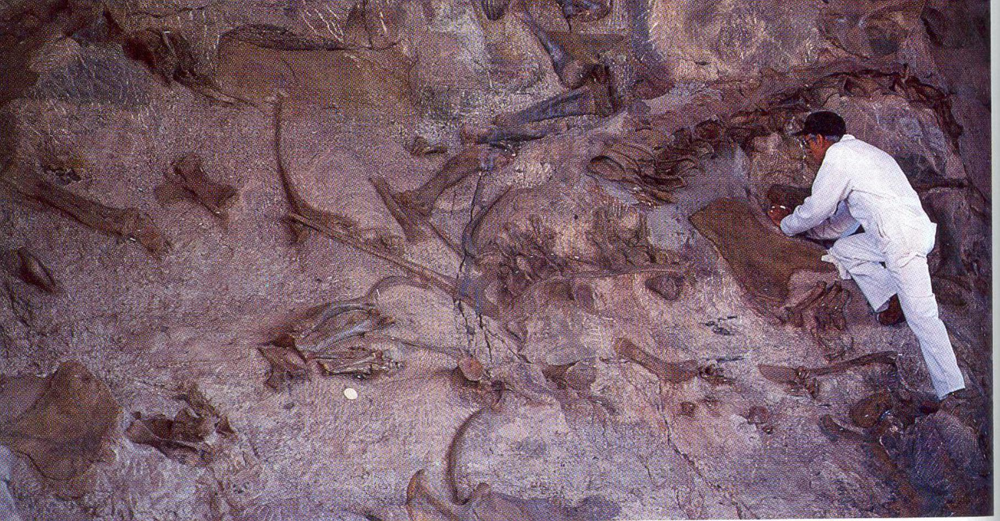
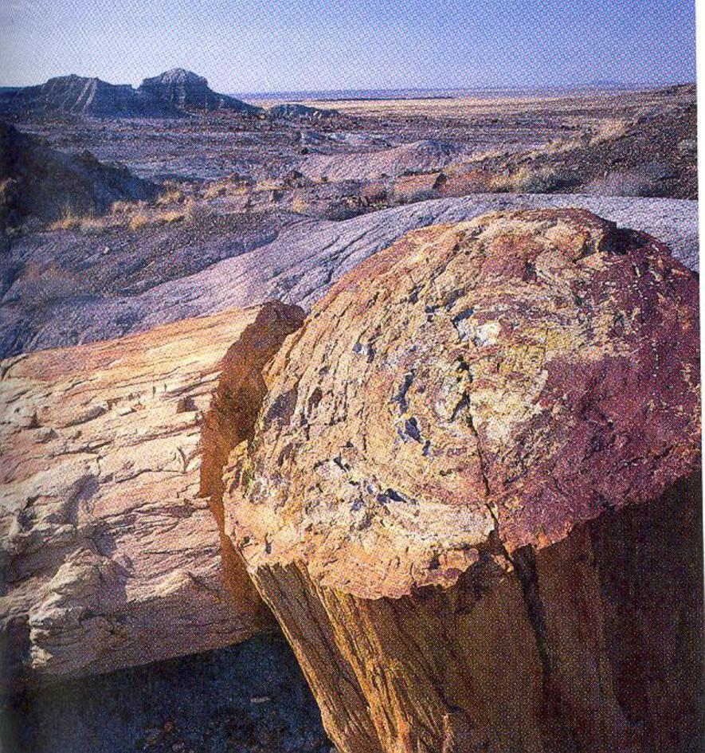
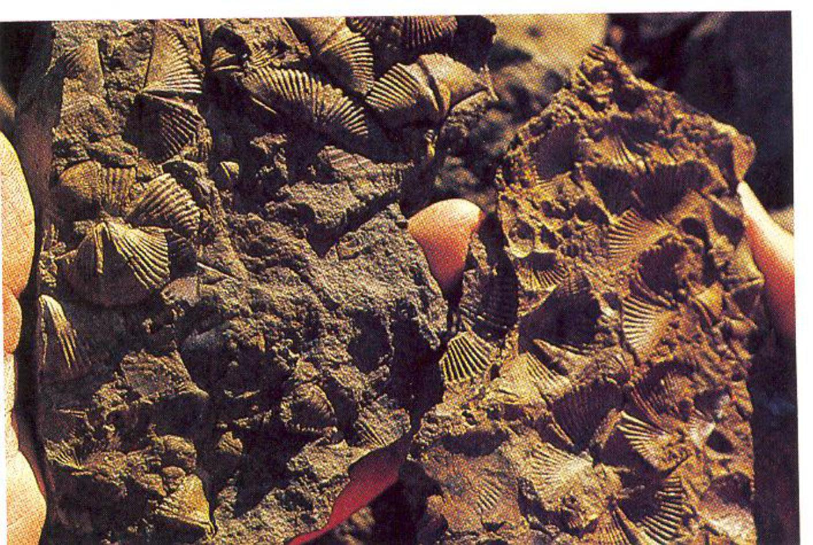
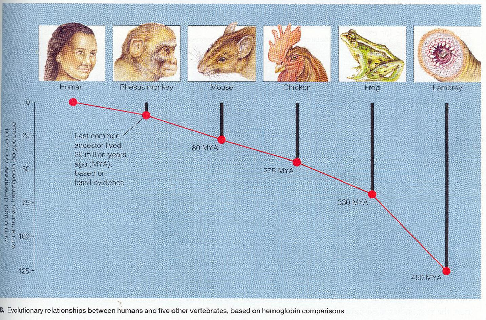
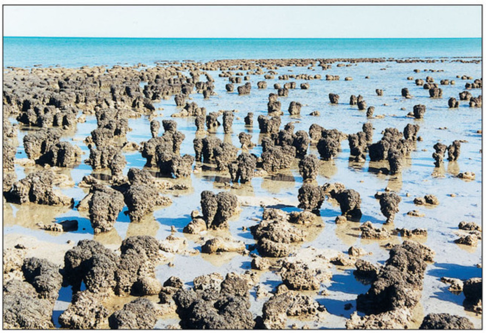
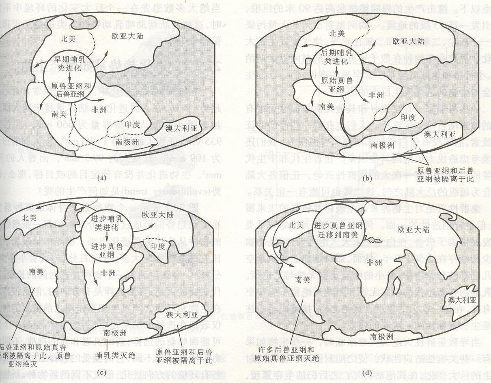
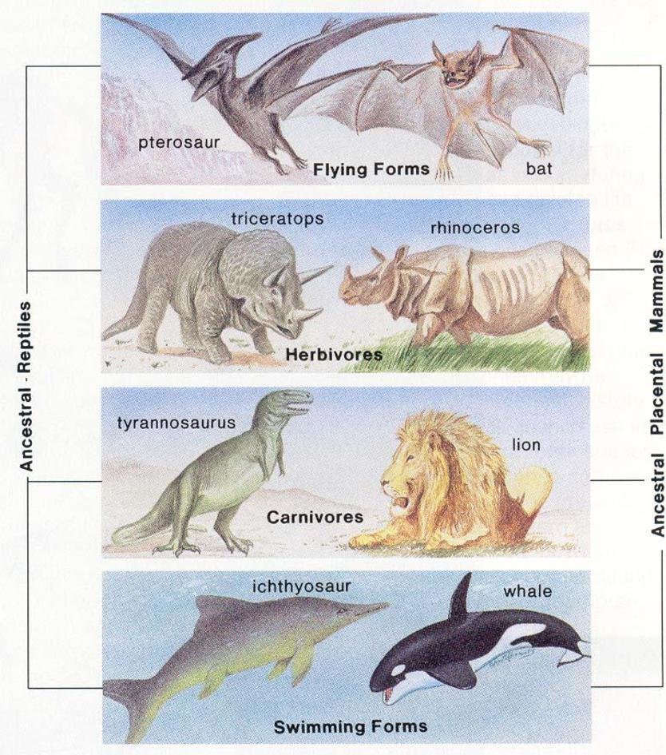
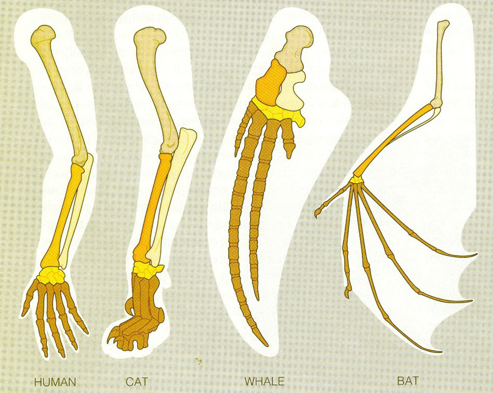

* 微观进化
:   物种内的进化.

    * 以代为单位, 直接观察.
    * 研究方法 --- 实验.

* 宏观进化
:   物种以上分类群的进化.

    * 地质年代, 不能直接观察.
    * 研究方法 --- 化石记录, 形态解剖和生物大分子的比较.

# 27.1 研究宏观进化依据的科学材料

## 27.1.1 化石的形成和年代测定

化石是以前生活的生物被保存在地层中的遗留物或者它的印迹.

地层年龄, 用同位素衰变来测定. \ce{^{14}C} 的半衰期5730±30年.

\note{
同位素具有一定的衰变速度, 并且这个速度不受环境条件(如气候)的影响. 利用这一特点, 就可以比较准确地计算出各新, 老地层和化石的年龄.
各种同位素的衰变速度都是用半衰期(half-life)来计算的, 半衰期是指一个样品中某一同位素原子衰变一半所需要的时间.

同位素衰变          半衰期       适用范围
87铷－87锶            490 亿年       1 亿年
232钍－208铅         140 亿年       2 亿年
238铀－206铅         45 亿年         1 亿年
40钾－40氩            13 亿年          1 亿年
235铀－207铅         7亿 年            10 万年
14碳－14氮             5730 年         6 万年

}

---

---

---

---

---

---

## 27.1.2 分子生物学工具

* 遗传密码的通用性 --- 共同由来
* 蛋白质, 核酸等生物大分子蕴含生物多样性信息
* 同源的生物大分子如细胞色素C和血红蛋白的氨基酸顺序, DNA和RNA的核苷酸顺序的差异可用来确定生物的亲缘关系

## 中性突变与蛋白质的比较

中性突变
:   对生物体既无好处, 又无害处.

细胞色素, 血红蛋白等生物大分子在进化过程中较保守, 在各物种间的差异比较小, 因此可用来确定不同物种的亲缘关系的远近.

\note{
1968年日本遗传学家木村资生M. Kimura, 在英国科学杂志"自然"上, 发表了"分子水平上的进化速率"一文.

}

---

: 不同生物的细胞色素c与人的比较

| 名称 | 差别 | 名称 | 差别 |
|:-:|:-:|:-:|:-:|
| 黑猩猩 | 0 | 金枪鱼 | 21 |
| 猕猴 | 1 | 鲨鱼 | 23 |
| 袋鼠 | 10 | 天蚕蛾 | 31 |
| 豹 | 11 | 小麦 | 35 |
| 马 | 12 | 链孢霉 | 43 |
| 鸡 | 13 | 酵母菌 | 44 |
| 响尾蛇 | 14 | | |

细胞色素c是104--112氨基酸的多肽. 它在进化上保守, 200万年才发生1%的改变.

---

---

\note{
   可比的DNA片段测序, 比较
}

---

* 分子钟:
    * 每一种大分子在不同生物中的进化速率都是一样的
    * 比较化石记录和大分子序列差异, 得出每置换一个氨基酸或核苷酸所需要的时间 --- 进化速率.
    * 进化速率起分子钟的作用.

# 27.2 生物的宏观进化

## 27.2.1 地层中的化石记录了生物进化的历程

地球有45亿年历史, 地质学家将其分为四个大期:

* 冥古宙(45--38亿年前)
* 太古宙(38--25亿年前)
* 元古宙(25--6亿年前)
* 显生宙(6亿年前至今)

---

* 冥古宙无化石 --- 化学进化阶段.
* 太古宙的生命印记(biosignature)
    * 生命活动有``分馏'' \ce{^{12}C} 和 \ce{^{13}C} 的作用, 使 \ce{^{12}C} 更多地进入有机碳化合物
        * 生物有机碳中 \ce{^{12}C:^{13}C} 显著高于没有被生物利用过的碳
        * 格陵兰Isua的太古宙岩层露头中的碳斑点之 \ce{^{12}C:^{13}C} 非常接近于生物来源的值
    * 叠层石: 微生物群体构建的生物礁
    * 太古宙地层可能有微体化石, 源于原核生物 --- 但常遭质疑.

---

---

* 蓝细菌在元古宙走向繁盛
    * 蓝细菌 --- 光合作用 $\rightarrow$ 氧(氧化性大气层) $\rightarrow$ 臭氧层
    * 单细胞真核生物(19亿年前); 元古宙末出现多细胞生物

---

* 显生宙多细胞真核生物的进化
    * 古生代, 中生代, 新生代
    * 寒武纪爆发(cambrian explosion)
        * 寒武纪物种的爆发式突增
        * 几乎所有各门多细胞动物都在此期(500万年)出现 --- 生态位空白
        * 辐射进化

---

* 古生代
    * 早期: 高等藻类和无脊椎动物的时代. 甲胄鱼
    * 中期: 裸蕨类和鱼类. 蕨类, 总鳍鱼
    * 晚期: 蕨类和两栖类. 原始裸子植物如种子蕨, 科达树

---

* 中生代
    * 裸子植物和爬行类繁盛的时代.
    * 森林 --- 现在地下的煤炭
    * 白垩纪后期, 被子植物逐渐发展起来.
    * 三叠纪末出现原始的哺乳动物.
    * 侏罗纪则出现鸟类.

---

* 新生代
    * 鸟类, 哺乳类和被子植物占优势的时代

## 27.2.2 地壳板块的移动影响了生物进化

* 地球上的陆地曾经大合大分, 这对环境和生物进化带来巨大的影响
* 大陆漂移学说(theory of continental drift)
* 澳大利亚动物区系
    * 原兽亚纲, 后兽亚纲, 缺真兽亚纲

---

## 27.2.3 集群性灭迹掀开生命史性的一页

* 渐进式进化的前提是地球历史是渐变的
* 地球历史上也可能出现过灾变, 如陨石碰撞导致气候剧烈变化, 最终引起物种集群性灭绝. 像恐龙的灭绝可能就是这个缘故.
* 尽管许多物种灭绝, 但灾变后仍有生物成活, 这些活下来的物种, 通过适应辐射, 产生新物种 $\rightarrow$ 这样进化就发生了.

## 27.2.4 进化趋势是如何产生的

生物进化没有预定目标, 那么, 进化趋势(evolutionary trend)是如何产生的呢?

* 自然选择(natural selection)
* 趋同进化(convergent evolution)
* 趋异进化(divergent evolution)
* 适应辐射(adaptive radiation)
* 平行进化(parallel evolution)

---

自然选择:

* 自然选择是有方向的, 但这种方向不是生物与环境之间发生相互作用之前被预定的, 而仅仅表现在选择的结果之中.
* 一个群体, 在每一个世代都可能面临新的选择, 机遇和挑战.
* 不同的群体所处的环境不同, 它们经受不同的选择压力, 向适应各自环境的方向进化, 形成不同的新物种.
* 因此, 下列2种情况可产生进化趋势:
    * 不同物种之间存在不均等的存活(unequal survival)就能产生进化趋势;
    * 如果存活机会相等, 而物种形成不均等, 则也会呈现进化趋势.

---

趋同进化
:   生活在相同环境中的不同生物, 产生功能相同或十分相似的形态结构, 以适应相同的条件.

* 鱼, 海豚和鲸分属鱼类和哺乳类, 但都有流线型体型和鳍
    * 有利于在水中运动
* 仙人掌科植物, 大戟科植物, 沙漠, 外形相似
    * 肉质茎储水, 行光合作用, 叶退化

---

---

---

趋异进化
:   生活在不同环境中的同一物种, 由于进化趋势不同而产生功能相异的结构.

第四纪更新世时冰川活动  		      	

* 棕熊: 棕, 黑色, 足底无刚毛, 以植物为主要食物(属食肉目)
* 北极熊: 白色, 足底刚毛, 肉食(与生存环境相适应)

---

适应辐射
:   一个祖先种适应多种不同的环境而分化成多个在形态, 生理和行为上不相同的种, 形成一个同源的辐射状的进化系统.

物种迁移到新环境时, 选择压力小, 各自可以占据不同的生态位. 如达尔文在加拉帕戈斯群岛上发现的13个地雀姊妹种.

---

---

平行进化
:   两个或多个物种谱系, 因有大体相近的进化方向而分别独立地进化出相似的特征. 如有袋类, 真兽类间的相似特征.

平行进化的事实说明生态条件对进化的影响很大!

---

## 27.2.5 真核细胞的内共生起源

* 水平进化 (horizontal evolution)
* 垂直进化 (vertital evolution)
* 内共生学说 (endosymbiotic theory)

---

水平进化
:   增加生物多样性, 而结构复杂性没有显著变化的进化.

如来自南美大陆的祖先地雀在加拉帕戈斯群岛分别演化为13种不同地雀. 	

---

垂直进化
:   导致生物结构呈复杂性增长的进化.

一些高级分类群特征的出现往往导致生物结构呈复杂性增长, 如:  	

* 真核细胞细胞器的起源
* 脊椎动物脊索与脊椎骨的起源
* 维管植物维管系统的起源
* 两栖类呼吸器官的出现
* 陆生动物羊膜卵的出现

这类演化构成宏观进化中的\alert{重大}事件.

---

内共生学说
:   真核生物线粒体和叶绿体是以内共生方式发展起来.

* 线粒体 --- 始祖好氧型细菌(紫色光合细菌, 有氧呼吸, 化能异养型); 某些原生动物和真菌缺.

* 叶绿体 --- 始祖光合细菌(蓝藻, 光能自养型); 现代共生种.

* 线粒体和叶绿体都有自主性
    * 有自己的基因组;
    * 其70S核糖体与细菌, 蓝藻相同, 而与真核生物细胞质的(80S核糖体)不同;
    * 与真细菌有许多相似之处(二分裂).

* 共生关系: 宿主细胞提供营养成分， 小细胞提供大量的ATP或有机物.

---

\begin{figure}
    \begin{minipage}[b]{.38\linewidth}
        \includegraphics{ch-27.images/image40.jpg}
    \end{minipage}
    \hfill
    \begin{minipage}[b]{.58\linewidth}
        \includegraphics{ch-27.images/image41.jpg}
    \end{minipage}
    \caption{林恩·马古力斯和内共生学说}
\end{figure}

## 27.2.6 旧结构对新功能的适应

# 27.3 生物的系统发育

## 27.3.1 进化论赋予分类学新的目标

* 分类学
* 系统学

---

\begin{figure}
    \includegraphics{ch-27.images/image20.jpg}
    \caption{亚里士多德(Aristotle), 384--322 BC, 分类学之父}
\end{figure}

\note{

“ladder of nature” and taxonomy

He grouped the types of creatures according to their similarities: animals with blood and animals without blood, animals that live on water and animals that live on land. Aristotle's view of life was hierarchical. He assumed that creatures could be grouped in order from lowest to highest, with the human species being the highest.

}

---

\begin{figure}
    \includegraphics{ch-27.images/image50.jpg}
\end{figure}

---

\begin{figure}
    \includegraphics{ch-27.images/image51.jpg}
\end{figure}

---

\begin{figure}
    \includegraphics{ch-27.images/image52.jpg}
\end{figure}

---

\begin{figure}
    \includegraphics{ch-27.images/image53.jpg}
\end{figure}

---

\begin{figure}
    \includegraphics{ch-27.images/image54.jpg}
\end{figure}

---

\begin{figure}
    \includegraphics{ch-27.images/image55.jpg}
\end{figure}

\note{
1. It is based on shared similarities, such as skeletal features and body type.

2. It is hierarchical, meaning that we have more and less inclusive groupings; for example, the cat and the lion are grouped together compared to the dog, but the dog, cat, and lion are all grouped together compared to the birds.

}

---

\begin{figure}
    \includegraphics{ch-27.images/image29.jpg}
    \caption{林奈(Carl Linnaeus), 1707--1778, 现代分类学之父}
\end{figure}

\note{
Species Plantarum 植物种志

Systema Naturae  自然系统

人为分类系统，没反映物种间的进化历史

叶互生, 对生
直根, 须根
叶脉网, 平行, 银杏
花三出, 四出, 五出等

}

---

\begin{figure}
    \includegraphics{ch-27.images/image30.jpg}
    \caption{维利·亨尼希(Willi Hennig), 1913--1976}
\end{figure}

\note{
phylogenetic systematics

}

## 27.3.2 系统发育系统是如何构建的

* 同源相似性
* 同功相似性
* 祖征(primitive character)
* 衍征(derived character)
    * 共同衍征(shared derived character)
* 独征

---

---

---

---

: 脊椎动物表型特征

| | 颚 | 四肢 | 毛发 | 肺 | 尾巴 |
|:-:|:-:|:-:|:-:|:-:|:-:|
| 八目鳗 | - | - | - | - | + |
| 鳟鱼 | + | - | - | - | + |
| 肺鱼 | + | - | - | + | + |
| 龟 | + | + | - | + | + |
| 猫 | + | + | + | + | + |
| 大猩猩 | + | + | + | + | - |
| 人 | + | + | + | + | - |

---

# 27.4 进化与发育的修饰

---

27.4.1 编码某些转录黑子的基因在发育中起着重要作用

27.4.2 发育机理和发育的变化

27.4.3 花椰菜和绿菜花开始于一个终止密码子

27.4.4 基因重复与趋异进化

27.4.5 四肢的发育和转录调节的改变

27.4.6 Ubx蛋白C端的变化与昆虫的进化
