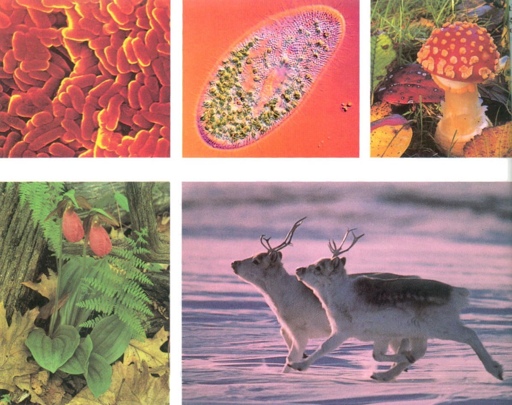

# 28.1 生命的起源

## 28.1.1 关于生命起源的众多假说和争论

1.  神创论: 来自神的创造或超智能者的设计
    + 圣经旧约《创世录》就是最典型的一个代表.
2.  宇生论: 生命起源于外太空
    + 宇宙星球中存在的某些有机分子或微生物孢子, 附着在尘埃上而由彗星带到地球上的; 外星人.
    + 证据: 澳大利亚发现的一颗含碳物质的陨石中和月球样品中检测出了许多氨基酸和有机酸.

---

3.  自然发生说
    + 现有生命自然发生
    + 谷粒+破旧衬衫 → 黑暗21天 → 老鼠(与常见的一致)
    + 17世纪意大利医生Francesco Redit用实验证明腐肉不能生蛆, 蛆是苍蝇在肉上产的卵孵化而成的.
    + 19世纪60年代法国微生物家巴斯德的精确``鹅颈瓶''实验, 证明现有生命不可能自然发生.

---

---

---

4.  生命进化起源说
    + 生命是在特殊的环境条件下, 由无生命的物质经历一个自然的, 长期的化学进化过程而产生.
        - 生命的进化与(地球的)宇宙进化密切相关
        - 生命不是在现有条件下由非生命有机物质突然产生
    + 地球进化, 生命的化学进化和生物进化.

## 28.1.2 生命的摇篮 --- 地球的进化

* 地球的形成:
    + 宇宙的诞生: 150亿±30亿年前一次突发性大爆炸. 随后出现了由氢和氦组成的大, 小星云.
    + 太阳的形成: 大星云中心的氢原子在高温下发生热核反应.
    + 地球的形成: 太阳甩出去的球体就形成了围绕太阳旋转的行星, 根据地壳放射性同位素衰变计算, 地球的年龄约有45亿年.

---

* 原始地球
    + 初级大气圈: 初形成的地球是由热的氢和氦以及一些固体尘埃聚合的内核和外面包围的一层气体组成, 形成了第一次大气层.
    + 次生大气圈: 地球内部温度很高, 物质分解产生大量气体, 通过火山活动喷射出地表, 形成了第二次大气层(还原性气体, 如: \ce{H2O}, \ce{CH4}, \ce{NH3}, \ce{H2S}等).

---

* 原始地球
    + 原始的海洋和河流: 大气层中的饱和水蒸气冷却凝结成雨水, 从而聚集形成原始的海洋和河流.
    + 原始生命的诞生:
        - 能量: 紫外线, 闪电, 辐射能以及热能等.
        - 物质: 可溶性有机分子, 甲烷.
        - 时间: 古生物化石记录, 约40亿年前.

## 28.1.3 生命的化学进化

1. 有机小分子的非生物合成
    + 原始汤假说: 生命起源于原始蛋白质聚集形成的团聚体或地表温水池``原始汤'' .
    + 美国人Miller: 模拟实验.
        - 混合气体(如\ce{CH4}, \ce{CO}, \ce{CO2}, \ce{NH3}, \ce{N2}和\ce{H2}等);
        - 能量: (放电, 紫外线和电离辐射, 加热等).
    + ``热喷水口'': 古细菌.
    + 外太空: 生命的原料.

---

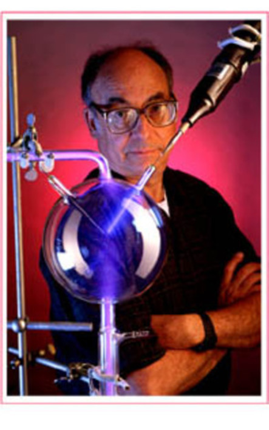

---

\begin{figure}
    \begin{minipage}[b]{.38\linewidth}
        \includegraphics{ch-28.images/image5.jpg}
    \end{minipage}
    \hfill
    \begin{minipage}[b]{.58\linewidth}
        \includegraphics{ch-28.images/image6.jpg}
    \end{minipage}
    \caption{米勒放电实验}
\end{figure}

\note{
米勒, 1953年, 芝加哥大学研究生

70岁时的照片
2007去世

1951年毕业于UC Berkeley, 随后去了芝加哥大学化学系, 师从美国氢弹之父Edward Teller
换导师, 转到Urey名下
54年毕业
}

---

2. 生物大分子的非生物合成
    + 蛋白质与核酸生物大分子的形成: 聚合作用, 2种方式
        - 溶液聚合: 在粘土表面吸附作用下发生聚合. 实验可证明.
        - 浓缩聚合: 小水体中, 长期蒸发, 水中氨基酸等分子含量很高.
    + 模拟实验:
        - 混合的氨基酸溶液高温浓缩形成``类蛋白'';
        - 单核苷酸高温加热也可聚合成多聚核苷酸.
    + 由此推测, 溶解在原始海洋中的氨基酸与核苷酸经过长期积累与浓缩, 波涛或大雨可将有机单体分子飞溅到新生的岩浆或滚烫的石块上, 从而发生这种聚合作用.

---

3.  核酸--蛋白质等多分子体系的建成
    + 只有核酸与蛋白质精巧地组成高度有序的独立多分子体系时, 方可表现出生命现象.
        - 生命现象:新陈代谢, 生长, 繁殖, 复制, 遗传等.
    + 非细胞形态原始生命的诞生有两种学说:
        - 蛋白质起源说
        - 核酸起源说

---

* 蛋白质起源说
* 团聚体学说: 奥巴林
    + 团聚体学说: 生物大分子(主要是蛋白质和核酸)可形成团聚体小滴, 即多分子体系, 它具有一定的生命现象.
    + 团聚体小滴: 直径为1--500μm; 有膜样结构把它与周围介质分开; 有原始代谢特性; 能无限制地增长和繁殖.
* 微球体学说: 福克斯
    + 微球体学说: 将干的氨基酸或实验所得的``类蛋白质''加热, 可形成微球体. 它也是一种多分子体系, 能够表现一定的生命现象.
    + 微球体: 直径1--2μm, 相当于细菌大小; 表面有双层膜, 能缩胀; 能生长和繁殖; 有类似于简单细菌的超微结构; 表面膜有选择透性.

---

* 核酸起源说
* RNA的多重功能:
    + RNA自我复制;
    + RNA酶(核酶): 催化蛋白质和新的RNA合成.
    + 推论: 第一批基因和酶是在非生物世界中能开始自我复制的短链RNA.
* 实验也证明核苷酸单体在黏土表面可形成短链RNA分子, 新合成的RNA分子还可与原始RNA分子互补配对.
* ``RNA世界假说'': 推测某些混合的核苷酸单体可自发结合成短链RNA, 短链RNA作为第一基因, 又以自身编码的信息为模板, 依靠RNA的催化功能进行自我复制.

---

\begin{figure}
    \begin{minipage}[b]{.48\linewidth}
        \includegraphics{ch-28.images/image7.jpg}
    \end{minipage}
    \hfill
    \begin{minipage}[b]{.48\linewidth}
        \includegraphics{ch-28.images/image8.jpg}
    \end{minipage}
    \caption{METHINKS IT IS LIKE A WEASEL}
\end{figure}

\note{

我想它像一只黄鼠狼

http://en.wikipedia.org/wiki/Weasel-program

}

---

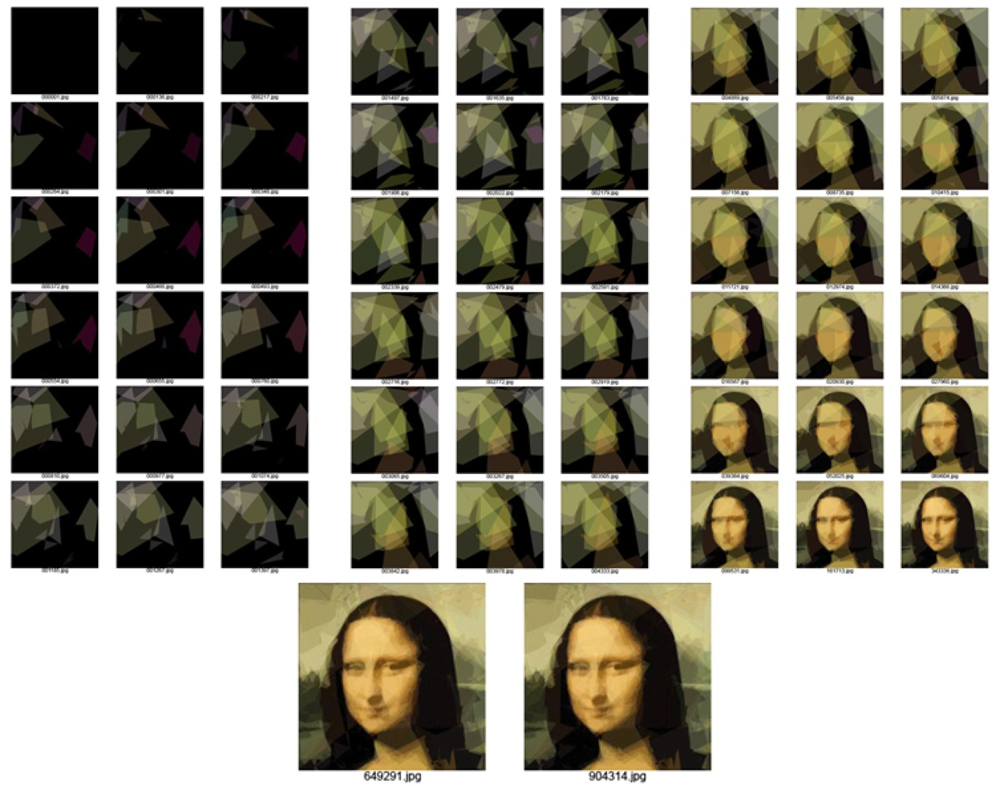

\note{
遗传算法, 还加入重组

}

---

4.  原始细胞的起源
    + 作为原始生命, 必须具备两点:
        - 有复杂结构的核酸和蛋白质首先必须成为相互依赖, 相互调控的多分子体系, 内部有一定的物理化学结构, 执行与生命活动相关的多项功能.
        - 形成原始膜, 才可成为独立的稳定体系, 以便分隔, 选择性地吸收.
    + 原始细胞的起源:
        - RNA基因转录和翻译系统合成第一批蛋白质(``多肽'')
        - ``多肽''作为第二代酶, 帮助RNA复制
        - 由膜包裹的DNA--RNA--蛋白质体系具有原始生命现象

# 28.2 原核生物多样性及其进化

## 28.2.1 地球上独领风骚十几亿年的原核生物

* 原核生物的地质时期: 太古宙和元古宙, 占优势30亿年.
    + 化石记录; 原核生物繁衍于35亿年前, 真核单细胞生物化石大约19亿年前, 多细胞动物和植物的化石出现于大约6亿年前.

---

* 原核生物的分类与形态
* 原核生物+病毒+真菌 → 微生物
* 原核生物的分类:
    + 真细菌: 细菌, 蓝细菌(蓝藻), 放线菌, 螺旋体, 衣原体, 立克次氏体和支原体.
    + 古细菌
* 细菌的形态: 多为单细胞, 有球状, 杆状或螺旋状.

---

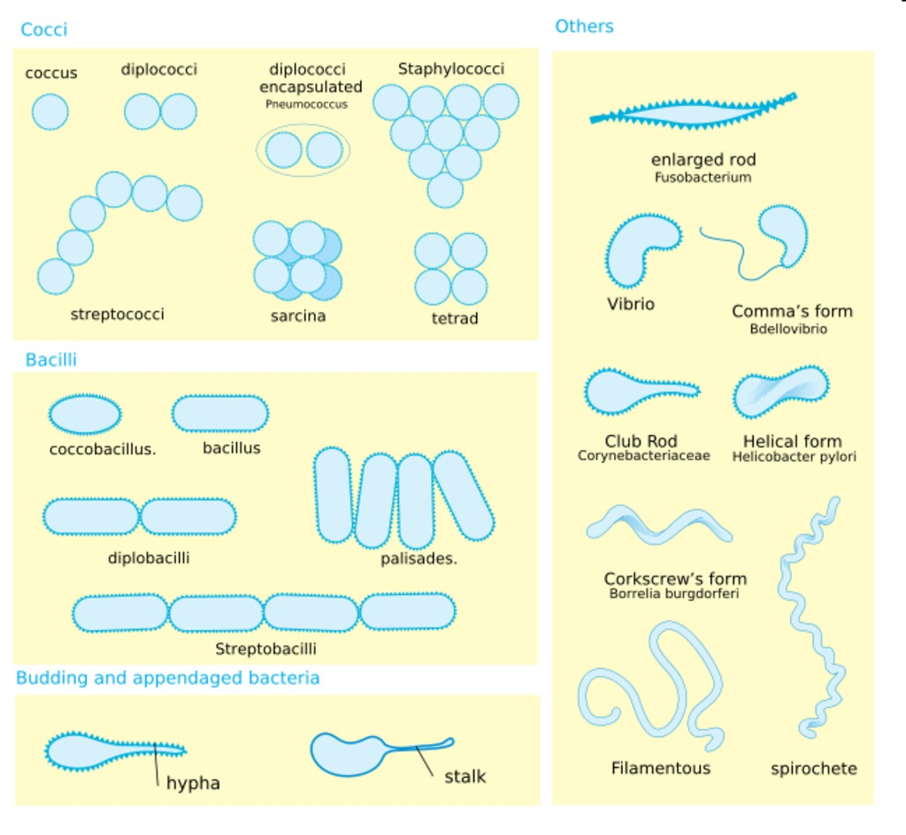

---

细菌的结构

菌落
:   单个或少数几个细胞生长和繁殖而成的群体, 有几百万个细菌的细胞.

* 结构特点: 无细胞核, 细胞器, 有细胞壁(肽聚糖).
    + 革兰氏染色 --- 鉴定细菌的简便方法, 紫(阳性菌), 红(阴性菌).

---

* 特殊结构 --- 鞭毛, 芽孢和荚膜, 这些结构有助于细菌在各种环境中生活.
    + 鞭毛: 固定在原生质膜和细胞壁上, 运动
    + 菌毛, 帮助细菌粘附在人和动物的肠中或流水石头的表面. 而执行``交配''功能的菌毛成为性菌毛.
    + 芽孢: 芽孢壁厚, 有抗干燥, 抗热, 抗辐射, 抗化学药物等特性, 使细菌能在恶劣环境下存活.
    + 荚膜: 一些细菌的细胞壁外有由多糖或蛋白质构成荚膜, 帮助细菌附着和抵抗白细胞吞噬.

\note{
芽孢壁厚，有抗干燥、抗热、抗辐射、抗化学药物等特性，使细菌能在恶劣环境下存活。

在研究了细菌在压力下共同的权衡、启用不同的生存策略后，科学家表示他们获得了人类如何作出影响健康、财富和社会其他人命运的战略决策的新见解。报告发表 在《美国国家科学院学报》学报上。 加州大学San Diego分校和以色列特拉维夫大学的理论物理学家和化学家使用数学工具去刻画复杂生物学系统。特拉维夫大学的物理学教授Eshel Ben Jacob说，每个人都知道需要推迟作出重要决策直到最后一刻，但自然界的简单生物在这方面比人类做的更好。在自然界，一个群体的细菌数量可能是地球人口 总数的100倍。细菌回应极端压力—如饥饿、中毒和辐射—的方式是通过创造孢子，进入休眠状态。以科学家研究的枯草杆菌（Bacillus subtilis）为例，参与这一过程的基因超过500个，需要花费10个小时。当细菌形成孢子，母细胞便会死去，但在死亡之前它会将自身的DNA拷贝储 存在特殊容器内。随后母细胞分解，DNA和蛋白质释放到周围环境。但细菌在形成孢子的路上并不总会形成孢子，如果周围环境有变，它也会改变命运，进入叫 “competence（感受态）”的不同状态。在感受态下，细菌能改变膜，使之能吸收来自死亡细胞的物质，创造“感受中间态”。细菌以这种方式努力在不 友好的环境中生存下来。

}

---

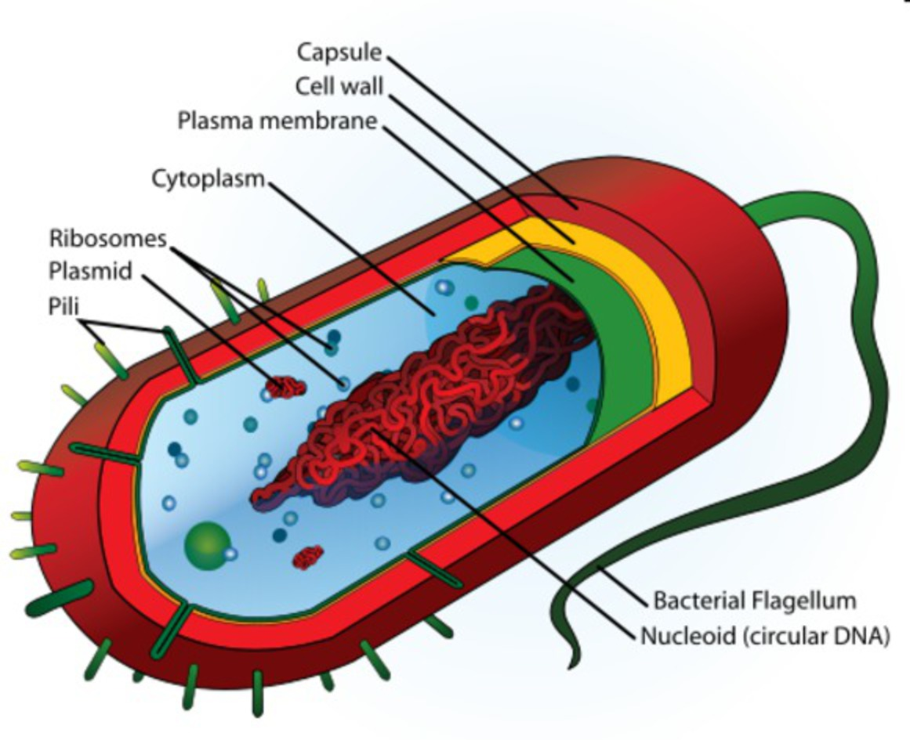

---

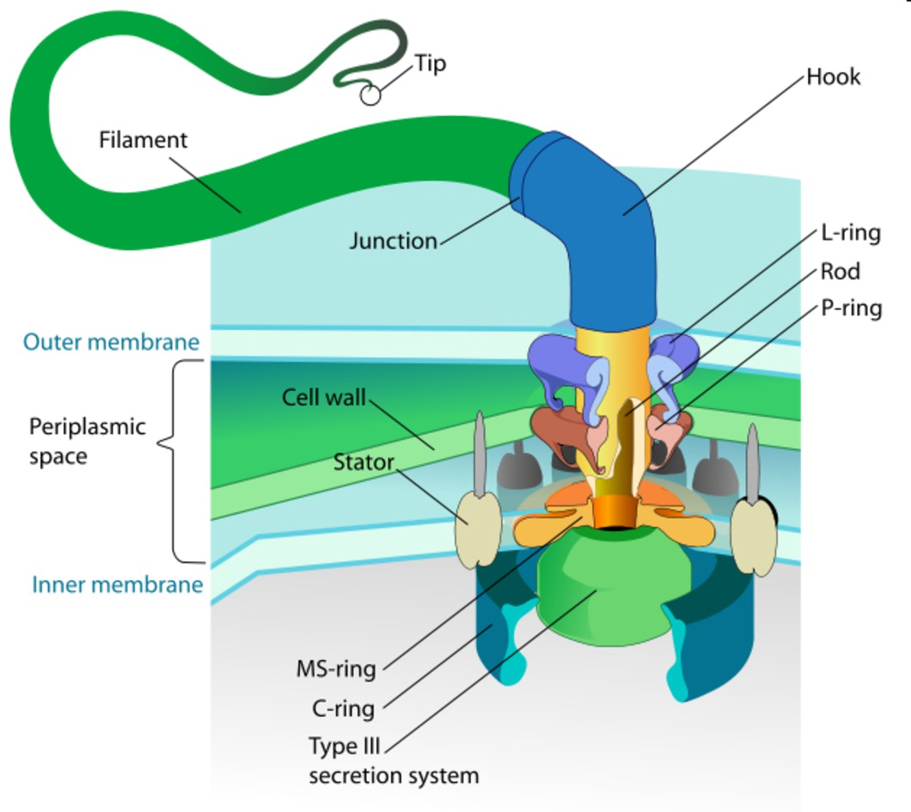

\note{
鞭毛结构
}

---

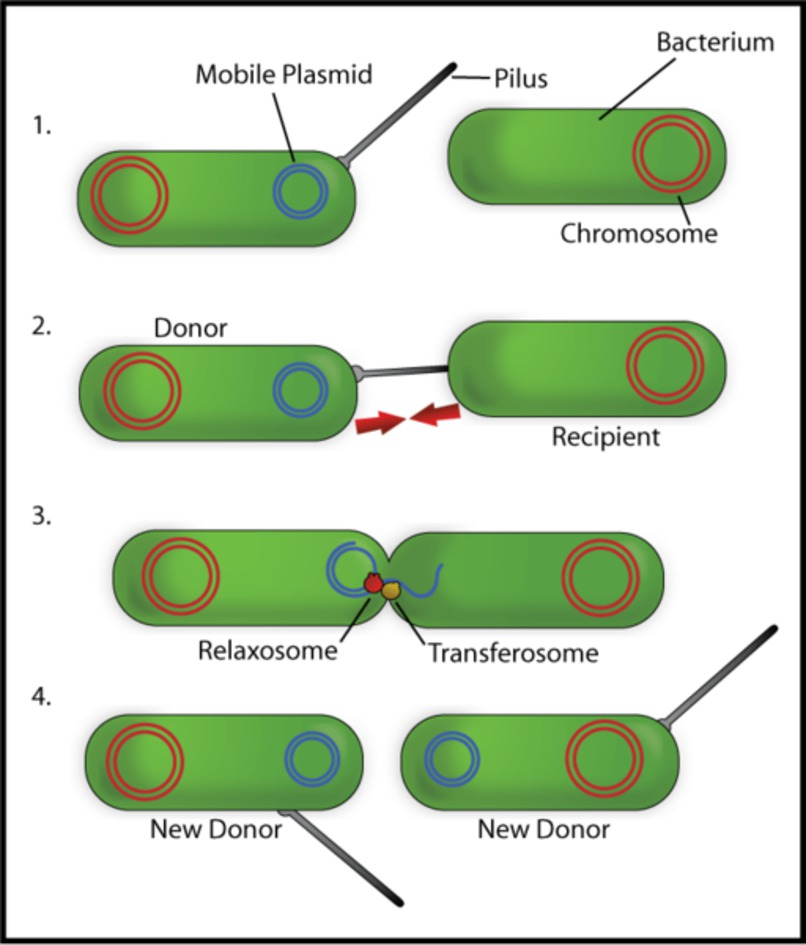

\note{
菌毛帮助细菌粘附在人和动物的肠中或流水石头的表面.

而执行“交配”功能的菌毛成为性菌毛.
}

---

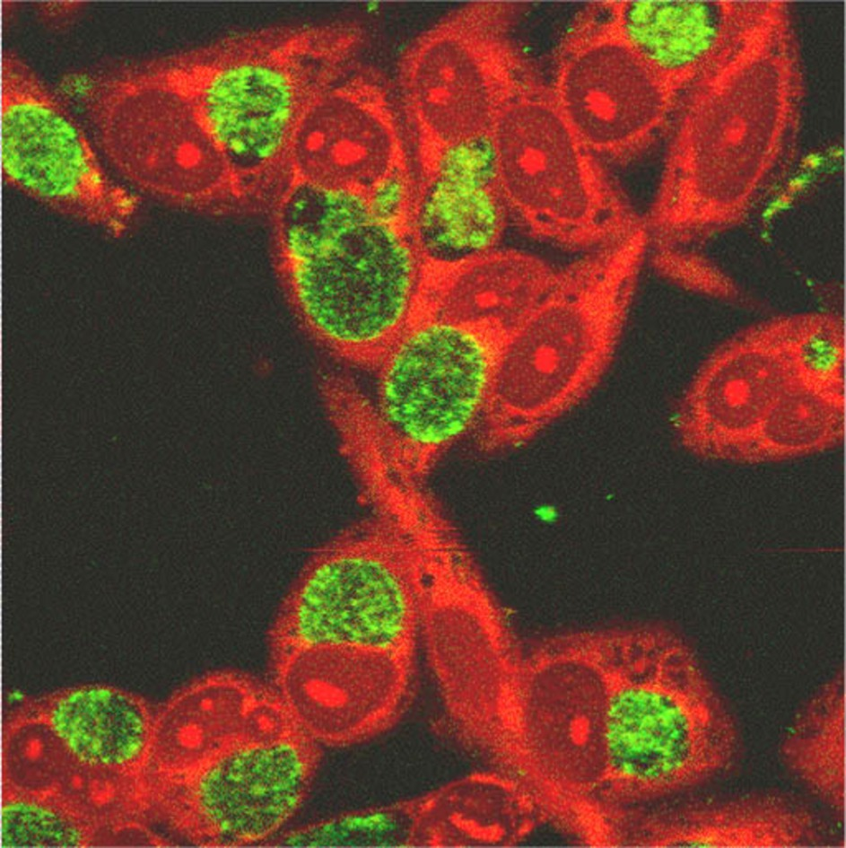

\note{
衣原体是一种非常特殊的细菌，一直过着寄生在其他细胞体内的生活
}

## 28.2.2 古细菌和真细菌

* 16S rRNA分子序列比对:
    + 一类称为真细菌, 序列是: AAACU\alert{C}AAA;
    + 另一类称为古生菌, 序列是: AAACU\alert{U}AAA\alert{G};
    + 古生菌与真核生物(18S rRNA)一致.
* 三原界学说:
    + 真细菌原界
    + 古细菌原界
    + 真核生物原界

---

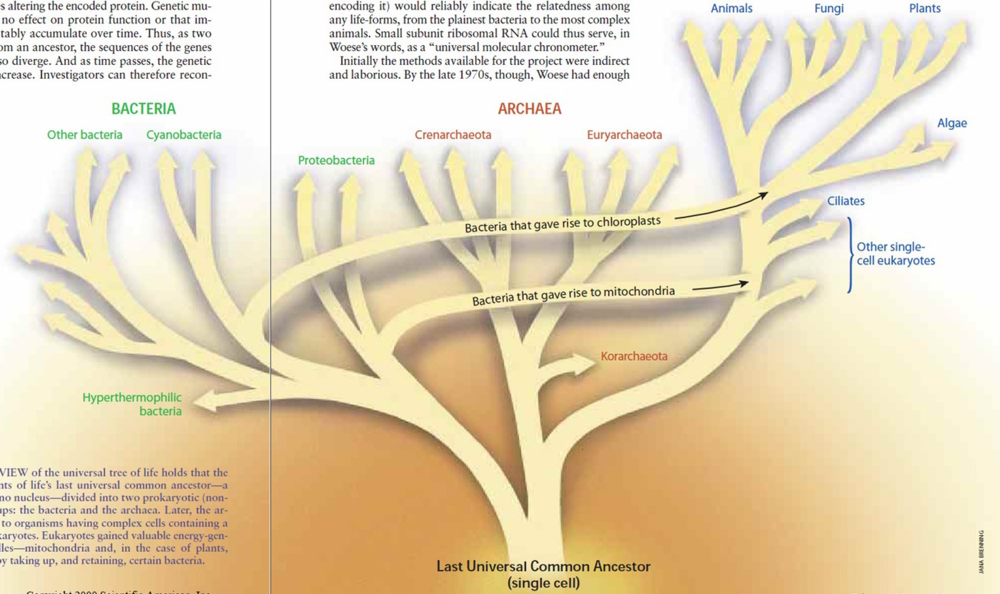

## 28.2.3 真细菌的多样性及其进化

* 营养和代谢类型的多样性:
    + 根据碳的来源, 能量来源及电子供体性质不同,
    + 4种营养类型:
        - 光能自养型: 以\ce{CO2}为唯一或主要碳来源, 以光为能源;
        - 化能自养型: 以\ce{CO2}为碳来源, 自无机物氧化获得能量;
        - 光能异养型: 能量来自日光, 碳来源为有机物;
        - 化能异养型: (大多数微生物)依靠有机物氧化获得能源和碳源.
    + 氧的需求: 好氧菌, 厌氧菌, 兼性厌氧菌, 微好氧菌和耐氧菌.

---

1.  最早的原核生物: 厌氧和有机营养(异养)类型
    + 特征: 酶系统和代谢类型简单, 从``原始汤''中直接获取能量分子; 或对海洋中丰富的有机质进行发酵获取能量.
2.  自养类型的出现: 厌氧化能自养型和光能自养型
    + 特征: 生物遇到了第一次能量危机, 酶合成能力的进化.

---

3. 放氧型的光能自养型的出现:
    + 特征: 出现叶绿素分子,由\ce{H2O}光解代替\ce{H2S}光解,释放\ce{O2}
    + 蓝细菌出现的意义:
        - 构成了生物合成和分解的统一生态系统;
        - 释放大量的\ce{O2}, 改变了地球面貌;
        - 原核生物改变代谢类型, 从厌氧发展为需氧;
        - 为动, 植物起源创造条件.
4. 好氧型细菌的出现:
    + 特征: 呼吸作用变为有氧呼吸类型.
    + 意义: 有氧呼吸类型产能效率远远超过了无氧呼吸和发酵类型.

## 28.2.4 古细菌的多样性及其进化

* 古细菌的分类: 根据16S rRNA序列分析细分为3个亚群
    + 泉古生菌界(包括硫还原球菌和硫化叶菌等);
    + 广古生菌界(包括产甲烷古生菌, 极端嗜盐菌和极端嗜热嗜酸菌, 嗜酸和嗜热的热源体等);
    + 古生古菌界(指运用荧光原位杂交技术检测证实其存在, 但目前实验室中尚不可培养的微生物, 如超嗜热古生菌).

---

* 古生菌所栖息的环境对现代生物都是极其严酷的
    + 产甲烷古生菌: 严格厌氧菌, 利用\ce{H2}作为\ce{CO2}的还原剂以合成有机物.
    + 极端嗜热嗜酸菌: 在含硫热泉或深海火山口的热流中, 大多数代谢硫.
    + 极端嗜盐古生菌: 在含\ce{NaCl} 20--30%的环境下生活, 严格需氧的化能异养菌.
    + 超嗜热古生菌: 在$90\,^{\circ}\mathrm{C}$以下不能生长.
* 古生菌对早期地球环境的适应
    + 极端环境: 高热, 高盐, 高湿, 厌氧, 低pH和充满还原性气体.

---

\begin{figure}
    \begin{minipage}[b]{.48\linewidth}
        \includegraphics{ch-28.images/image17.jpg}
    \end{minipage}
    \hfill
    \begin{minipage}[b]{.48\linewidth}
        \includegraphics{ch-28.images/image18.jpg}
    \end{minipage}
    \caption{古细菌的生活环境}
\end{figure}

## 28.2.5 原核生物的重要性

1. 自然界的物质循环

    + 原核生物的合成作用:
        - 光能自养型和化能自养型细菌是生态系统中的初级生产者, 利用光能和无机物的化学能直接合成有机物.
    + 原核生物的分解作用: 更为重要
        - 光能异养型和化能异养型细菌有机物的主要分解者, 将复杂的动, 植物和微生物残体分解为无机化合物.
        - 地球上90%以上有机物的矿化都是由细菌和真菌完成.

---

2.  污水治理
    
    + 微生物处理法: 可以用于环境监测.
        - 有氧处理: 包括活性污泥法, 生物膜法和氧化塘法.
        - 无氧处理

3. 工业, 农业和医药上的应用

    + 应用: 这主要是利用微生物菌体, 初级代谢及次级代谢产物和微生物的转化机能.

---

原核生物与人类生活:

* 有益: 肠道共栖细菌
* 有害: 细菌性疾病, 称病原体
    + 外毒素: 细菌分泌到介质中的毒素, 为毒性很强的蛋白质, 随血液和淋巴进入身体各部位.
    + 内毒素: 革兰氏阴性细菌细胞壁脂多糖中的成分, 只在细菌死亡溶解后才释放出来.
    + 治疗方法: 疫苗, 抗毒素, 抗血清预防和治疗, 磺胺药和抗生素.

---

原核生物在环境(物质循环)和进化(氧的进化)两方面都是所有生物的基础.

# 28.3 处于生物与非生物之间的病毒

## 28.3.1 病毒

1. 大小和形态
    + 大小: 极微小(纳米级), 电子显微镜观察.
    + 基本形态: 杆状, 球状, 蝌蚪状, 也有砖状和丝状等.

---

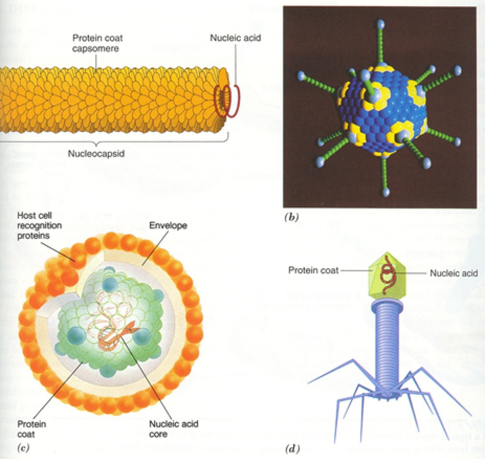

---

2. 组成和结构
    + 结构: 病毒无细胞结构, 核苷酸核心＋蛋白质衣壳
        - 核苷酸核心: 单一类型的核苷酸(DNA或RNA), 不仅有单链和双链, 线状和环状, 还有正链和负链之分.
        - 外壳蛋白: 病毒衣壳的壳粒排列是高度对称的, 螺旋对称, 二十面体对称, 螺旋对称和二十面体对称兼有的复合对称.
        - 被膜: 有些病毒在衣壳外还有从活细胞脱离时携带的细胞膜或核膜组分构成的被膜, 突刺或囊膜粒的突出物.

---

3. 病毒的增殖
    + 病毒在细胞外是无生命的, 亚显微的大分子颗粒, 不能生长和分裂. 但它们是能够侵染特定活细胞的遗传因子.
    + 一旦进入特定的活细胞, 便借助宿主细胞的能源系统, tRNA, 核糖体和复制, 转录, 翻译等生物合成体系, 复制病毒的核酸和合成病毒的蛋白质, 最后装配成结构完整, 具有侵染力的, 成熟的病毒粒.

---

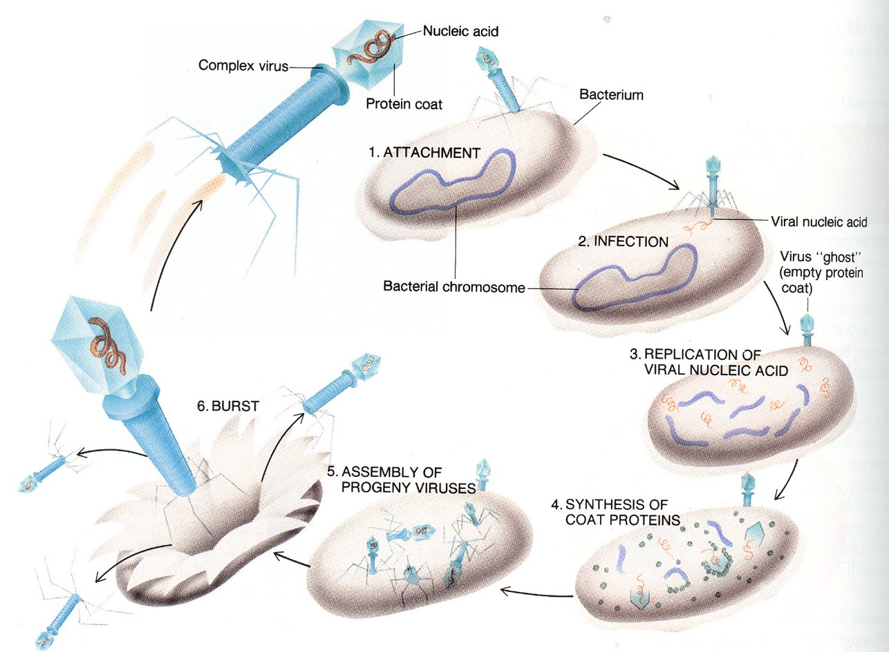

## 28.3.2  病毒的种类和病毒病

* 病毒的种类: 根据宿主的不同
    + 脊椎动物(包括人类)病毒(近1000种);
    + 无脊椎动物(包括昆虫)病毒(1700种);
    + 植物病毒(6000余种);
    + 微生物病毒(噬菌体, 近3000种).

---

* 病毒病: 约50--60%的人类和动, 植物疾病
    - 如严重急性呼吸综合症SARS(``非典型性''肺炎)等.
    - 病毒病传染性强, 传播广, 目前只有干扰素等少数药物能对付某些病毒.

\begin{figure}
    \begin{minipage}[b]{.48\linewidth}
        \includegraphics{ch-28.images/image23.jpg}
    \end{minipage}
    \hfill
    \begin{minipage}[b]{.48\linewidth}
        \includegraphics{ch-28.images/image22.jpg}
    \end{minipage}
    \caption{埃博拉病毒  流感病毒}
\end{figure}

---

1.  类病毒
    + 结构: 类病毒没有蛋白质外壳, 只是裸露单链环状RNA分子.
    + 危害: 可引起马铃薯, 番茄, 黄瓜, 柑橘及椰子树等减产.
2.  朊粒: 也称蛋白质病毒
    + 结构: 是一种蛋白质分子.
    + 危害: 侵入寄主细胞, 在寄主细胞中繁殖, 引起寄主中枢神经病变
        - 疯牛病 --- 牛脑海绵状症(BSE).

## 28.3.3 病毒的起源

* 病毒不可能是``前细胞''生物, 而是细胞出现后的产物: 
    + 无完整的酶系统;
    + 不能制造ATP和独立生活;
    + 有控制特定活细胞代谢的遗传信息.
* 病毒是生物细胞中不断进化和逃脱出来的基因片段: 病毒, 细菌, 酵母菌中独立于染色体外的质粒和生物细胞中的转座子相似.
* 现今几乎所有生物都有其相应的一种或多种病毒. 							
