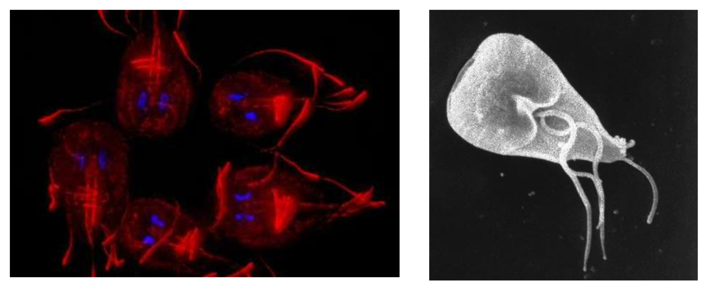
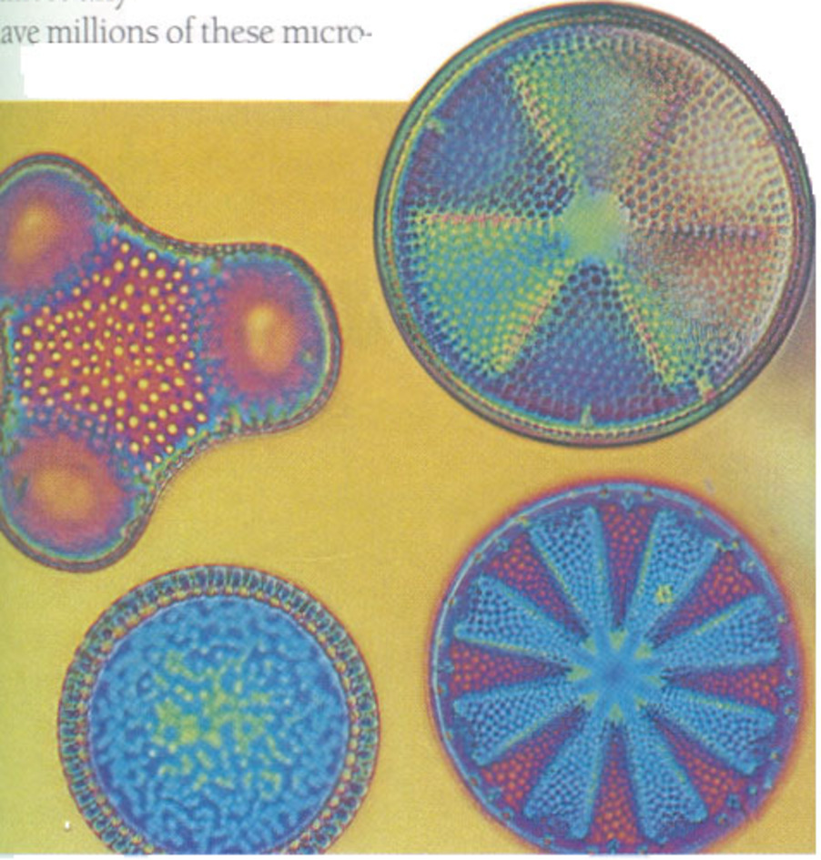
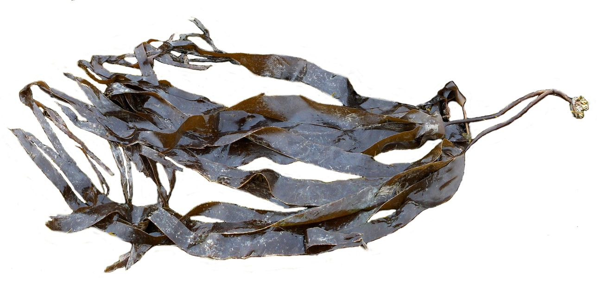
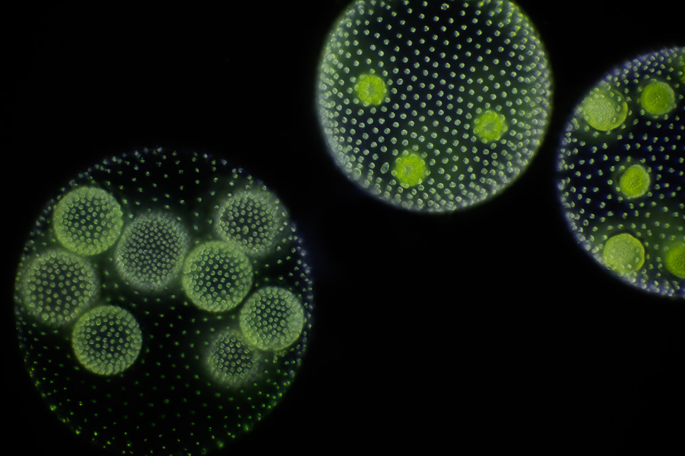
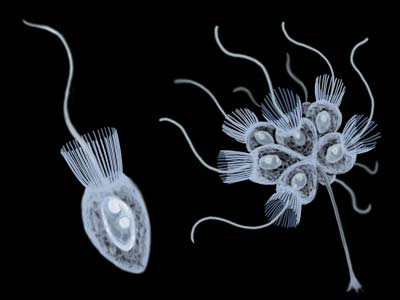
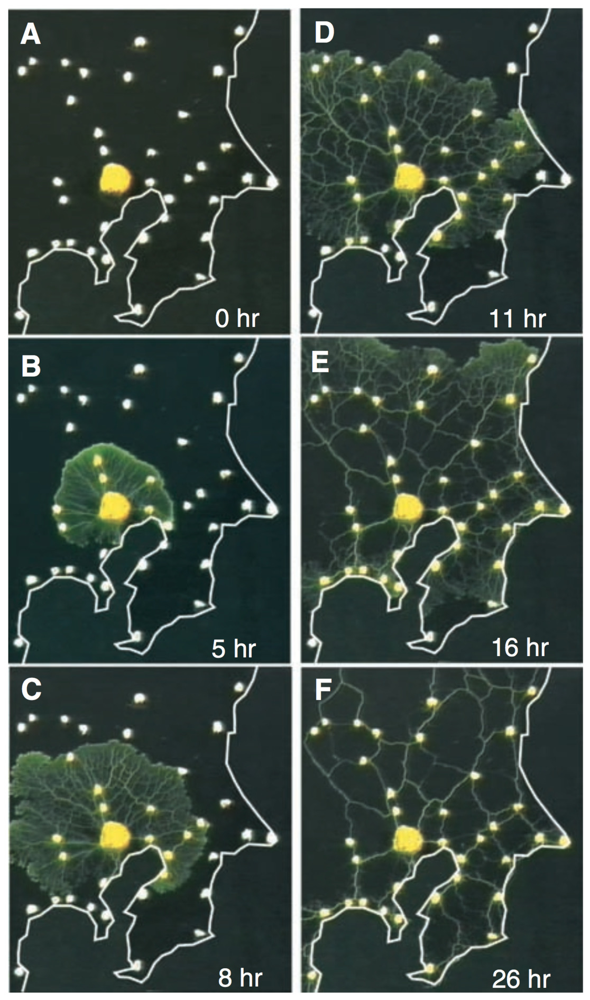
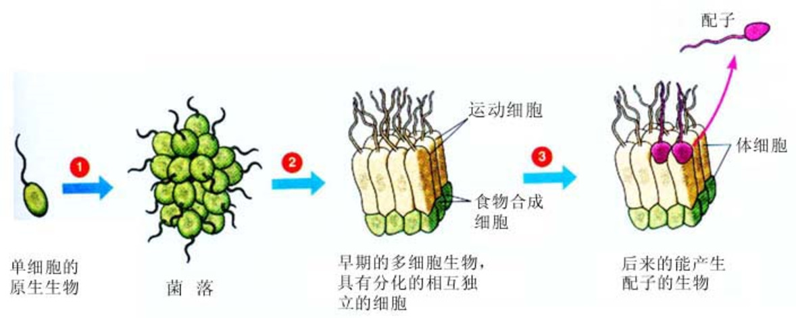

* 起源历史：化石和rRNA分子生物学研究
    + 30亿年前真核生物就进化为独立分支；
    + 16－20亿年前，最早的真核生物的化石；
    + 只有蓝细菌出现后，需\ce{O2}的真核生物才得以产生。
* 结构特点：有膜包围的细胞核和细胞器。
* 真核细胞的进化过程：
    1.  膜内折
    2.  内共生						

## 真核细胞的进化过程

1.  膜内折

膜内折
:   真核细胞的内膜系统从原核细胞质膜内折进化而来。

* 核膜的出现：细胞机构和功能的多样化，分为以复制、遗传为中心的细胞核和以蛋白质等合成代谢为中心的细胞质。

---

2.  内共生

内共生
:   真核生物线粒体和叶绿体是以内共生方式发展起来

* 线粒体的祖先：始祖好氧型细菌（有氧呼吸、化能异养型），它们寄生或被吞噬，形成线粒体。
* 叶绿体的祖先：始祖光合细菌（光能自养型），通过上述类似途径进化。
* 共生关系：宿主细胞提供营养成分，小细胞提供大量的ATP和有机物。
* 相关证据：与真细菌有许多相似之处(二分裂)；一定的遗传自主性。

# 29.2 原生生物多样性的进化

## 29.2.1  什么是原生生物

1.  最简单的真核生物

结构特点：最简单的真核生物，个体微小，多为单细胞，细胞核有核膜，细胞基本无组织分化。

---

* 原始真核生物：现代原生生物和多细胞真核生物共同祖先

    + 贾第虫：现存古真核生物代表，有鞭毛、无线粒体和叶绿体、细胞骨架简单的单细胞原生生物，有二单分体。

---

* 原生生物的细胞结构、营养方式和生活史等方面差异很大
    + 大多数为单细胞，部分种类是群体或多细胞的；
    + 原生生物的细胞核具有核膜，一核或多核；
    + 多细胞原生生物的有性生殖过程：原始的功能分化。

---

2.  最全能的细胞

* 无细胞和组织的分化，最全能的细胞，细胞结构更为复杂。
    + 运动：鞭毛或伪足或纤毛；
    + 营养类型多样化：光能自养型的藻类、光能异养型的鞭毛虫，而大多数则是化能异养型，但也有许多种类的营养类型为兼性。

---

*
    + 其摄食方式多样，可通过胞口摄食、伪足吞噬、胞饮等。
    + 排泄：通过伸缩泡的伸缩活动来完成。
    + 多种细胞骨架以支持和维持其外形，如藻类的细胞壁、放射虫的内骨骼、有孔虫的外壳等。
    + 特殊的细胞器：如眼虫的眼点等。

* 原生生物：原生动物，黏菌，藻类。并系。

---

## 29.2.2 鞭毛原生动物

1.  双滴虫

2.  侧基粒虫

## 29.2.3 类眼虫生物

1.  眼虫

2.  动基体目

## 29.2.4 囊泡生物

1.  沟鞭藻

2.  顶复虫

## 29.2.5 茸鞭生物

1.  硅藻

* 特征：细胞壁由两个半片组成套，主要成分是二氧化硅。
* 经济价值：硅藻土可作为过滤、绝缘、磨光、防火材料的主要成分。

---

---

2.  褐藻

* 代表种海带
* 形态：多细胞、分支丝状体，
* 结构：植物体有组织分化，由表皮层、皮层和髓组成。
* 生活史：异形世代交替。

---

## 29.2.6 红藻

* 代表种珊瑚色藻，紫菜
* 形态：多数为多细胞，少数为单细胞，藻体较小。
* 结构：丝状体或假薄壁组织形成的叶状体和枝状体。
* 生活史：同形或异形世代交替。

---

## 29.2.7 绿藻

* 单细胞, 群体或多细胞

\note{

生活史：典型同形世代交替，有双倍体的孢子体世代和单倍体的配子体世代。

海藻的世代交替与许多从绿藻进化到植物的中间阶段类似。
}

---

\note{
衣藻：绿藻门的单细胞成员。

特征：有纤维素壁，营养细胞有两根鞭毛。
}

---

\note{
团藻属：绿藻门群体细胞成员

特征：由数百至上万个的双鞭毛细胞排列成一层中空球状团聚体。
}

---

\note{
形态：多细胞。

结构：大型多细胞片状体或管状体。

生活史：典型同形世代交替，有双倍体的孢子体世代和单倍体的配子体世代。

海藻的世代交替与许多从绿藻进化到植物的中间阶段类似。
}

---

---

* 植物是由古代绿藻进化的：
    + 绿藻的鞭毛和某些植物的双鞭毛配子极为相似。
    + 绿藻叶绿体光合色素、纤维素的细胞壁及以淀粉形式储存食物等与植物相同。

---

\note{
硅藻

绿藻

被子植物

苔藓植物 

红藻

}

## 29.2.8 领鞭毛目

## 29.2.9 其它原生生物

1.  变形虫

---

2.  黏菌

* 结构特征：介于原生动物与真菌
* 营养期为裸露、**无细胞壁**、多核变形虫状的细胞（称原生质团），与原生动物中的变形虫相似。
* 原生质团成熟时发育成**繁殖结构的**子实体，与真菌中的霉菌相似。

---

* 细胞学研究中常用的两类模型。
    + 盘基网柄菌：典型细胞型黏菌，生活史有3个阶段：单细胞变形虫状营养期；无性生殖的子实体；有性生殖的变形虫状细胞。
    + 原质型黏菌：多核原质团，营养期的原质团为合胞体；原质团成熟时发育成类似于有足、茎和孢子囊的子实体；细胞囊内进行减数分裂产生单倍体孢子，并萌发成带鞭毛的游动孢子或变形虫状细胞。

---

---

# 29.3 多细胞生物的起源

---

* 多细胞生物与单细胞生物的根本区别：细胞分化，分化后的细胞间形成了相互依赖、更加适应环境的整体结构。

* 多细胞生物的出现：分别从几类单细胞原生生物祖先起源
    + 海藻：可能来自3种或更多种古代原生生物。
    + 植物：可能起源于绿藻谱系中的一个分支。
    + 真菌和动物：可能来自共同的原生生物祖先。

---

* 多细胞真核生物的化石记录：大约出现在6亿年前。
* 两种类型植物的化石（大约6亿~6.5亿年前）
    + 一种可能是细胞集群；
    + 第二种是细胞分化明显的叶状体植物（叶藻），其内部有皮层和髓部的分化，髓部还有薄壁组织和假薄壁组织的分化。

---

进化过程：

1)  单细胞原生生物细胞分裂后不分离而形成群体。
2)  群体中的细胞已经分化，既有分工，又相互依赖。
3)  群体中另外的细胞各自分化、发展为体细胞（非生殖细胞）和性细胞（配子）。

