## 植物和多细胞绿藻的异同

* 同
    * 光合自养的多细胞真核生物; 
    * 叶绿体色素相同; 
    * 细胞壁主要成分相同: 纤维素; 
    * 糖分储存形式相同: 淀粉; 
    * 细胞分裂过程: 高尔基体小泡形成细胞板. 
* 异
    * 水生到陆地生活的适应
    * 根, 茎, 叶分化; 
    * 生殖细胞被非生殖细胞所保护. 

---

\begin{columns}[onlytextwidth]
    \column{0.6\textwidth}
        \begin{itemize}
            \item 6.5亿年前, 出现了叶状体藻类
            \item 志留纪末期, 多细胞藻类生活在湿地环境
        \end{itemize}
    \column{0.4\textwidth}
        \begin{figure}
            \includegraphics{ch-30.images/image1.jpg}
            \caption{现代轮藻}
        \end{figure}
\end{columns}

\note{

现代轮藻生活在池塘湖泊边缘的浅水之中

}

---

\begin{columns}[onlytextwidth]
    \column{0.5\textwidth}
        \begin{itemize}
            \item 4.15亿年前, 最早的维管植物化石祼蕨
            \begin{itemize}
                \item 直立的分枝的茎; 
                \item 原始的维管组织; 
                \item 生殖器官孢子囊
            \end{itemize}
        \end{itemize}
    \column{0.5\textwidth}
        \begin{figure}
            \includegraphics{ch-30.images/image2.jpg}
            \caption{祼蕨}
        \end{figure}
\end{columns}

# 30.2 陆生植物的世代交替和对陆地生活的适应

## 30.2.1 陆生植物的世代交替

* 动物无世代交替现象
    * 无单倍体的多细胞个体. 
* 植物的世代交替
:   **单倍体的配子体**世代和**二倍体的孢子体**世代交替出现. 
    * 基本元素: 孢子 (spore), 配子 (gamete), 合子 (zygote).
* 与藻类的世代交替相比, 重要变化在于鞭毛及运动性
    * 藻类: 配子, 孢子均有
    * 植物: 精子有, 卵子, 孢子无

\note{

世代交替

一种指有性生殖和无性生殖的交替.

这里讲的是单倍体和二倍体的世代交替. 

}

---

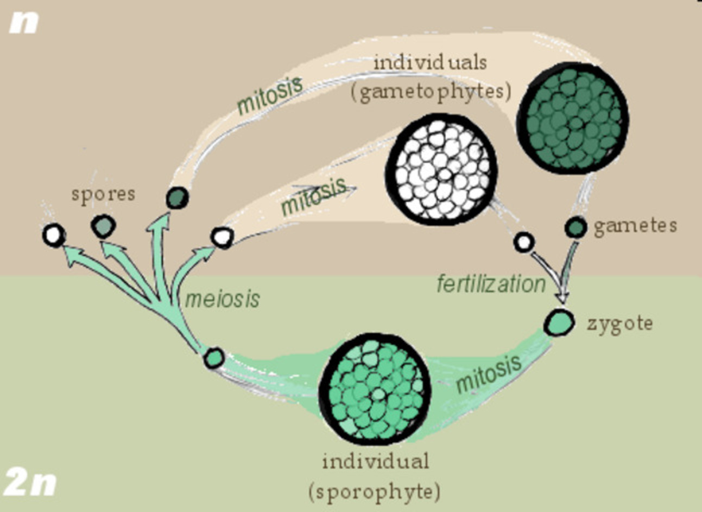

---

* 原始植物分化为\alert{苔藓}和\alert{维管}植物. 
* 维管植物分化为\alert{蕨类}和\alert{种子}植物. 
* 种子植物分化为\alert{裸子}植物和\alert{被子}植物: 
    * 裸子植物: 3 亿年前产生, 胚珠裸露;
    * 被子植物: 1.3 亿年前产生, 胚珠包被, 双受精.

---

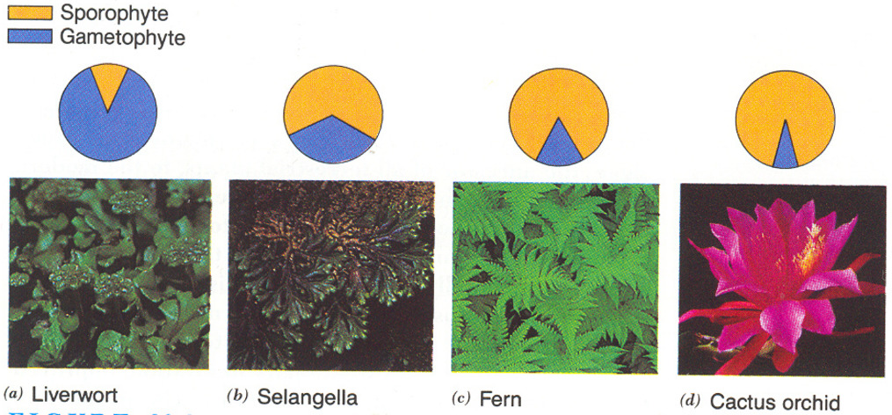

\note{

地钱

卷柏   九死还魂草

蕨

昙花

}

## 30.2.2 植物对陆地生活的适应

* 形态结构适应
    * 防止水分散失: 气孔, 角质层
    * 根, 茎, 叶的分化: 适应空气, 土壤介质
    * 维管系统的出现: 
        * 支持
        * 运输
* 生殖器官的进化: 
    * 防止配子干燥失水
    * 配子囊的 ``保护'' 功能: 生殖细胞被无生殖功能细胞包被
    * 配子的 ``运动'' 功能: 水中自由运动到风媒和虫媒

# 30.3 陆生植物多样性的进化

## 30.3.1 苔藓植物

* 苔藓植物的分类: 
    * 苔纲: 无茎叶分化, 地钱
    * 藓纲: 有茎叶分化, 葫芦藓
    * 角苔纲

---

\begin{figure}
    \begin{minipage}[b]{.6\linewidth}
        \includegraphics{ch-30.images/image5.jpg}
        \subcaption{地钱}
    \end{minipage}
    \hfill
    \begin{minipage}[b]{.38\linewidth}
        \includegraphics{ch-30.images/image6.jpg}
        \subcaption{葫芦藓}
    \end{minipage}
\end{figure}

---

* 苔藓植物的陆地适应: 
    * 角质层: 保护功能, 防止水分散失; 
    * 假根: 从土壤中吸收营养; 
    * 生殖细胞被包裹: 保护作用, 维持湿度. 

---

* 苔藓植物的生活史
    * 配子体为主 (光合自养, 营养体), 叶状体或茎叶体, 有性生殖过程需水, 精子有鞭毛.
    * 孢子体寄生, (配子体) 无性生殖过程不受水的限制.

---

\begin{figure}
    \begin{minipage}[b]{.48\linewidth}
        \includegraphics{ch-30.images/image8.jpg}
    \end{minipage}
    \hfill
    \begin{minipage}[b]{.48\linewidth}
        \includegraphics{ch-30.images/image9.jpg}
    \end{minipage}
    \caption{地钱的配子体与孢子体}
\end{figure}

\note{

配子体: 叶状体, 腹(假根), 背(光合).

雌雄异体: 雌(颈卵器), 雄(精子器);

精子有鞭毛, 在水中游入颈卵器进行受精作用, 只能生活在潮湿的地方(贴近地面). 

孢子体: 基足, 蒴柄和胞蒴.

寄生生活: 基足吸收营养;

少数有叶绿体.

}

---

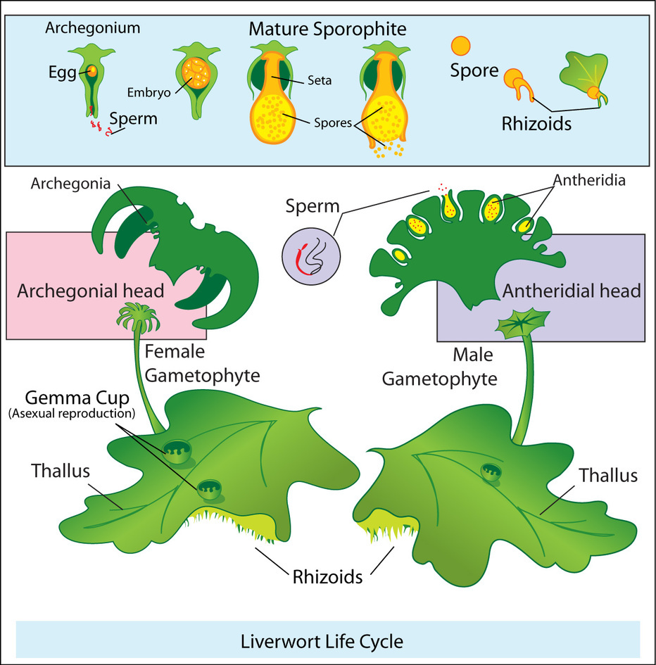

\note{

苔藓植物的生活史 (地钱):

无性生殖过程: 配子体的营养繁殖, 胞芽 (芽杯).

有性生殖过程: 离不开水.

}

## 30.3.2 蕨类植物

* 蕨类植物 (无种子维管植物) 的分类:
    * 裸蕨类, 石松类, 楔叶类, 真蕨类. 
* 常见蕨类植物: 
    * 蕨, 海金沙, 贯众, 桫椤等. 

---

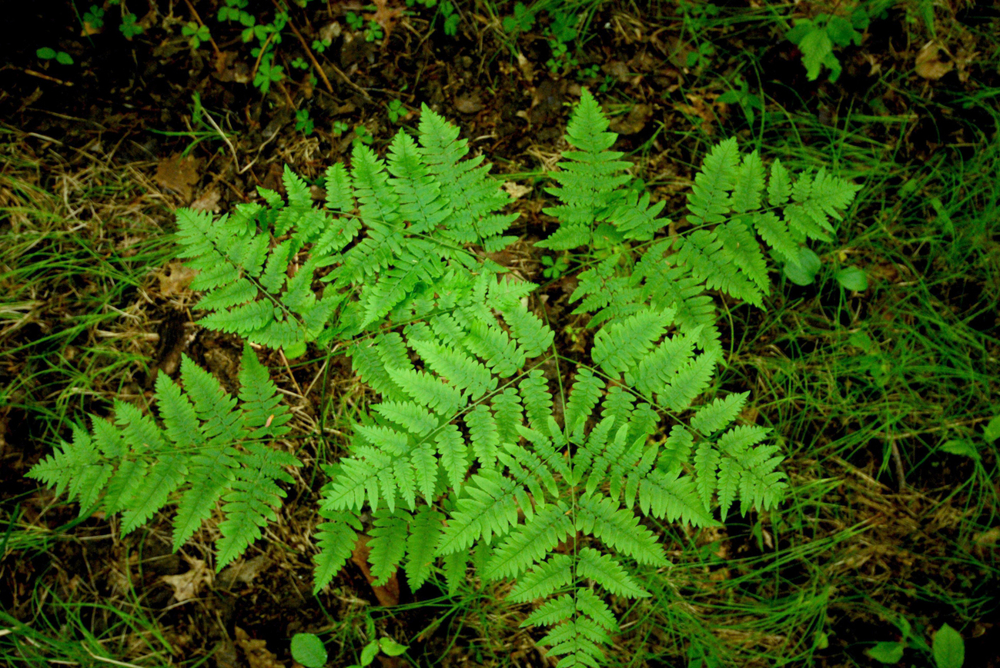

\note{

蕨菜, 嫩叶柄可食

原蕨苷, 人食用会导致癌症的发病率提高

}

---

\note{

干燥成熟孢子为中药材

}

---

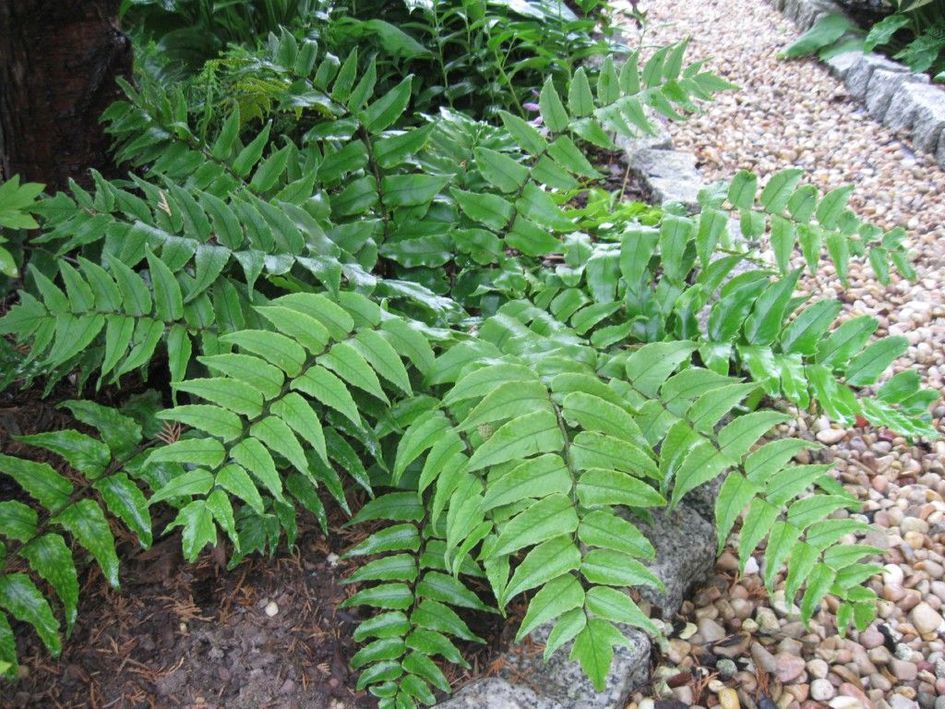

\note{

根茎及叶柄残基为中药材

}

---

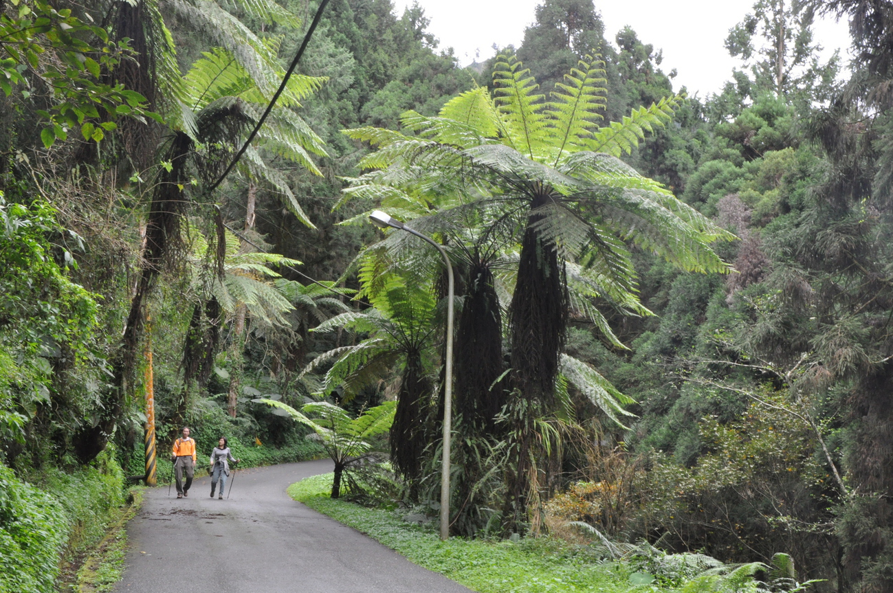

\note{

保护植物

}

---

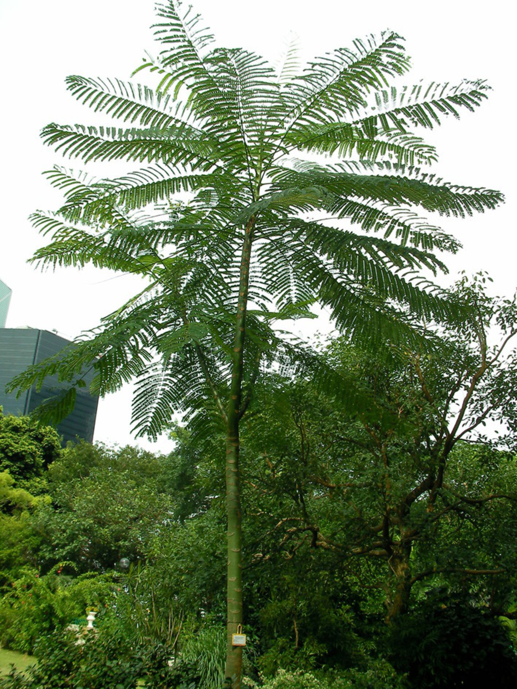

---

---

蕨类植物的进化特征: 

* 孢子体光合自养, 胚胎阶段从配子体吸取营养; 
* 有维管组织, 有根, 茎, 叶分化; 
* 孢子体营养体, 世代时间长. 

---

* 维管植物的生活史
    * 孢子体占优势 (光合自养, 独立生活), 无性生殖过程不受水的限制.
    * 配子体: 
	    * 蕨类: 原叶体, 精子有鞭毛, 有性过程需水; 
	    * 种子植物: 配子体高度简化, 有性过程摆脱对水的依赖. 

---

\begin{figure}
    \begin{minipage}[b]{.48\linewidth}
        \includegraphics{ch-30.images/image10.jpg}
    \end{minipage}
    \hfill
    \begin{minipage}[b]{.48\linewidth}
        \includegraphics{ch-30.images/image12.jpg}
    \end{minipage}
    \caption{蕨类植物的孢子体与配子体}
\end{figure}

\note{

Dicksonia antarctica 软树蕨 

孢子体: 具根, 茎, 叶分化.

叶: 羽状复叶, 叶脉分支, 有角质层, 气孔.

生殖器官: 孢子叶(叶背面着生孢子囊).

减数分裂产生同型孢子, 发育形成配子体. 

配子体: 原叶体, 可独立生活.

原叶体(同时着生雌雄配子体), 光合细胞, 假根.

有性过程需水: 精子有鞭毛.

生活史特点: 孢子体发达, 配子体退化(仍可独立生活). 

}

---

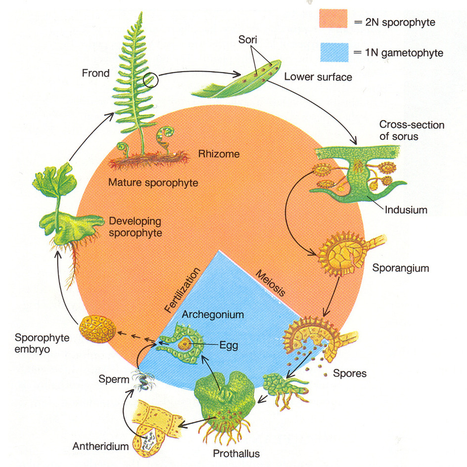

---

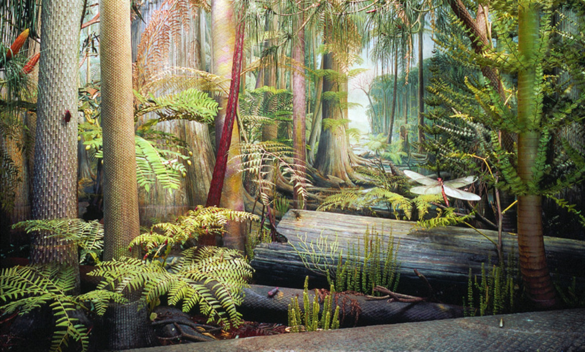

## 30.3.3 裸子植物

这类植物形成种子, 但种子是裸露的, 故称裸子植物. 

裸子植物的分类: 苏铁类, 银杏类, 红豆杉类, 买麻藤类, 松柏类. 

常见的有松, 杉, 柏, 苏铁, 还有中国特有的银杏, 银杉, 水杉等. 

\note{

1941年年我国前中央大学森林系干铎教授, 在川鄂交界的一个深山谷地, 竟意外地发现了拟北美红杉生存种――水杉, 1948年公布于世. 

}

---

---

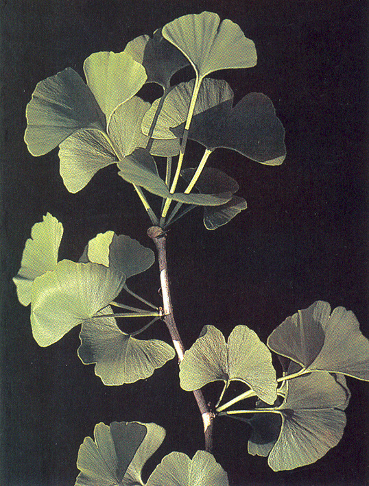

---

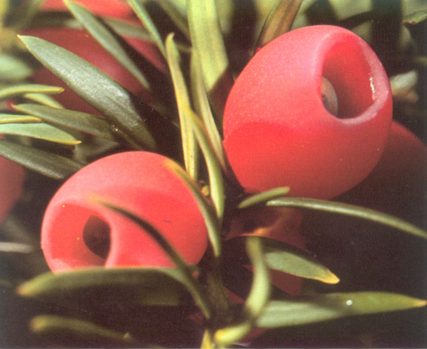

---

---

\begin{figure}
    \begin{minipage}[b]{.38\linewidth}
        \includegraphics{ch-30.images/image23.jpg}
    \end{minipage}
    \hfill
    \begin{minipage}[b]{.58\linewidth}
        \includegraphics{ch-30.images/image24.jpg}
    \end{minipage}
    \caption{巨杉}
\end{figure}

\note{

Sequoiadendron giganteum

}

---

\begin{figure}
    \begin{minipage}[b]{.48\linewidth}
        \includegraphics{ch-30.images/image25.jpg}
    \end{minipage}
    \hfill
    \begin{minipage}[b]{.48\linewidth}
        \includegraphics{ch-30.images/image26.jpg}
    \end{minipage}
    \caption{红杉}
\end{figure}

\note{

Sequoia sempervirens

}

---

裸子植物的进化特征: 

* 花和花粉的出现: 有性过程不需水. 
* 种子的出现: 加强对胚的保护, 提高幼小孢子体对不良环境的抵抗能力. 

---

裸子植物对陆地的征服

* 生殖过程摆脱水的限制: 风力传粉受精. 
* 土壤营养的高效: 直根系, 利用深层水. 
* 减少水分散失: 叶针状或鳞状, 角质层, 气孔窝. 

裸子植物的地质时期: 二叠纪至中生代

\note{

琥珀

}

---

生活史特点: 

* 孢子体特别发达, 都是多年生木本植物. 
* 配子体非常微小, 构造简单, 完全寄生在孢子体上. 种子成熟时成为种子中的胚乳, 贮存养料, 供种子萌发时胚来利用. 

---

裸子植物的有性生殖过程 (松)

* 雄配子体: 小孢子叶, 背面两个小孢子囊; 
* 雌配子体: 胚珠, 颈卵器. 

---

受精过程: 摆脱水的限制, 风力传播. 

* 花粉粒翅状突起, 随风飘荡, 到达胚珠; 
* 花粉管生长, 进入珠心, 停止生长, 次年再发育; 
* 精子和卵子结合成合子, 再发育成胚; 
* 多胚现象: 一个雌配子体上几个颈卵器同时受精. 
* 前一世代的珠被 (2n) 发育成种皮, 雌配子体 (n) 发育成胚乳, 贮存养料, 供幼胚 (2n) 营养.

---

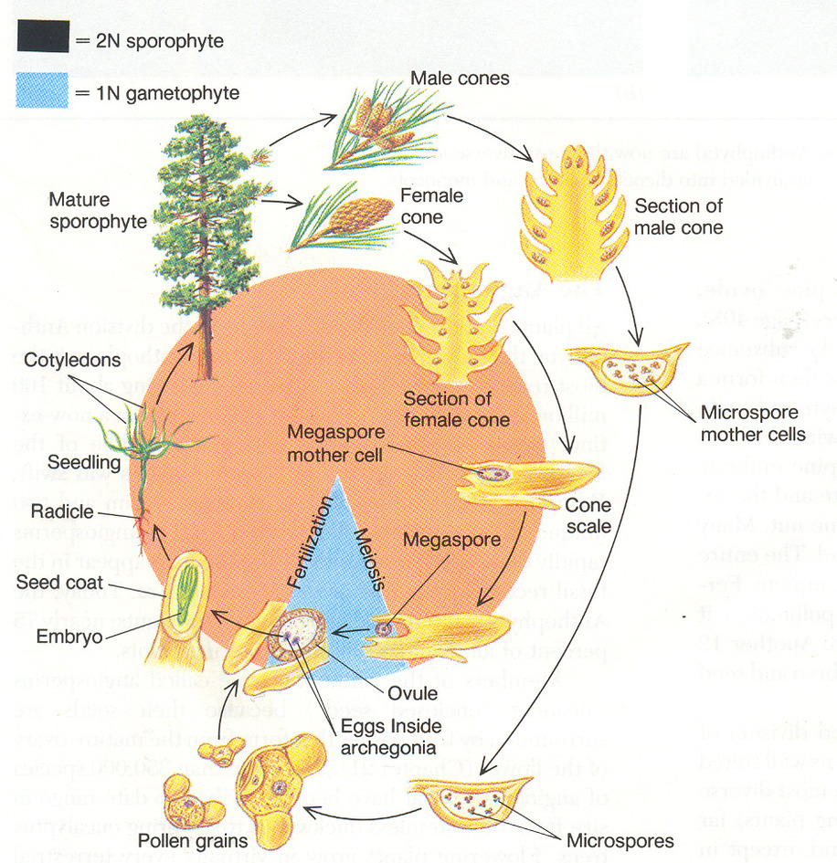

## 30.3.4 被子植物

最进化的植物类群, 现今地球上的优势物种. 约20多万种, 占植物种数的一半以上. 

有真正的花. 因此又称有花植物. 

---

被子植物的进化特征

* 传粉方式: 绝大多数虫媒; 
* 胚珠不再裸露: 子房壁发育成果实 (种子传播);
* 受精时间更短, 更经济; 
* 双受精方式, 胚乳三倍或多倍体; 
* 雌雄配子体进一步退化; 雄配子体 (花粉) --- 2或3细胞; 雌配子体 (胚囊) --- 8核7细胞.
* 孢子体组织分化细致, 生理机能效率更高. 

---

---

\begin{figure}
    \begin{minipage}[b]{.58\linewidth}
        \includegraphics{ch-30.images/image30.jpg}
    \end{minipage}
    \hfill
    \begin{minipage}[b]{.38\linewidth}
        \includegraphics{ch-30.images/image31.jpg}
    \end{minipage}
    \caption{被子植物雄配子体}
\end{figure}

---

---

被子植物资源的利用

* 被子植物与人类的关系
	* 食物，纺织纤维，绿化植物等。
* 被子植物与其他生物的关系 (协同发展)
	* 鸟类和昆虫提供食物，鸟类和昆虫则帮助被子植物传粉和散布果实与种子。

## 30.3.5 重新适应水生和异奍的植物
