* 植物: 生产者, 光合自养.
* 动物: 消费者, 吞咽式异养.
* 真菌: 分解者, 吸收式异养.

\note{
~100,000 species described, though the actual number may be as many as 1.5 million.
}

## 真菌的结构

* 细胞组成: 菌丝
    * 基本结构: 菌丝有横隔(细胞一到二核), 或无(细胞多核).
    * 细胞器: 无叶绿体, 质体.
    * 细胞壁: 壳多糖(几丁质, 甲壳素, chitin).

\note{
真菌与动物更近缘些, 尽管曾经被认为是植物

}

---

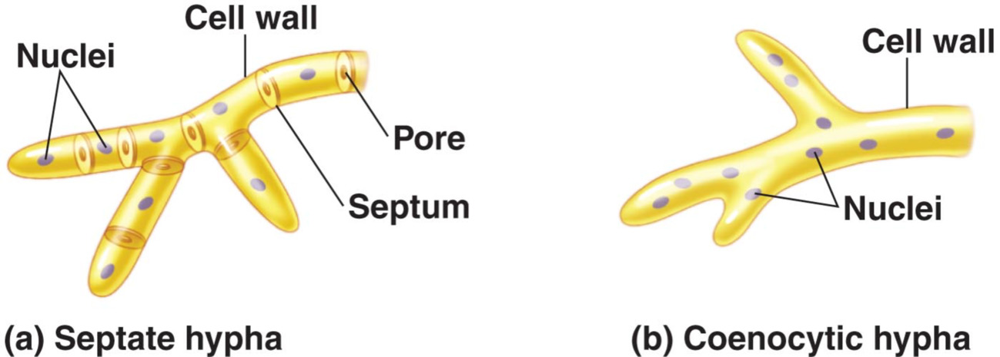

\note{
播放细胞质运动视频
}

---

* 营养体除少数为单细胞(如酵母)外, 一般是分枝或不分枝的菌丝(hypha), 或由菌丝组成的菌丝体(mycelium).

\begin{figure}
    \begin{minipage}[b]{.48\linewidth}
        \includegraphics{ch-31.images/image34.jpg}
    \end{minipage}
    \hfill
    \begin{minipage}[b]{.48\linewidth}
        \includegraphics{ch-31.images/hyphae.jpg}
    \end{minipage}
    \caption{菌丝体}
\end{figure}

---

\begin{figure}
    \begin{minipage}[b]{.3\linewidth}
        \includegraphics{ch-31.images/D-Glucose.png}
        \subcaption{葡萄糖}
    \end{minipage}
    \hfill
    \begin{minipage}[b]{.3\linewidth}
        \includegraphics{ch-31.images/alpha-D-glucosamine.png}
        \subcaption{葡糖胺}
    \end{minipage}    
    \hfill
    \begin{minipage}[b]{.3\linewidth}
        \includegraphics{ch-31.images/N-Acetyl-beta-D-glucosamine.png}
        \subcaption{N-乙酰葡糖胺}
    \end{minipage}
    \hfill
    \begin{minipage}[b]{.5\linewidth}
        \includegraphics{ch-31.images/640px-Chitin.svg.png}
        \subcaption{壳多糖}
    \end{minipage}
\end{figure}

\note{
几丁质为为长链状聚合物，是由约8000个葡萄糖的衍生物，N-乙酰葡糖胺作为单体聚合而成，是自然界的一种半透明而坚固的材料，常见于真菌的细胞壁和节肢动物（如虾、蟹）或昆虫的外骨骼。

几丁质与属多糖的纤维素类似，都会构成奈米纤维或细毛状的晶体结构。在实际功能上，则近于构成皮肤的角蛋白，因为具有这些特性，几丁质在医学和工业上具有实用价值。
}

---

* 养分: 糖原(glycogen)
    * 又称肝糖, 动物淀粉

    
\note{
糖原是人类等动物和真菌储存糖类的主要形式

在肝脏细胞（肝细胞），糖原可以在饭后不久构成高达其鲜重（成年人100-120克）的8％。

只有储存在肝脏的糖原可以由其他器官使用。在肌肉，糖原的浓度较低（约肌肉质量的1-2％）。

糖原的结构与支链淀粉相似，由α-1,4-糖苷键和支链连接处的α-1,6-糖苷键连接而成。

与支链淀粉在结构上的主要区别在于，糖原的支链多大约8～12个葡萄糖就有一个分支（支链淀粉一般是每隔24～30个葡萄糖才有一个分支）且分支有12～18个葡萄糖分子。

}

## 真菌的营养生活

方式: 腐生或寄生

亦可与藻类或植物等形成互利的共生结合体, 如地衣和菌根.

---

\note{
生物农药
}

---

* 具体过程:
    * 分泌水解酶, 分解食物成可溶性小分子;
    * 利用菌丝内高渗透压吸收食物.
* 菌丝与其吸收异养生活相适应的结构特点:
    * 可分泌水解酶消化植物细胞壁;
    * 柔韧性高, 可变态成各种吸器, 接触面积大;
    * 生长迅速.

# 31.2 真菌多样性的进化

---

真菌的三种主要类型

1. 接合菌
2. 子囊菌
3. 担子菌

根据营养体的形态和生殖方法的不同.

---

## 31.2.1 接合菌

\begin{figure}
    \begin{minipage}[b]{.38\linewidth}
        \includegraphics{ch-31.images/Rhizopus_structure.jpg}
    \end{minipage}
    \hfill
    \begin{minipage}[b]{.58\linewidth}
        \includegraphics{ch-31.images/bread_mold.jpg}
    \end{minipage}
    \caption{代表种: 黑根霉}
\end{figure}

---

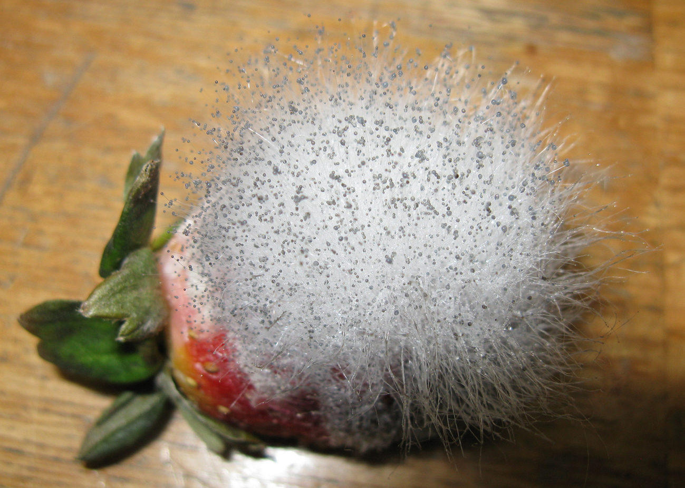

---

* 营养体特征:
    * 菌丝无间隔;
    * 核单倍;
    * 假根吸收营养.

---

* 无性生殖: 菌丝顶端膨胀成孢子囊, 散落萌发成新菌丝体.

---

* 有性生殖: 环境恶劣时进行.
    * 两种交配型菌丝体, +, -
    * 胞质融合, 核融合

* 有性生殖过程:
    * 横隔隔开单倍体核, 配子囊形成;
    * 配子囊融合, 形成二倍体的接合孢子;
    * 接合孢子中止休眠, 二倍体核减数分裂成多个单倍异配孢子;
    * 孢子囊壁破裂, 孢子萌发.

---

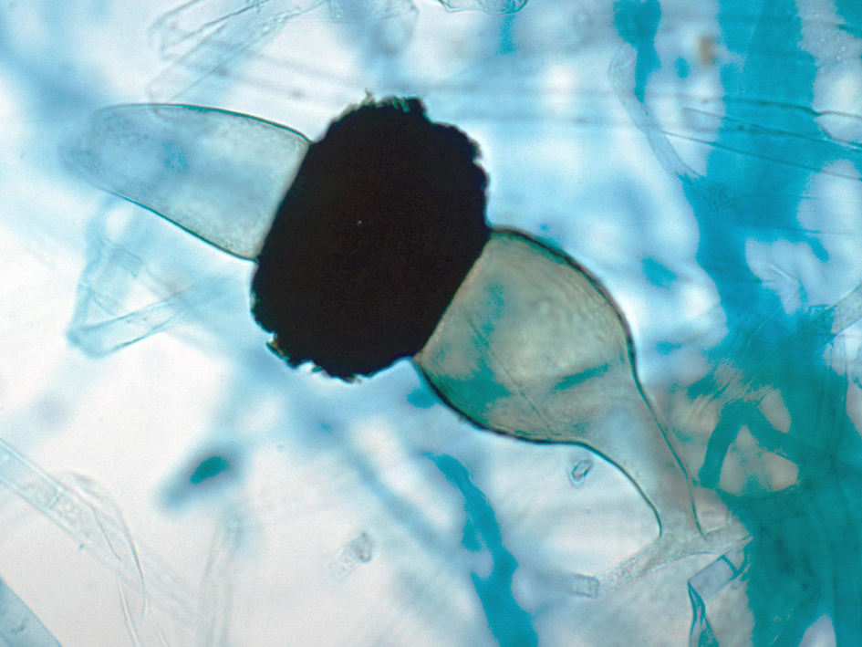

---

\begin{figure}
    \begin{minipage}[b]{.48\linewidth}
        \includegraphics{ch-31.images/Zygorhynchus_moelleri_SEM_zygospore.jpg}
        \subcaption{Zygorhynchus moelleri}
    \end{minipage}
    \hfill
    \begin{minipage}[b]{.48\linewidth}
        \includegraphics{ch-31.images/Absidia_spinosa_SEM_zygospore.jpg}
        \subcaption{Absidia spinosa}
    \end{minipage}
    \caption{扫描电镜下的接合孢子}
\end{figure}

\note{
卵孢接霉
犁头霉
}

---

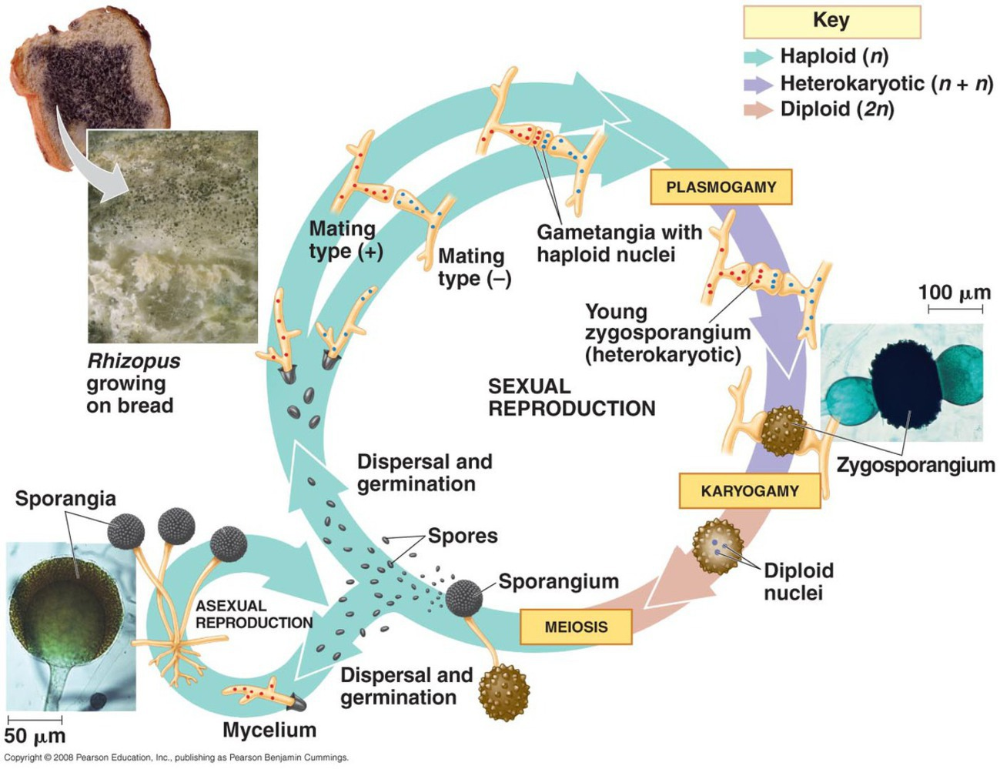

---

\note{
播放两个视频

}

---

## 31.2.2 子囊菌

\begin{figure}
    \begin{minipage}[b]{.48\linewidth}
        \includegraphics{ch-31.images/Pyronema_domesticum.jpg}
        \subcaption{砖火丝菌}
    \end{minipage}
    \hfill
    \begin{minipage}[b]{.48\linewidth}
        \includegraphics{ch-31.images/Pyronema_omphalodes.jpg}
        \subcaption{火烧火丝菌}
    \end{minipage}
    \caption{代表种: 火丝菌}
\end{figure}

---

* 营养体特征:
    * 菌丝具横隔, 多分枝.
* 常见子囊菌:
    * 酵母、青霉、冬虫夏草.

---

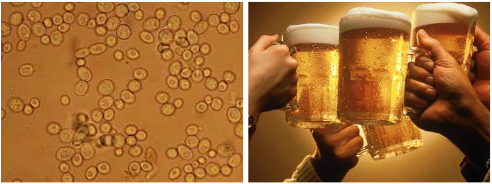

---

\note{
在1928年，科学家亚历山大·弗莱明在圣者玛利亚医院进行葡萄球菌相关的研究.

在他假期出去游玩的时候，放了一些标本在桌子上, 期望他们能够在他外出的时候生长繁衍

当弗莱明回来继续这个实验室中的细菌实验的时候

他发现他的细菌标本全死了, 它们被真菌彻底的干掉了

这激起了他的好奇心

弗莱明进一步测试了他的标本

他意识到可能是实验室上的孢子落在了培养基上然后生长

孢子开始快速地享用大餐, 排挤并且最终杀灭细菌

弗莱明没有忽视它的意义, 盘尼西林

}

---

\note{

并且虫草素是由所有细胞中的腺甘酸经过小幅的化学反应得来的化合物, 他们只有一个氧原子不同

但是由于一些原因，只有冬虫夏草能够合成虫草素, 尽管所有的生物都生产腺甘酸

虫草素中止了poly-A tails的合成, 所以它也许没有杀死细胞

但是重要的是它阻止了癌细胞的生长, 通过切断癌细胞生长的必要机制, 这是研发癌症药物的一个全新的理论

那么基于其它不同原理的癌症药物, 所以这能够成为一个新的药物种类, 不仅仅用于癌症，也可以用于炎症性的疾病

}

---

\begin{figure}
    \begin{minipage}[b]{.48\linewidth}
        \includegraphics{ch-31.images/image51.jpg}
    \end{minipage}
    \hfill
    \begin{minipage}[b]{.48\linewidth}
        \includegraphics{ch-31.images/image53.jpg}
    \end{minipage}
    \caption{肉杯菌 Sarcoscypha coccinea}
\end{figure}

\note{
红精灵杯 red elf cup
}

---

* 无性生殖: 菌丝顶端产生分生孢子.

\begin{figure}
    \begin{minipage}[b]{.48\linewidth}
        \includegraphics{ch-31.images/Aspergillus_flavus.jpg}
    \end{minipage}
    \hfill
    \begin{minipage}[b]{.48\linewidth}
        \includegraphics{ch-31.images/Aspergillus_flavus_SEM_rough_conidiophore.jpg}
    \end{minipage}
    \caption{黄曲霉的分生孢子}
\end{figure}

---

* 有性生殖: 形成子囊、子囊孢子.

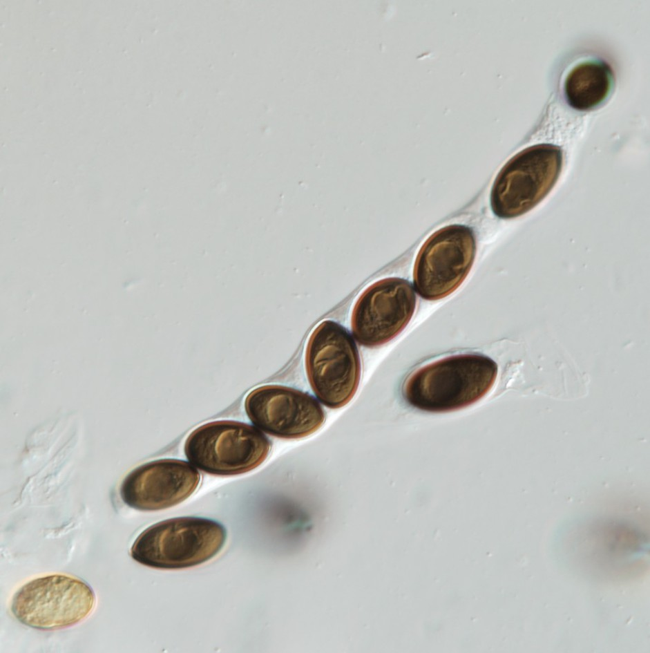

\note{
Ascomycetes are named for the ascus, an 8-spored sac which is used for spore dispersal. (Hence the common name, sac-fungi) 

In this scanning electron micrograph the ascus coat is peeled away revealing 8 spores.

}

---

\begin{figure}
    \begin{minipage}[b]{.48\linewidth}
        \includegraphics{ch-31.images/image48.jpg}
    \end{minipage}
    \hfill
    \begin{minipage}[b]{.48\linewidth}
        \includegraphics{ch-31.images/image49.jpg}
    \end{minipage}
    \caption{子囊孢子}
\end{figure}

---

* 有性生殖过程:
    * 产生多核的精子囊和产囊体;
    * 产囊菌丝的形成, 一对核;
    * 子囊果和子囊母细胞的形成;
    * 雌雄核融合, 形成含8个子囊孢子的子囊;
    * 子囊成熟, 子囊孢子射出.

---

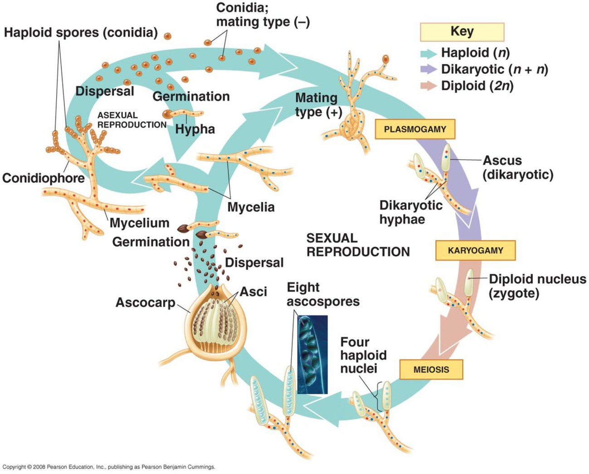

## 31.2.3 担子菌

* 代表种: 蘑菇

* 营养体特征: 菌丝具横隔.
* 有性生殖: 形成担子, 担孢子; 子实体(担子果).
* 双核期: 大多数真菌有.
* 常见担子菌:
    * 蘑菇、灵芝、木耳、银耳等.

---

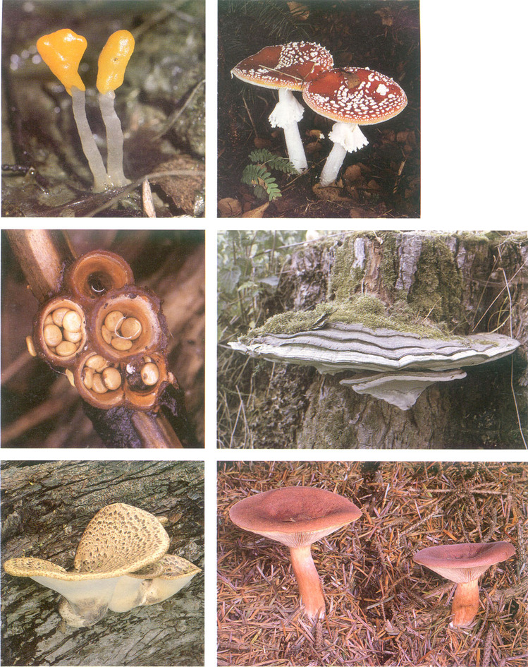

---

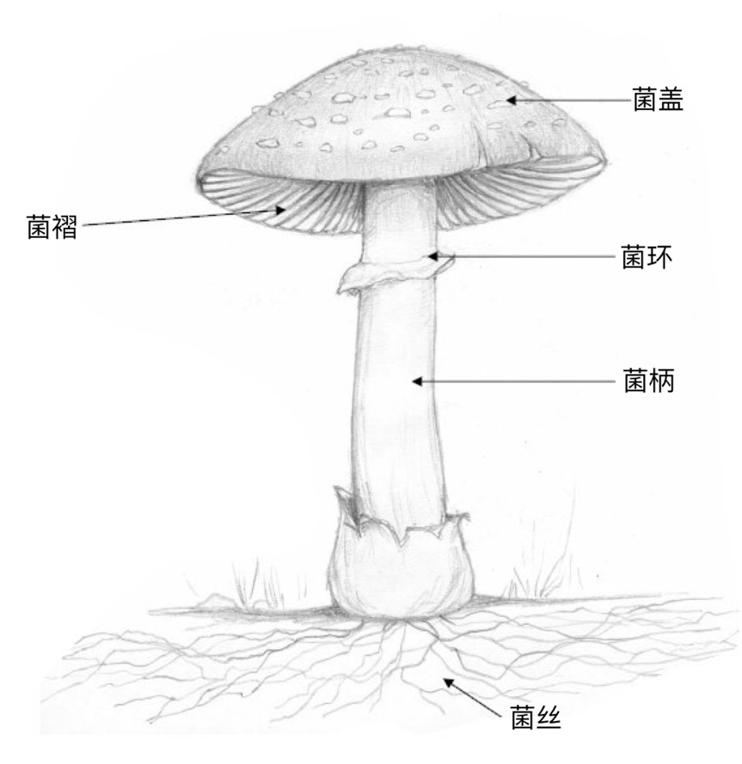

---

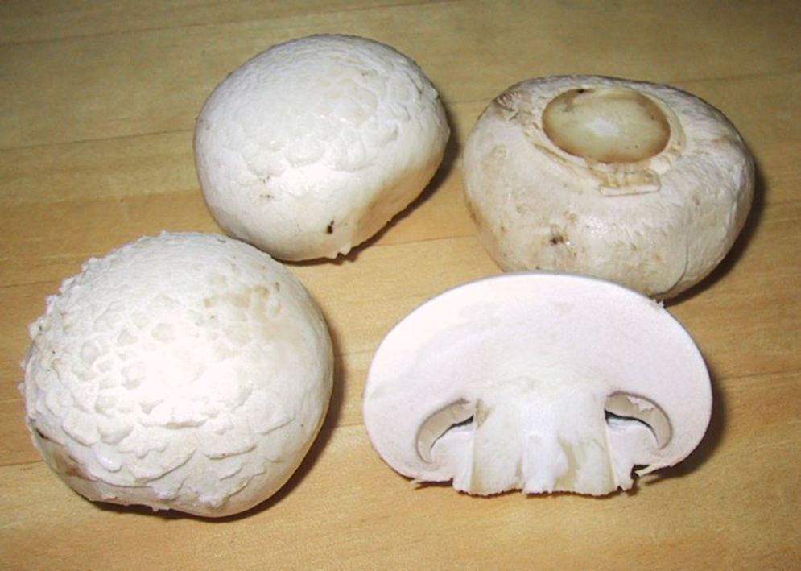

\note{
洋菇
}

---

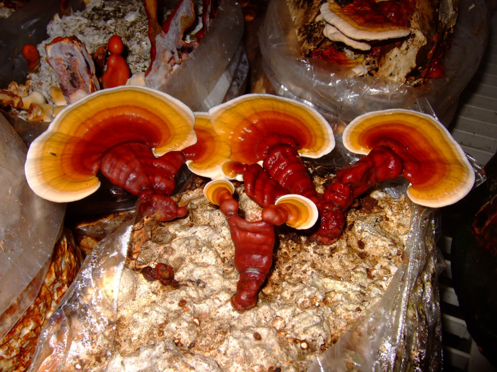

---

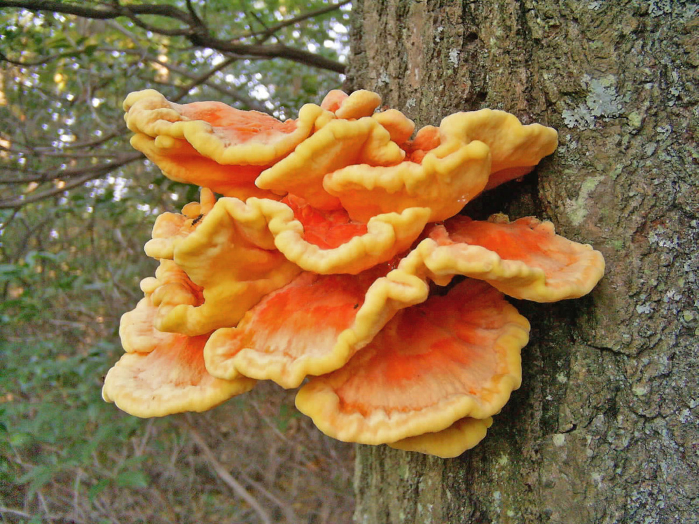

\note{
橡树上生长的硫色绚孔菌
}

---

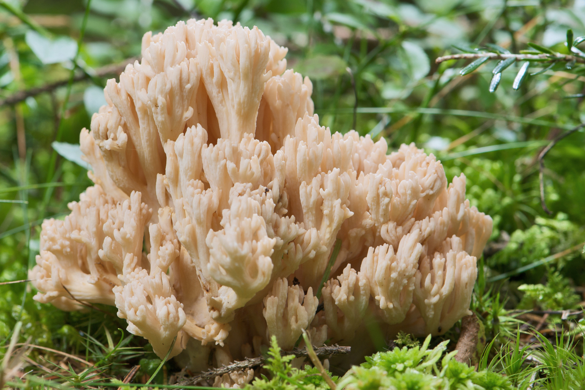

\note{
珊瑚菌的一种

人们进食粉红枝瑚菌后会引发急性胃肠道症状、恶心、呕吐、腹泻和肠绞痛，而目前引致上述病症的毒素仍然不为人类所知。如果除去了分枝的尖顶，那么粉红枝瑚菌后将会变得可食用的

}

---

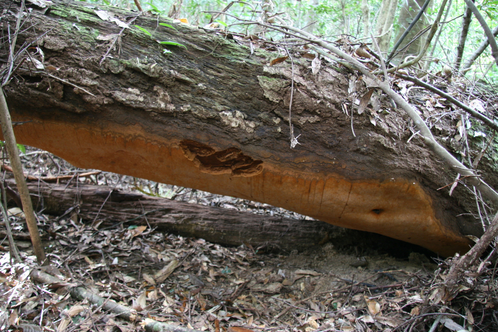

\note{
真菌子实体，俗称蘑菇，是许多大型真菌的有性生殖阶段，可产生孢子（类似于植物的种子）进行繁殖。

该研究中所报道的真菌是椭圆嗜蓝孢孔菌Fomitiporia ellipsoidea，隶属于担子菌门，伞菌亚门，伞菌纲，锈革孔菌目，锈革孔菌科。

这个巨大的子实体是2010年戴玉成研究员在海南进行木腐菌资源调查的过程中发现的，其位于海拔958米的原始林中，平伏生长于一粗壮的热带树木——托盘青冈（Cyclobalanopsis patelliformis）倒木下方。

野外观察和适量取样的实验室研究表明，该子实体已生长了20年，长度超过10米，宽度接近1米，厚度在5厘米左右，体积为409262–525140立方厘米，重量超过500千克。
}

---

\begin{figure}
    \begin{minipage}[b]{.48\linewidth}
        \includegraphics{ch-31.images/Amanita_muscaria.jpg}
        \subcaption{毒蝇伞}        
    \end{minipage}
    \hfill
    \begin{minipage}[b]{.48\linewidth}
        \includegraphics{ch-31.images/Amanita_caesarea.jpg}
        \subcaption{橙盖伞}
    \end{minipage}
    \caption{鹅膏菌属}
\end{figure}

\note{
由于人们普遍认知毒蝇伞具有毒性，因此致死的案例极端少见；而毒蝇伞在经大量水煮熟过后，于欧洲、亚洲和北美洲，成为一个广泛使用的食材。

然而，现今毒蝇伞主要著名在于它的幻觉毒性，其精神刺激作用的成分则是蝇蕈素。此毒素被西伯利亚地区居民，用来作为引起幻觉和感到灵魂出窍的药物，并在他们的文化当中，具有重要的宗教意义。

毒蝇伞在诸多欧洲语言当中的俗名，事实上起源于人们曾使用毒蝇伞，当做杀虫剂喷洒在牛奶里面。

由于它是罗马帝国众凯撒的喜好，故又被称为“凯撒磨菇”
}

---

\begin{figure}
    \begin{minipage}[b]{.48\linewidth}
        \includegraphics{ch-31.images/Amanita_phalloides.jpg}
        \subcaption{毒鹅膏}
    \end{minipage}
    \hfill
    \begin{minipage}[b]{.48\linewidth}
        \includegraphics{ch-31.images/Amanita_verna.jpg}
        \subcaption{白毒伞}
    \end{minipage}
    \caption{鹅膏菌属2}
\end{figure}

\note{
Amanita phalloides，鬼笔鹅膏, 是已知的毒菇中最毒的一种菇类。这种菇类在人类因毒菇中毒而死亡的比例中，超过了半数[1]，并且有可能是罗马皇帝克劳狄乌斯和神圣罗马帝国皇帝查尔斯六世的死因。

α-鹅膏蕈碱是一种八氨基酸的环肽，它可能是毒伞肽中毒性最强的化合物。是RNA聚合酶II和III的抑制剂，被肝细胞摄入后，导致肝细胞溶解。目前没有任何已知的决定性解毒剂被发现。

摄入10小时内出现症状的报告极少，24小时内发生明显反应常见，发生明显反应时，有毒的食物早已通过胃，这种延迟易造成误诊，也使得中毒造成的危险性提高。

腹泻与抽搐是早期症状，但这之后会经历一段虚假的缓解状态，直到第四至第五天，毒素开始对肝肾造成严重损伤，导致器官功能衰竭，一般在一周左右死亡。

白毒鹅膏，又名白毒伞（Amanita verna）

}

---

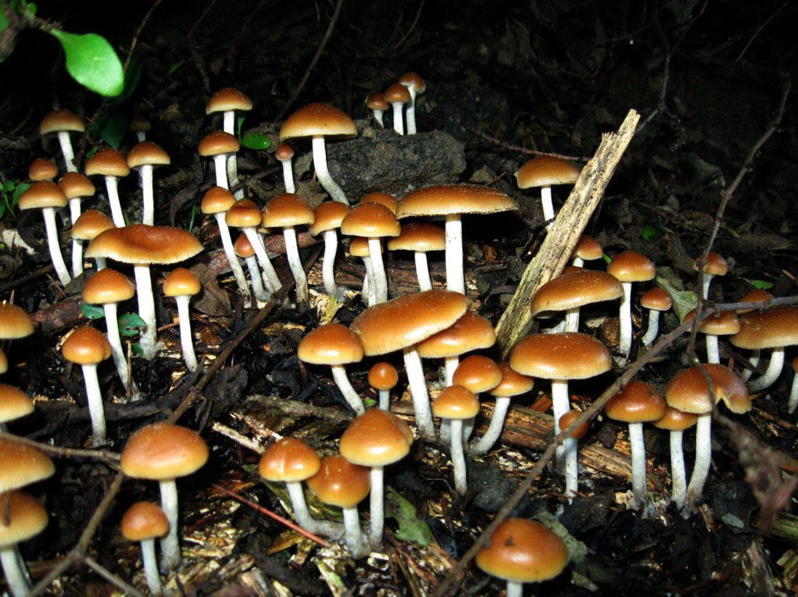

\note{
含有裸盖菇素和脱磷酸裸盖菇素等迷幻物质的蕈类

考古文献显示，早在史前时代人类就已懂得食用含有致幻性物质的蕈类。

民族植物学暨致幻剂学者乔治·萨莫里尼指出，阿杰尔高原的塔西利（北非卡普萨文化的史前遗址）的某些中石器时代石洞壁画可能记录了萨满教使用原始的迷幻魔菇的情景，并推测应为裸盖菇种[3]。

中部美洲的原住民，自前哥伦布时代，便已经使用裸盖菇属的致幻菇种于宗教共融、占卜和治疗，直至今日。

考古遗址也发现许多蕈类状的雕像，似乎印证著古代以致幻性蕈类为仪式使用的悠久历史[4]。
}

---

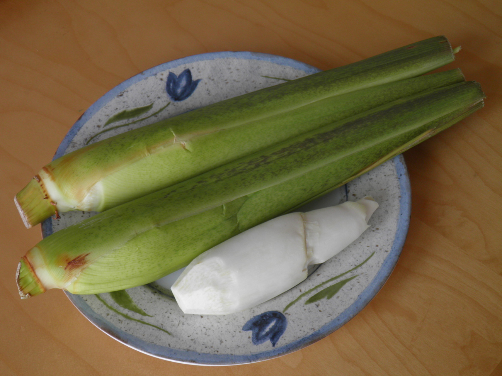

\note{
菰 gū

水生草本植物

在菰茎中寄生的茭白黑粉菌（Ustilago esculenta, 菰黑粉菌）会刺激薄壁组织的生长，使幼嫩茎部膨大，成为茭白（又名茭瓜、茭白笋），是中国南方常见的一种蔬菜。
}

---

\begin{figure}
    \begin{minipage}[b]{.48\linewidth}
        \includegraphics{ch-31.images/image59.jpg}
        \subcaption{菌褶}
    \end{minipage}
    \hfill
    \begin{minipage}[b]{.48\linewidth}
        \includegraphics{ch-31.images/image58.jpg}
        \subcaption{菌孔}
    \end{minipage}
\end{figure}

---

\begin{figure}
    \begin{minipage}[b]{.48\linewidth}
        \includegraphics{ch-31.images/Psathyrella_candolleana_spore_print.jpg}
        \subcaption{白黄小脆柄菇}
    \end{minipage}
    \hfill
    \begin{minipage}[b]{.48\linewidth}
        \includegraphics{ch-31.images/Boletus_chrysenteron_spore_print.jpg}
        \subcaption{红绒盖牛肝菌}
    \end{minipage}
    \caption{孢子印}
\end{figure}

\note{
播放spore-print.mkv

孢子印是辨别蘑菇孢子颜色的一种简便易行的方法，它能在缺乏显微镜观察或化学染色的情况下对蘑菇进行初步鉴定。

孢子印由菌褶或菌管中的孢子散落沉积而成。

制作孢子印时将菌柄切断，倒扣菌盖于纸或玻璃板上，放置数小时后就能得到一层孢子。

孢子颜色大多可被划分为4至5类：白色，粉色，赭色，和黑紫色。

}

---

* 有性生殖过程:
    * 双核菌丝体形成, 担子形成;
    * 担子果的形成;
    * 担子中双核融合成二倍体合子核;
    * 合子核减数分裂, 发育形成担孢子.

---

* 担子菌与子囊菌差异:
    * 子囊孢子在子囊内形成;
    * 担孢子在担子外形成.

\note{
播放 spore-spread.mkv

他们发现了一小滴液体，现在叫做布朗氏液, 存在于每一个孢子的底部

当孢子成熟准备要分离时, 布朗氏液由在孢子边缘的两个小水滴融合

就像两个雨滴在玻璃窗上汇合, 这次融合导致了孢子迅速大幅度的移动

它用如此壮观的方式将孢子挤出, 这一微观的过程全部是在百万分之一秒内完成的

}

---

---

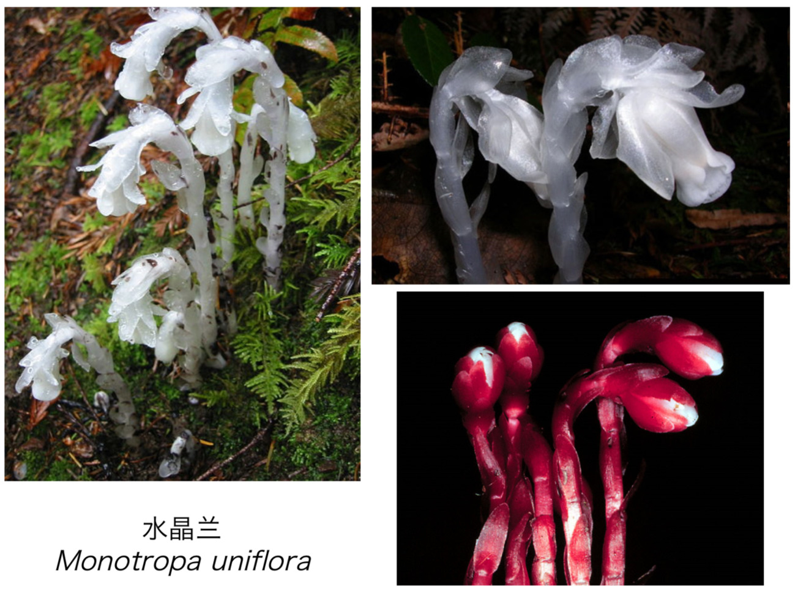

\note{
球囊菌门 Glomeromycota
}

---

\note{
球囊菌门 
}

## 31.2.4 地衣

* 地衣的结构: 真菌和绿藻的共生体
    * 藻类: 蓝藻、绿藻, 制造有机养料.
    * 真菌: 多数为子囊菌, 少数为担子菌, 提供水等.
* 地衣的基本形态: 壳状, 叶状, 枝状.
* 地衣的颜色: 灰白、暗绿、鲜红等色.

---

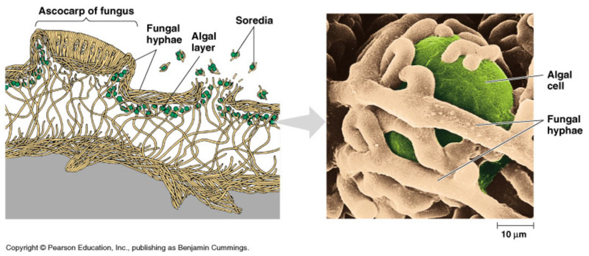

---

---

---

---

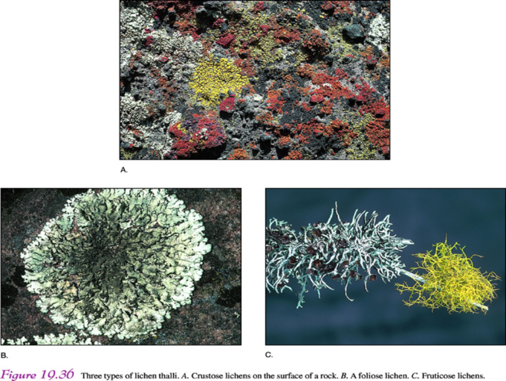

\note{
* 壳状地衣
* 叶状地衣
* 灌木状地衣

}

---

* 地衣对环境的适应
    * 生存环境: 岩石、树皮、高山、极地.
    * 北极驯鹿, 以地衣为食物.

---

* 地衣可在极端恶劣的环境中生存, 生命力极强.
    * 生长极慢, 几十年仅长几厘米, 干旱时进入休眠状态.
    * 对污染敏感, 是很好的环境指示植物.
* 地衣又是自然界的先锋植物. 
    * 它能促进岩石的风化和土壤的形成, 为其它生物的生存创造条件.
