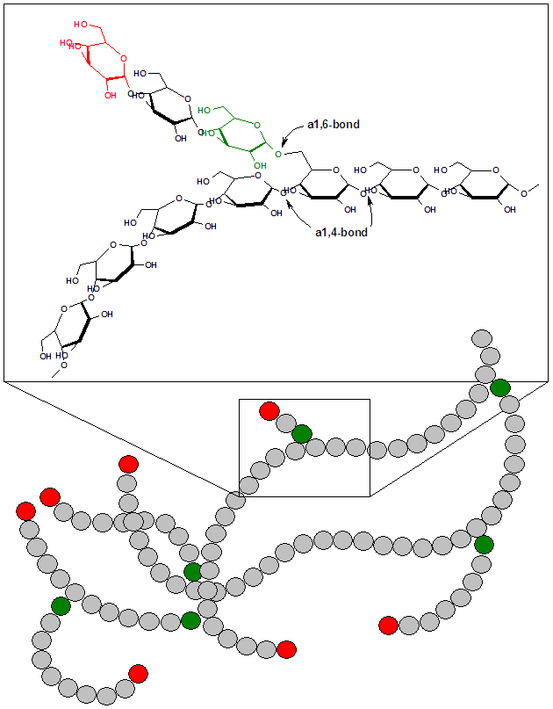
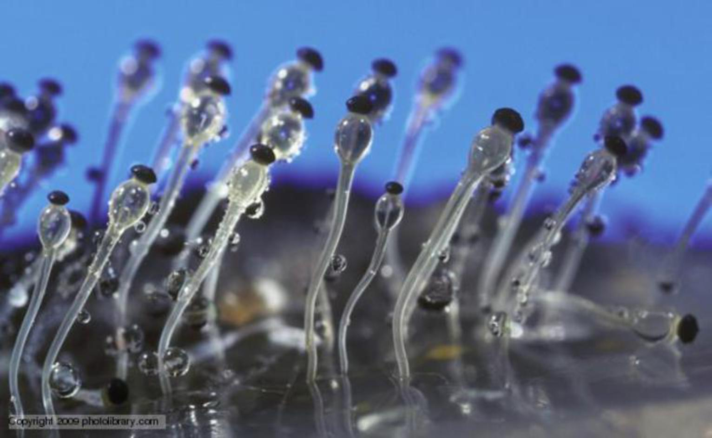
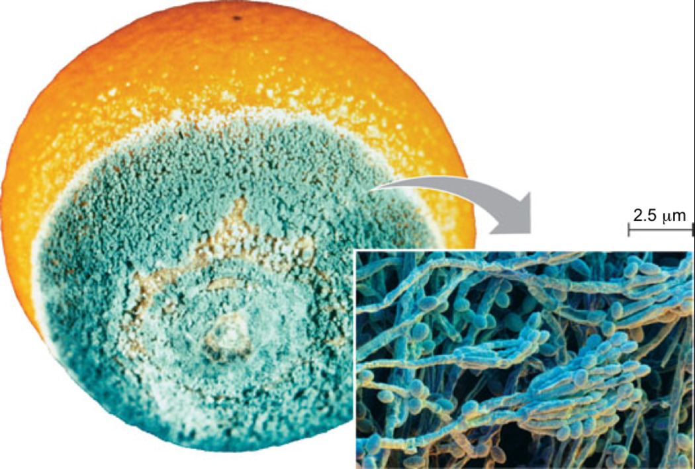
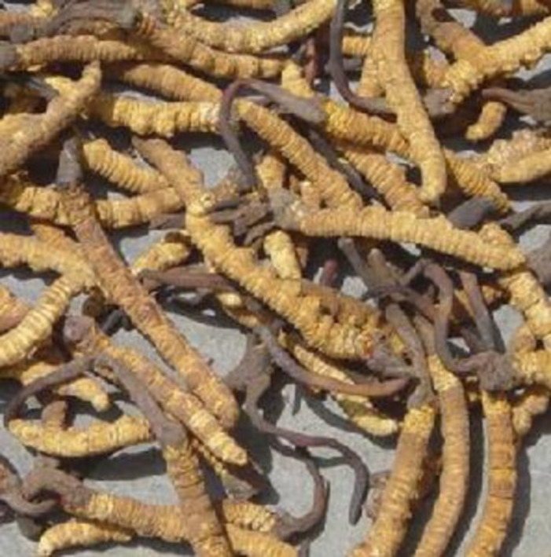
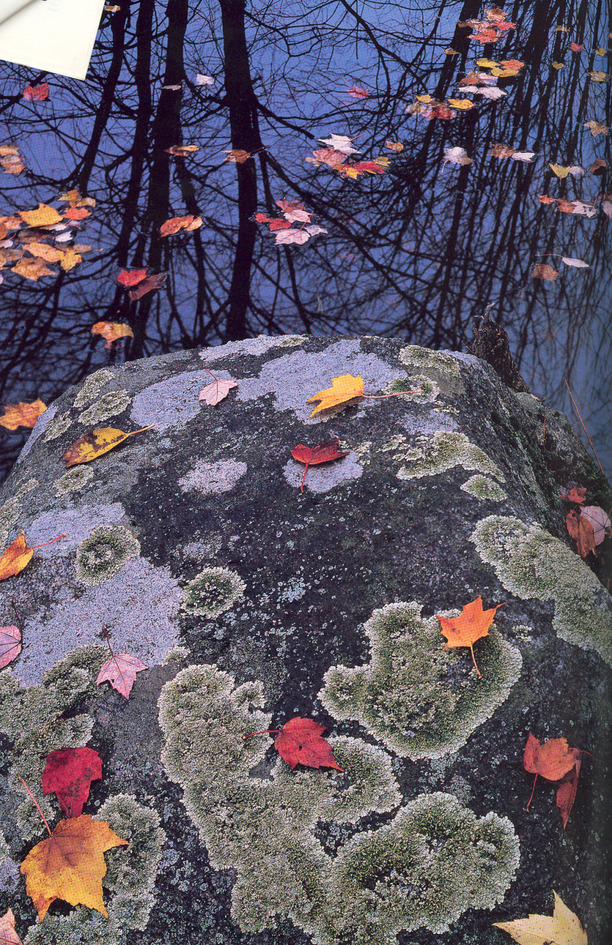
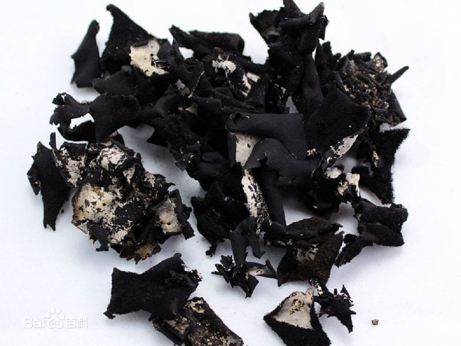

* 植物: 生产者, 光合自养.
* 动物: 消费者, 吞咽式异养.
* 真菌: 分解者, 吸收式异养.

## 真菌的结构

* 菌丝体: 营养体除少数为单细胞(如酵母)外, 一般是分枝或不分枝的菌丝, 或由菌丝组成的菌丝体.

\begin{figure}
    \begin{minipage}[b]{.48\linewidth}
        \includegraphics{ch-31.images/image34.jpg}
    \end{minipage}
    \hfill
    \begin{minipage}[b]{.48\linewidth}
        \includegraphics{ch-31.images/hyphae.jpg}
    \end{minipage}
    \caption{菌丝体}
\end{figure}

---

* 细胞组成: 菌丝
    * 基本结构: 菌丝有横隔(细胞一到二核), 或无(细胞多核).
    * 细胞器: 无叶绿体, 质体.
    * 细胞壁:壳多糖(几丁质).

\note{
播放细胞质运动视频
}

---

* 养分: 糖原(glycogen)
    * 又称肝糖, 动物淀粉

    
\note{
糖原是人类等动物和真菌储存糖类的主要形式
}

## 真菌的营养生活

方式: 腐生或寄生

亦可与藻类或植物等形成互利的共生结合体, 如地衣和菌根.

---

\note{
生物农药
}

---

* 具体过程:
    * 分泌水解酶, 分解食物成可溶性小分子;
    * 利用菌丝内高渗透压吸收食物.
* 菌丝与其吸收异养生活相适应的结构特点:
    * 可分泌水解酶消化植物细胞壁;
    * 柔韧性高, 可变态成各种吸器, 接触面积大;
    * 生长迅速.

# 31.2 真菌多样性的进化

---

## 31.2.1 接合菌

\begin{figure}
    \begin{minipage}[b]{.38\linewidth}
        \includegraphics{ch-31.images/Rhizopus_structure.jpg}
    \end{minipage}
    \hfill
    \begin{minipage}[b]{.58\linewidth}
        \includegraphics{ch-31.images/bread_mold.jpg}
    \end{minipage}
    \caption{代表种: 黑根霉}
\end{figure}

---

---

* 营养体特征:
    * 菌丝无间隔;
    * 核单倍;
    * 假根吸收营养.

---

* 无性生殖: 菌丝顶端膨胀成孢子囊, 散落萌发成新菌丝体.

---

* 有性生殖: 环境恶劣时进行.
    * 两种交配型菌丝体, +, -
    * 胞质融合, 核融合

* 有性生殖过程:
    * 横隔隔开单倍体核, 配子囊形成;
    * 配子囊融合, 形成二倍体的接合孢子;
    * 接合孢子中止休眠, 二倍体核减数分裂成多个单倍异配孢子;
    * 孢子囊壁破裂, 孢子萌发.

---

---

\begin{figure}
    \begin{minipage}[b]{.48\linewidth}
        \includegraphics{ch-31.images/Zygorhynchus_moelleri_SEM_zygospore.jpg}
        \subcaption{Zygorhynchus moelleri}
    \end{minipage}
    \hfill
    \begin{minipage}[b]{.48\linewidth}
        \includegraphics{ch-31.images/Absidia_spinosa_SEM_zygospore.jpg}
        \subcaption{Absidia spinosa}
    \end{minipage}
    \caption{扫描电镜下的接合孢子}
\end{figure}

\note{
卵孢接霉
犁头霉
}

---

---

\note{
播放两个视频

}

---

## 31.2.2 子囊菌

\begin{figure}
    \begin{minipage}[b]{.48\linewidth}
        \includegraphics{ch-31.images/Pyronema_domesticum.jpg}
        \subcaption{砖火丝菌}
    \end{minipage}
    \hfill
    \begin{minipage}[b]{.48\linewidth}
        \includegraphics{ch-31.images/Pyronema_omphalodes.jpg}
        \subcaption{火烧火丝菌}
    \end{minipage}
    \caption{代表种: 火丝菌}
\end{figure}

---

* 营养体特征:
    * 菌丝具横隔, 多分枝.
* 常见子囊菌:
    * 酵母、青霉、冬虫夏草.

---

---

---

---

* 无性生殖: 菌丝顶端产生分生孢子.

\begin{figure}
    \begin{minipage}[b]{.48\linewidth}
        \includegraphics{ch-31.images/Aspergillus_flavus.jpg}
    \end{minipage}
    \hfill
    \begin{minipage}[b]{.48\linewidth}
        \includegraphics{ch-31.images/Aspergillus_flavus_SEM_rough_conidiophore.jpg}
    \end{minipage}
    \caption{黄曲霉的分生孢子}
\end{figure}

---

* 有性生殖: 形成子囊、子囊孢子.

---

\begin{figure}
    \begin{minipage}[b]{.48\linewidth}
        \includegraphics{ch-31.images/image48.jpg}
    \end{minipage}
    \hfill
    \begin{minipage}[b]{.48\linewidth}
        \includegraphics{ch-31.images/image49.jpg}
    \end{minipage}
    \caption{子囊孢子}
\end{figure}

---

* 有性生殖过程:
    * 产生多核的精子囊和产囊体;
    * 产囊菌丝的形成, 一对核;
    * 子囊果和子囊母细胞的形成;
    * 雌雄核融合, 形成含8个子囊孢子的子囊;
    * 子囊成熟, 子囊孢子射出.

---

\begin{figure}
    \begin{minipage}[b]{.48\linewidth}
        \includegraphics{ch-31.images/image51.jpg}
    \end{minipage}
    \hfill
    \begin{minipage}[b]{.48\linewidth}
        \includegraphics{ch-31.images/image53.jpg}
    \end{minipage}
    \caption{肉杯菌 Sarcoscypha coccinea}
\end{figure}

\note{
红精灵杯 red elf cup
}

## 31.2.3 担子菌

* 代表种: 蘑菇

* 营养体特征: 菌丝具横隔.
* 有性生殖: 形成担子、担孢子; 担子果(子实体).
* 双核期: 大多数真菌有.
* 常见担子菌:
    * 蘑菇、灵芝、木耳、银耳等.

---

---

---

\begin{figure}
    \begin{minipage}[b]{.48\linewidth}
        \includegraphics{ch-31.images/image59.jpg}
        \subcaption{菌褶}
    \end{minipage}
    \hfill
    \begin{minipage}[b]{.48\linewidth}
        \includegraphics{ch-31.images/image58.jpg}
        \subcaption{菌孔}
    \end{minipage}
\end{figure}

---

* 有性生殖过程:
    * 双核菌丝体形成, 担子形成;
    * 担子果的形成;
    * 担子中双核融合成二倍体合子核;
    * 合子核减数分裂, 发育形成担孢子.

---

* 担子菌与子囊菌差异:
    * 子囊孢子在子囊内形成;
    * 担孢子在担子外形成.

---

\note{
球囊菌门 Glomeromycota
}

## 31.2.4 地衣

* 真菌和绿藻的共生体

---

* 地衣的结构: 真菌和绿藻的共生体
    * 藻类: 蓝藻、绿藻, 制造有机养料.
    * 真菌: 多数为子囊菌, 少数为担子菌, 提供水等.
* 地衣的基本形态: 壳状, 叶状, 枝状.
* 地衣的颜色: 灰白、暗绿、鲜红等色.

---

---

* 地衣对环境的适应
    * 生存环境: 岩石、树皮、高山、极地.
    * 北极驯鹿, 以地衣为食物.

---

---

---

---

* 地衣可在极端恶劣的环境中生存, 生命力极强.
    * 生长极慢, 几十年仅长几厘米, 干旱时进入休眠状态.
    * 对污染敏感, 是很好的环境指示植物.
* 地衣又是自然界的先锋植物. 它能促进岩石的风化和土壤的形成, 为其它生物的生存创造条件.
