\begin{columns}[onlytextwidth]
    \column{0.5\textwidth}
        灵长类(Primates)的独特生理特征
        \begin{itemize}
            \item 五指/趾
            \item 双目视觉, 分辨颜色
            \item 准确, 有力的抓握能力
            \item 灵活的四肢
            \item 相似的基因
        \end{itemize}
    \column{0.5\textwidth}
        \begin{figure}
            \includegraphics{ch-33.images/image1.jpg}
        \end{figure}
\end{columns}

---

\begin{columns}[onlytextwidth]
    \column{0.5\textwidth}
        \begin{itemize}
            \item 三维视觉
            \item 周围视觉
        \end{itemize}
    \column{0.5\textwidth}
        \begin{figure}
            \includegraphics{ch-33.images/image2.jpg}
        \end{figure}
\end{columns}

\note{
在绘画蒙娜丽莎那谜一般的微笑时，达·芬奇利用了人眼的一种生物学特质——一种被称为周围视觉(peripheral vision)的现象. 
这种现象与视网膜处理光线的方式有关. 当人们直视某件物品时，光线射在 视网膜中央被称为中央凹(fovea)的部分，该部分负责处理高空间频率(high spatial frequency)的光线. 而眼角余光看到的物体反射的光线则射到视网膜的周边部分，这一部分对中低空间频率的光线更适应. 
利文斯通认为，达·芬奇在画 中描绘的“微笑”是低空间频率的，因而会随人们注视中心的转移而发生变化. “(如果)你注视的中心是画的背景或是蒙娜丽莎的双手——这意味着你是用周边的 低频率视觉在看她的嘴——她的嘴会显得欢悦许多. 她的微笑在你望向她的嘴时凋谢，正如在你直视时就会消失不见的暗淡星光. ” 

}

---

\begin{columns}[onlytextwidth]
    \column{0.5\textwidth}
        人与其它灵长类共有的行为
        \begin{itemize}
            \item 家庭为生活单位
            \item 使用工具
            \item 暴力行为
            \item 智慧地解决问题
        \end{itemize}
    \column{0.5\textwidth}
        \begin{figure}
            \includegraphics{ch-33.images/image4.jpg}
        \end{figure}
\end{columns}

---

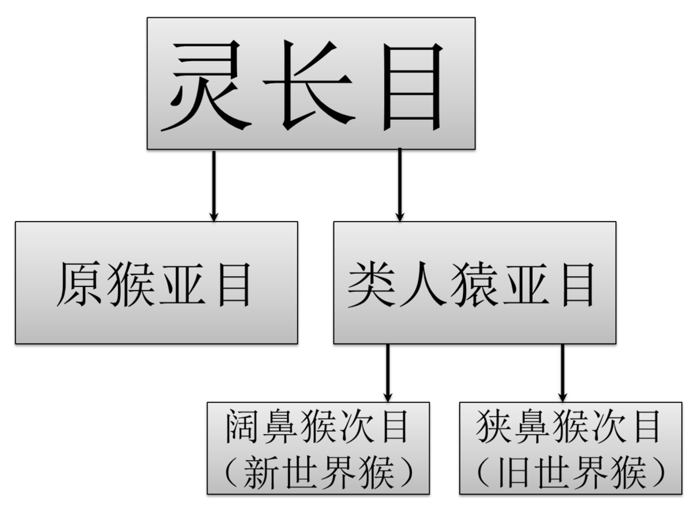

---

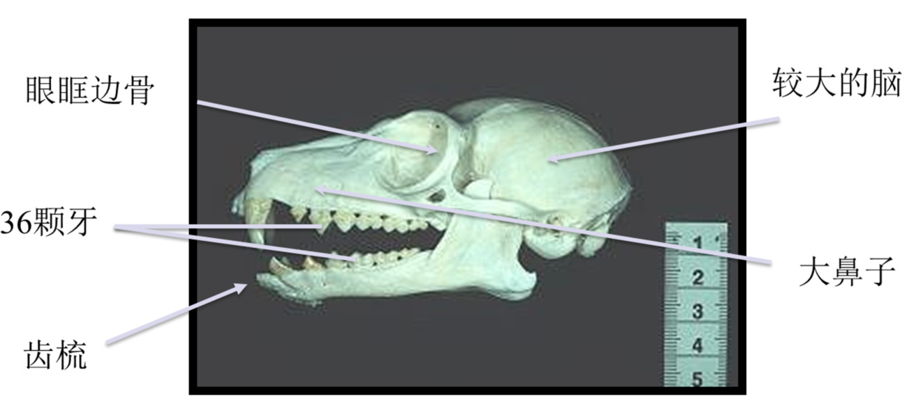

---

---

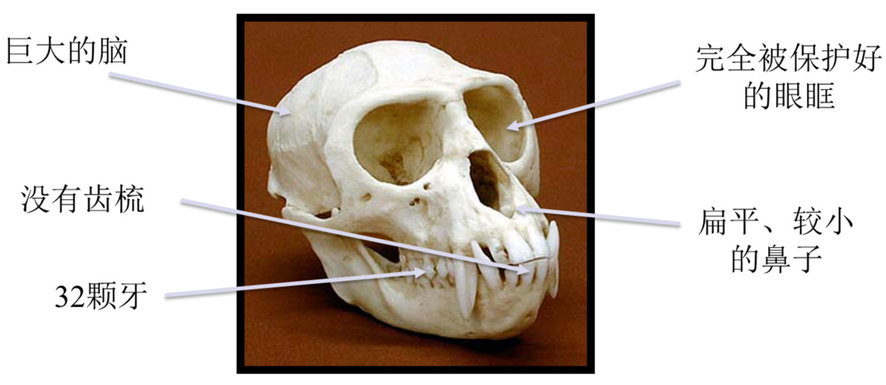

---

---

---

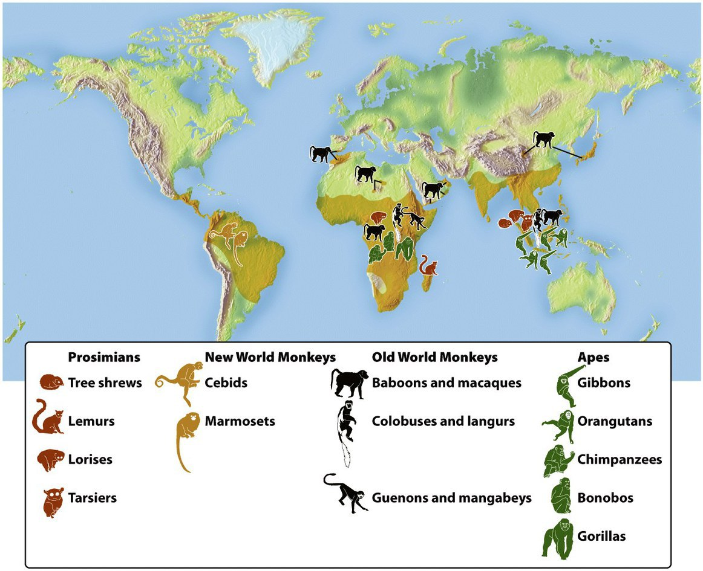

\note{
除人类以外的灵长目生活在
非洲, 马达加斯加; 
东亚, 南亚; 
南美, 墨西哥

}

---

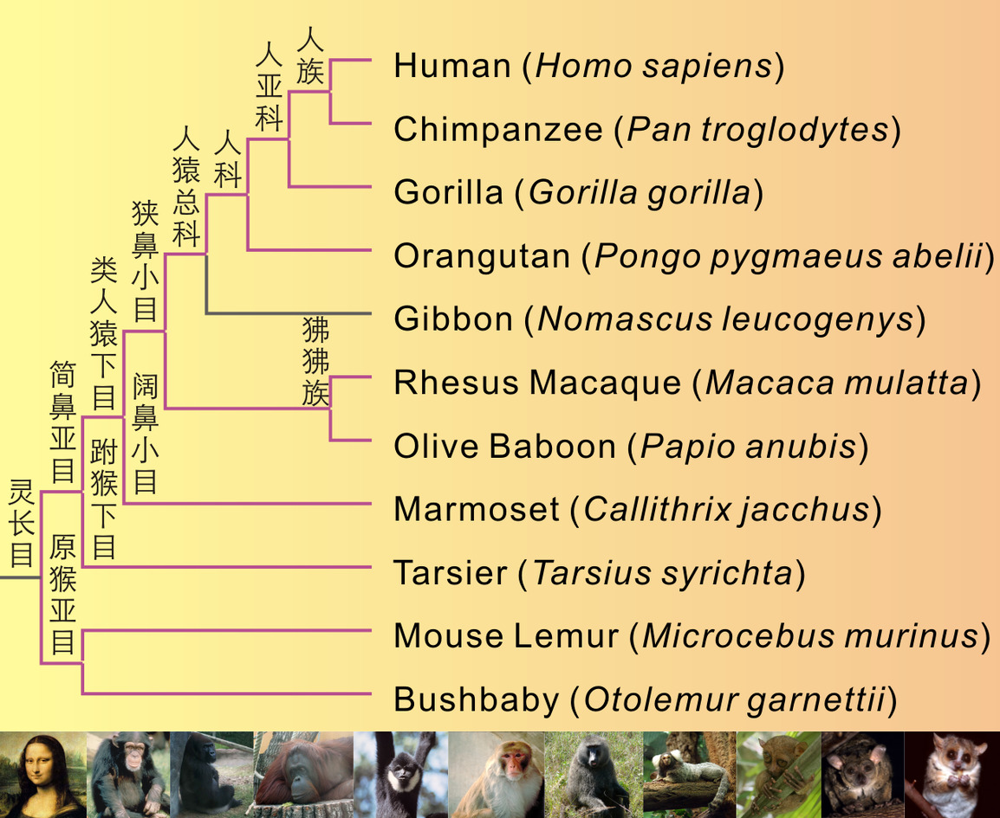

## 31.1.2  猿是我们的近亲

黑猩猩, 侏儒黑猩猩, 大猩猩和猩猩, 与人的血缘关系很近，它们生活于热带森林. 

分子生物学证据, 基因组序列. 

制造工具, 思考, 自我意识.  															   	

---

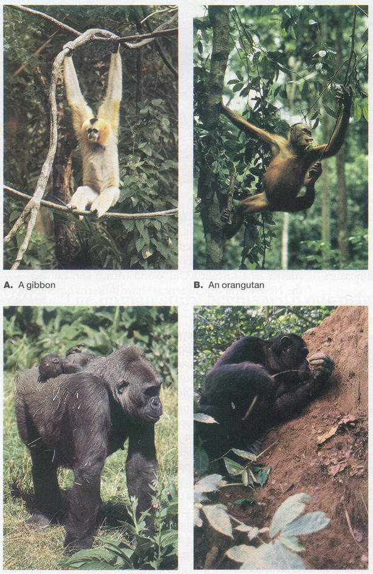

---

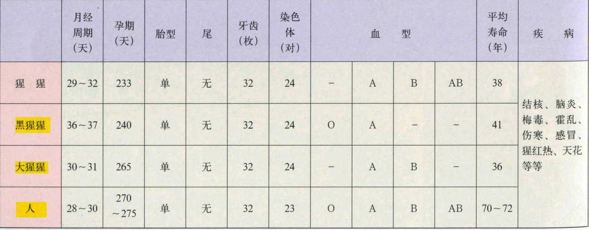

---

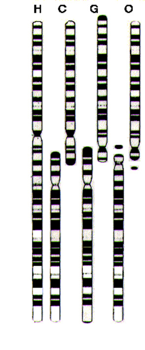

\note{
人与黑猩猩基因组序列的差异度为1.24%
}

## 镜子测试

\begin{columns}[onlytextwidth]
    \column{0.5\textwidth}
        \begin{itemize}
            \item 人类(18个月以上)
            \item 猿类
            \item 恒河猴
            \item 大象
            \item 宽吻海豚
            \item 猪
            \item 章鱼, 喜鹊?
        \end{itemize}
    \column{0.5\textwidth}
        \begin{figure}
            \includegraphics{ch-33.images/image21.jpg}
        \end{figure}
\end{columns}

\note{
通过镜子认出自己。另一只动物。
1970年，纽约州立大学教授、心理学家戈登·盖洛普。
自我意识

“我在故我思”
我们首先要有能力意识到自己，我们才会产生思维与意识，而不是相反。

新几内亚的比亚米人
}

---

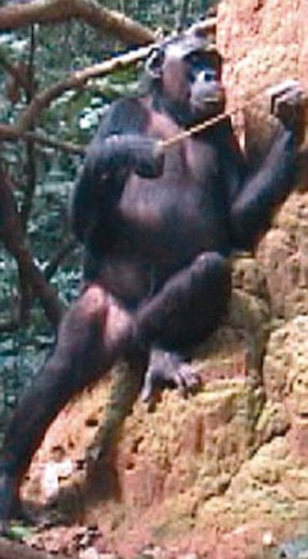

\note{
据英国《每日邮报》报道，科学家以前曾拍下过野生黑猩猩用复杂工具从地下蚁穴挖掘白蚁的情景，大猩猩会用长的小枝条捕捉这些小小的“营养美食”。但德国科学家首次发现黑猩猩会对树枝进行“技术处理”，以便使用起来更有效率。 
    在刚果热带森林中，科学家把摄影机藏在白蚁丘上，以便拍摄这些动物加工“钓杆”探 棒的过程。德国马克思·普朗克研究所的克瑞科特·桑斯博士和同事们发现，黑猩猩从竹芋科植物上折下树枝，然后撸去叶子。人类学家桑斯说：“接下来，黑猩猩 将树枝伸进嘴里，牙齿半合，轻咬这些树枝，，使树枝的表面参差不齐，像一把刷子。有时它们还抽出植物纤维，以便更好地捕捉白蚁。” 
    这根顶部像刷子的探棒比未经改造的工具可多收集10倍的白蚁，这表明黑猩猩已 具备一种改良工具的技能。《生物学快报》杂志刊登了他们的发现。研究人员说，只有个别黑猩猩掌握这种技能，并且只把它教给自己群体的其他成员。目前，没有 证据证明非洲其他地方的黑猩猩也具备这种非同寻常的技能。 
    以前的研究显示，非洲西部的黑猩猩比东部黑猩猩具有更多不同的文化传统，例如 只能在西非见到的黑猩猩会用石头和树枝击碎坚果。桑斯说：“人类文化传统的一个特点是随着时间推移而改变，有些传统则具有积累改良技巧的特点，从而使它们 的功能性得到改善。比起人来，黑猩猩具有的这种技术十分简单。然而，我们的研究显示，某些黑猩猩改良捕获白蚁探棒的这种行为将带来这样一个结果，那就是它 们使用工具的能力无疑会得到提高。这些发现将促使科学家进行更多研究，以便通过类人猿的行为研究累计工具改造的普遍程度和持续时间。”
}

---

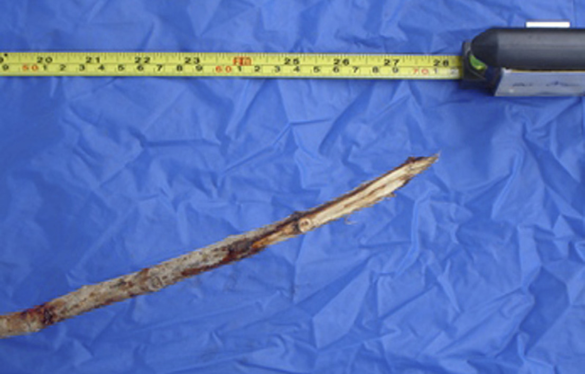

\note{
Tip of Hunting Tool Sharpened with Teeth
Tool length approximately 70 cm.

塞内加尔发现野生黑猩猩能制作象矛一样的工具捕猎其他脊椎动物
Savanna Chimpanzees, Pan troglodytes verus, Hunt with Tools 

}

---

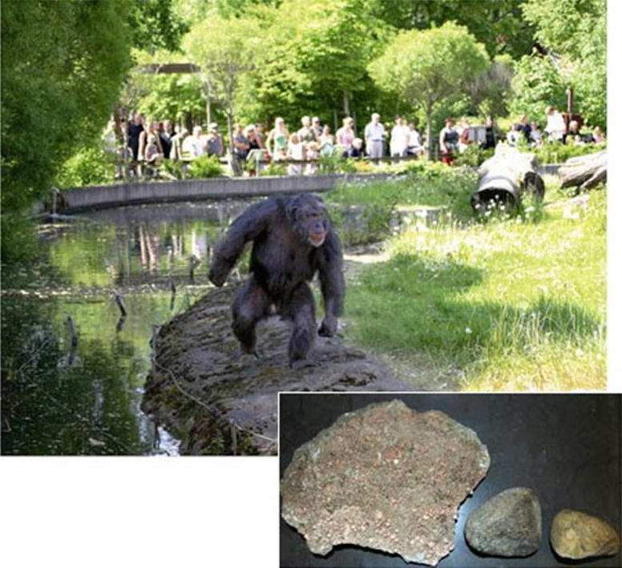

\note{
三年前，一只生活在瑞典Furuvik动物园的黑猩猩引起了广泛关注。这只名叫Santino的雄性黑猩猩会预先制定袭击游客计划，它在动物园早晨开门前收集石块，将不容易投掷的大石块摔成小块，囤积军火库，等到正午前后突然对游客发起攻击。现在，根据发表在PLoS ONE上的一篇论文，研究人员报告Santino又回来了。它现在变得更聪明，能藏起石头，面无表情的接近游客，缩短与攻击目标的距离。最新证据显示它的思考方式非常接近于人类。 
}

## 31.1.3  人与猿在解剖形状上的差别

人的解剖结构

* 适合于直立, 两足行走; 
* 手巧，成为劳动器官; 
* 脑发达; 
* 喉的位置高，有一个长而大的声道. 

---

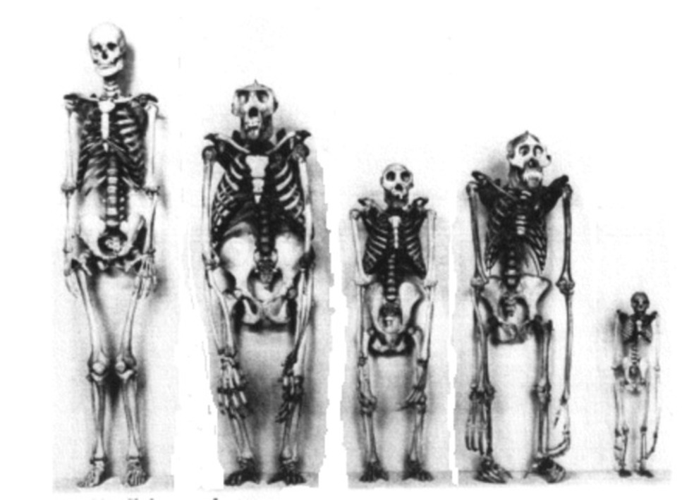

---

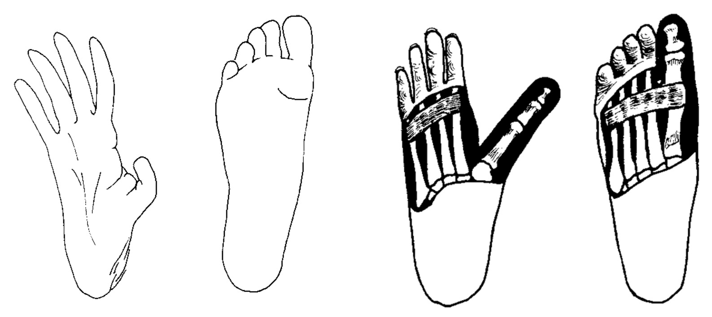

---

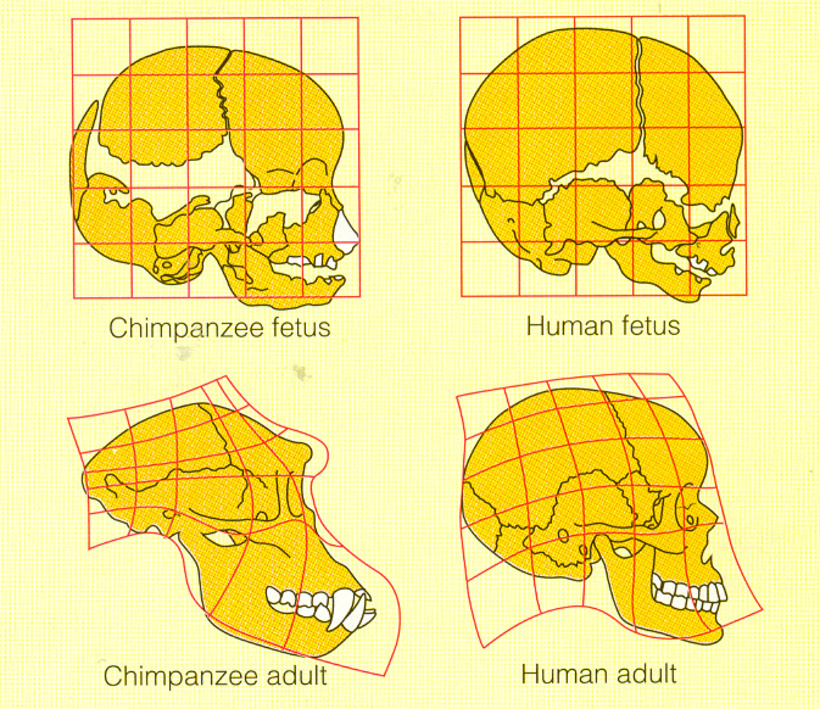

# 33.2  人类的进化过程

---

\begin{figure}
    \includegraphics{ch-33.images/image41.jpg}
    \vskip5mm
    \includegraphics{ch-33.images/image42.jpg}
\end{figure}
        
\note{
Prometheus and Athena

Prometheus shaped man out of mud, and Athena breathed life into his clay figure.

God and Adam

}

---

## 人和猿在非洲分歧的裂谷假说

* 1500万年前的非洲，从西到东覆盖一片森林居住着形形色色的灵长类；
* 1500万年前后，非洲东部的地壳开始隆起；
* 1200万年前在非洲东部形成了一条从南向北的大裂谷。
* 改变了非洲的气候，使东部丧失了森林生存的条件。
* 西部的祖先仍生活在湿润的森林，而东部的祖先则逐步演变为“类人猿”

\note{
沿红海经埃塞俄比亚，肯尼亚，坦桑尼亚等地一线裂开，

环境的力量使原非洲东部的“人”和“猿”的共同祖先分开，
}

---

\note{
板书示意裂谷形成
}

---

\begin{figure}
    \begin{minipage}[b]{.48\linewidth}
        \includegraphics{ch-33.images/image46.jpg}
    \end{minipage}
    \hfill
    \begin{minipage}[b]{.48\linewidth}
        \includegraphics{ch-33.images/image47.jpg}
    \end{minipage}
    \caption{东非大裂谷2}
\end{figure}

## 33.2.1 多分枝的人亚科

人的起源和进化有650万年历史，已发现的化石重现了这段历史. 

直线进化模式并不正确.

人类进化的四个阶段:

* 南方古猿, *Australopithecus*, 400--100万年前
* 能人, *Homo  babilis*, 200--175万年前   
* 直立人, *Homo erectus*, 160--20万年前
* 智人, *Homo sapiens*, 25万年前
* 现代人, 文明开端, 1万年前
    * 黑种人, 白种人, 黄种人, 棕种人

## 33.2.2 南方古猿阶段

直立姿态的进化在脑的扩大之前, 直立行走使上肢和手解放出来，为工具的进一步发展创造了条件. 

---

\begin{figure}
    \includegraphics{ch-33.images/lucy.png}
    \caption{南方古猿阿法种 Lucy}
\end{figure}

\note{
360--300万年前
}

---

\begin{figure}
    \includegraphics{ch-33.images/Australopithecus_africanus.png}
    \caption{南方古猿非洲种}
\end{figure}

---

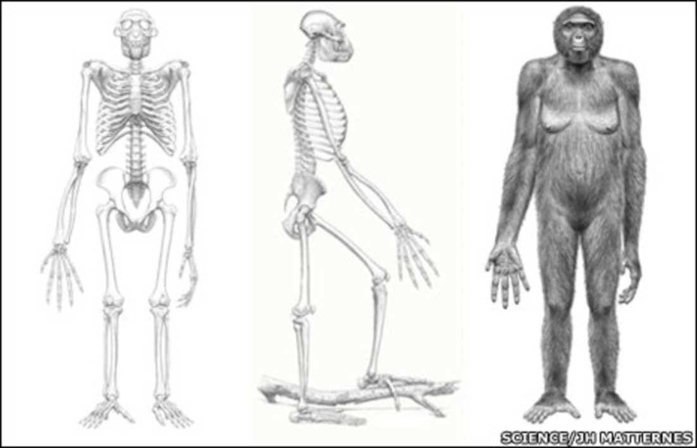

\note{
达尔文在《人类起源》中指出，人类和现代的类人猿出自共同的祖先。
在对颅骨、牙齿、盆骨、手、脚和其它骨头进行分析后，科学家们确认，Ardi所代表的物种兼有人类和猿猴的特征。
Ardi的体貌特征说明，现代猩猩身上某些看起来最古老的特点，比如可以弯曲的手指、能用指关节拄地行走的上肢，都是后来演化出 来的；
而人类手的历史，可能比我们想象的还要长。
她的大脑和黑猩猩的相同，比高尔夫球棍前端大不了多少，远远小于Lucy所属的更接近人类的南方古猿阿法 种。对Ardi牙齿的分析表明，她所属物种的门齿和犬齿都非常细小，主要吃水果、坚果和树叶，是典型的素食者。
相比之下，现代黑猩猩的尖牙利齿则显得凶悍 无比。
Ardi显示了灵长类共同祖先在进化过程中的分化：猿和猩猩在四肢和移动能力方面的疯狂进化；而原始人则更多地发展了社会性。 
}

---

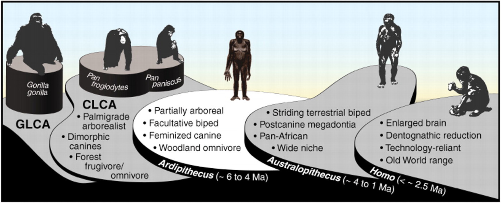

## 33.2.3 人属阶段

1. 能人(200--175万年前)

    * 脑量600ml以上，结构似人; 骨骼更接近现代人; 可能有语言; 可能能制造石器(人属特征). 

2. 直立人(200--20万年前)

	* 像爪哇人, 北京人. 脑量800--1100ml，上限与现代人脑量相衔接; 有语言; 会用火; 能制石器. 

---

---

---

---

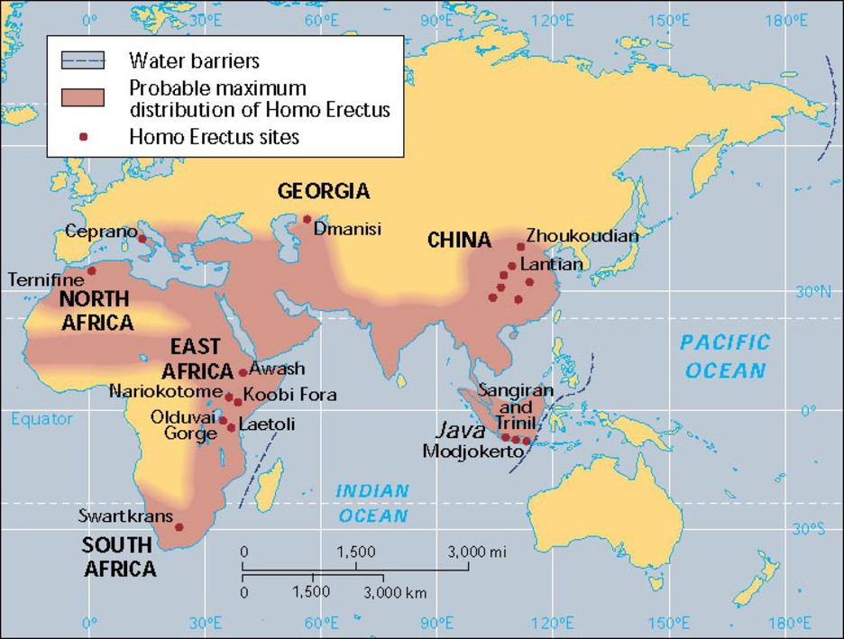

---

---

## 33.2.4 智人

3. 智人(15万年)
    * 脑量1300ml, 制造较进步的石器工具, 会使用火.

---

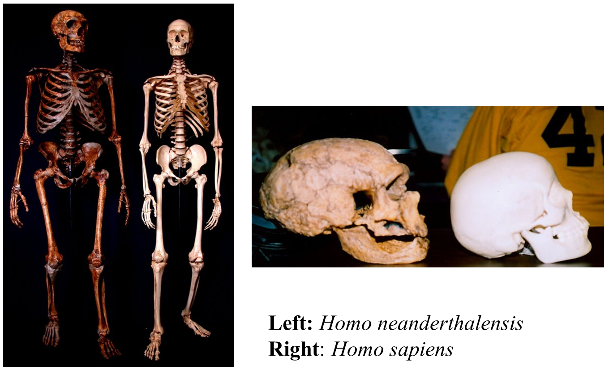

---

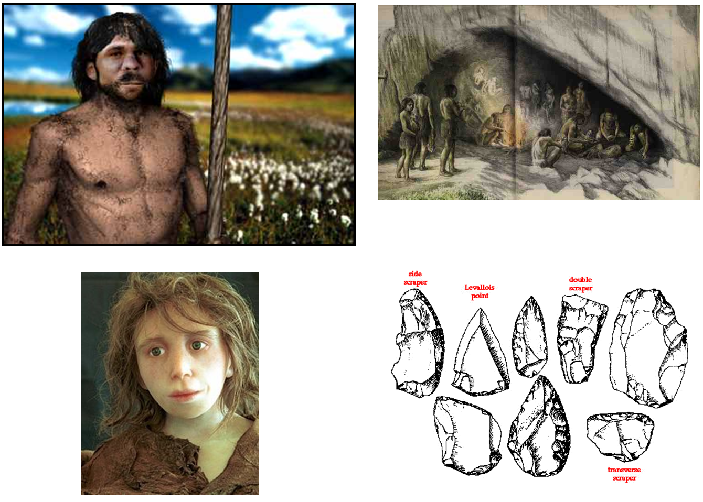

---

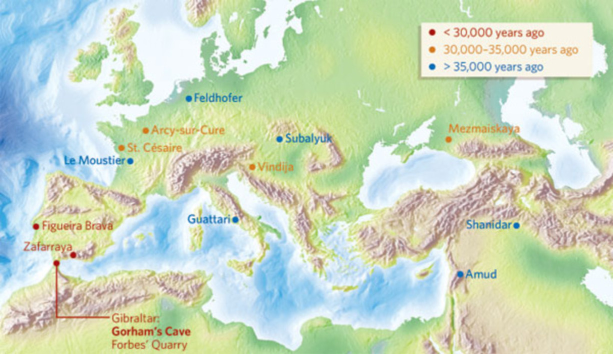

\note{
30,000 ybp
}

---

---

## 认知能力与创造力: 艺术, 宗教

* 文化是人类特有的一种适应方式
    * 哺乳动物: 皮毛抵御寒冷 $\rightarrow$ 生物性适应	  
    * 人: 衣服，取火 $\rightarrow$ 文化适应

---

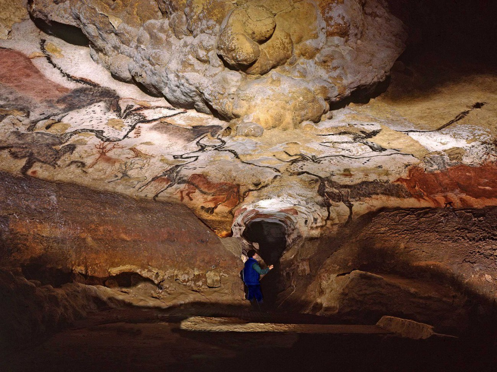

\note{
法国, 17000年前
}

---

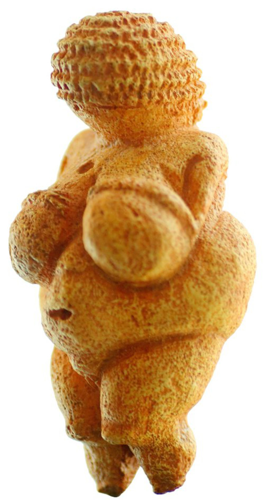

\note{
材质 	鱼卵石、石灰岩
所属年代 	公元前28000年–25000年
发掘于 	1908年于阿格斯巴赫附近被Josef Szombathy发现
现存于 	维也纳的自然史博物馆

11.1厘米
}

---

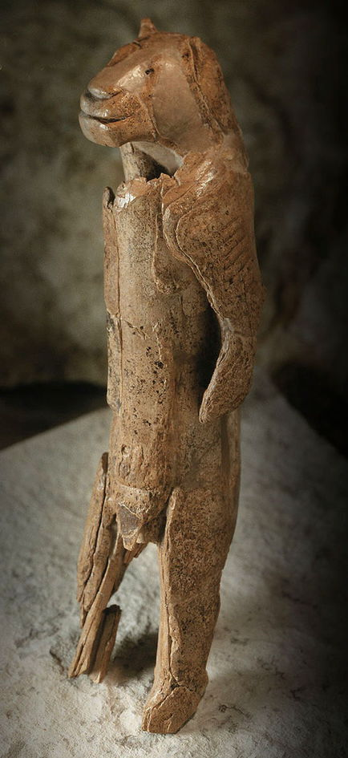

\note{
Height 30 cm, about 6 cm diameter. 

Made of mammoth ivory. 

Found in the cave of Hohlenstein-Stadel in the Valley of Lone, Baden-Wurttemberg (Germany), in 1931. Dated as Aurignacian, in a level now dated at 40 000 years old.
}

---

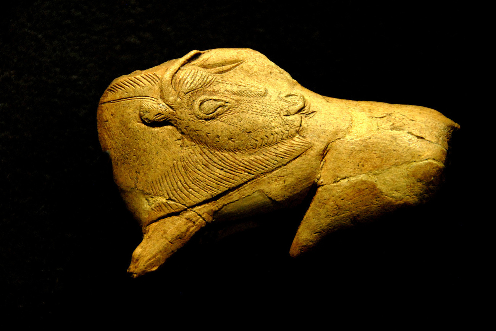

\note{
Bison Licking Insect Bite is a prehistoric carving by an unknown artist of the Upper Paleolithic, found at Abri de la Madeleine near Tursac in Dordogne, France, the type-site of the Magdalenian culture, which produced many fine small carvings in antler or bone.

Created sometime between 20,000 and 12,000 BP (15,000 BP according to the museum)

}

\note{

Modern Cognition: Cave art, abstract artifacts, religious/symbolic imagery
Archaic H. sapiens Culture
Cave paintings
Mostly animals on bare walls
Subjects were animals favored for their meat and skins
Human figures were rarely drawn due to taboos and fears that it would somehow harm others

}

## 31.2.5 现代人起源于何时何地

两种观点:

1. 多地区起源假说: 杂交, 基因交流, 保持一个种. 
2. 非洲起源假说: 迁徙各地, 线粒体DNA证据. 

---

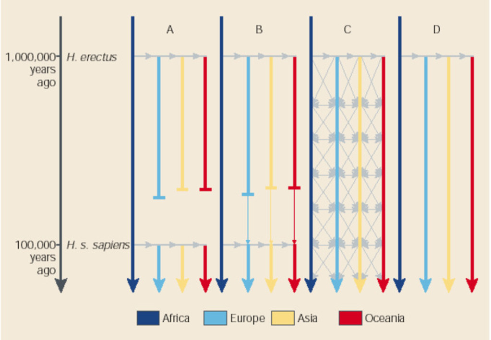

---

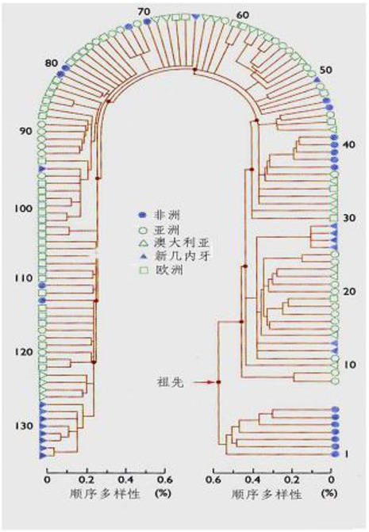

\note{
研究了许多种族的妇女，结果发现，所有女人的线粒体DNA基因图谱在某一段或一些位点上都很相似或者完全一样. 
这证明她们都有亲缘关系，很可能她们的mtDNA 出自同一女人. 

在非洲发现的线粒体世系的多态性比世界任何其他地方都丰富. 

}

---

走出非洲---亚当的证据

人类Y染色体非重组区的SNP:
     
1. 染色体非重组区在二倍体细胞中不存在同源拷贝. 
2. Y染色体非重组区不发生交换重组事件, 能忠实地记录进化事件. 
3. Y染色体SNP遗传标记构成了丰富的人群特 异性单倍型. 

---

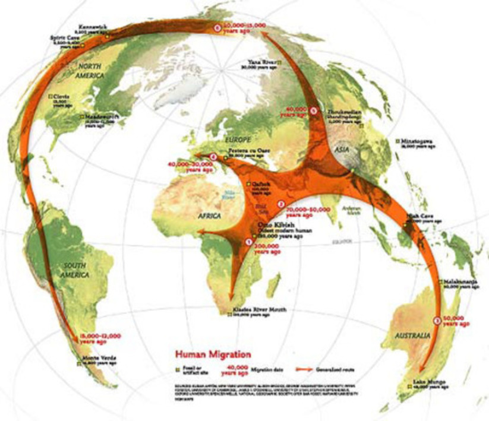

---

