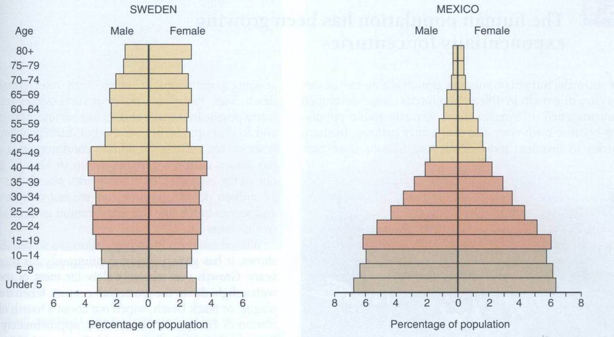
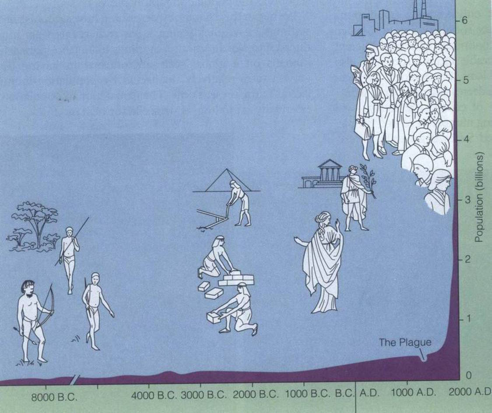

# 35.1 种群的概念和特征

## 35.1.1 种群是同一物种个体的集合体

种群
:   占有一定空间和时间的同一物种个体的集合体.

* 种群是物种存在的基本单位, 也是进化的基本单位.

* 种群是群落的基本组成.

\note{

对应"人群", 进化上用"群体"这个概念.

种群的类型(按研究对象分)
     自然种群
     实验种群
     单种种群
     混种种群

}

## 35.1.2 出生率和死亡率

种群密度是对种群进行数量描述的重要指标.

影响种群密度的重要参数:

* 出生率: 单位时间每100个体的出生个体数
* 死亡率: 单位时间每100个体的死亡个体数
    + 人类的人口控制: 降低出生率
* 迁移率: 迁入率与迁出率

\note{

单位空间内个体的数量.   密度是种群最基本的参数

影响出生率的因素:  a.性成熟速度;  b.每次产仔数;  c.每年生殖次数;  d.生殖年龄的长短.

}

## 35.1.3 年龄结构预示着种群未来的增长趋势

* 种群的年龄结构: 不同年龄个体在种群的比例关系.
    + 动物的年龄分为生殖前期, 生殖期和生殖后期
* 年龄结构与未来种群数量动态
    + 增长型: 金字塔形, 出生率大于死亡率
    + 衰退型: 壶形, 出生率小于死亡率
    + 稳定型: 钟形, 出生率与死亡率持平
* 世界人口的年龄结构:
    + 欧洲, 北美, 俄罗斯: 稳定型
    + 南亚, 非洲和南美洲: 增长型

---

---

\begin{figure}
    \begin{minipage}[b]{.48\linewidth}
        \includegraphics{ch-35.images/image2.jpg}
        \subcaption{墨西哥}
    \end{minipage}
    \hfill
    \begin{minipage}[b]{.48\linewidth}
        \begin{minipage}[b]{1\linewidth}
            \includegraphics{ch-35.images/image3.jpg}
            \subcaption{菲律宾}
        \end{minipage}\\
        \vfill
        \begin{minipage}[b]{1\linewidth}
            \includegraphics{ch-35.images/image4.jpg}
            \subcaption{印度}
        \end{minipage}
    \end{minipage}%
    \caption{人口快速增长的发展中国家}
\end{figure}

---

---

\note{

哈利法塔, 160层, 总高828米, 可容纳12K人

}

---

\note{

因历史, 政治及地理环境等原因, 香港土地开发率仅有23.7%. 用于住宅用途的土地开发面积76平方公里, 仅占土地总面积的6.8%.
对于土地开发的限制 导致市区人口密度很高, 707万人主要居住在高层住宅内. 全港共有6588座高层楼宇, 远超纽约的5818座,
成为名副其实的“摩天城市”.

香港平均房价为家庭年收入中位数的12.6倍, 居世界首位. 截止2011年, 47.7%的香港市民因无力购买私人住宅,
居住在公屋(政府廉租房)或居屋 (政府限价房)内. 其人均住房面积为12.8平方米. 九龙石硖尾公屋是香港第一个公共住宅区.
1953年12月24日, 石硖尾木屋区发生大火, 53000 人无家可归. 港府直接介入房屋供应, 在灾后原址兴建公共住宅, 安置灾民.
开启了香港公屋时代.

}

## 35.1.4 种群密度调查

种群密度
:   单位面积上(同种生物)个体数量.

* 调查方法: 取样调查法, 随机取样.
    + 动物: 标志重捕法. 应用条件:
        1. 均匀混合
        2. 不伤害动物＆不影响动物行为
        3. 无迁入, 迁出
    + 植物: 样方法, 分别调查后统计计算

## 35.1.5　种群中的个体有3种分布型

* 种群的空间结构: 种群中个体的空间分布格局.
* 分布格局:
    + 集群分布: 种群成员间有一定程度相互关系.
        - 生境差异, 生殖方式, 社会行为.
    + 均匀分布: 种群成员间相互竞争.
        - 动物领域行为; 植物自毒现象, 自疏现象
    + 随机分布: 生境均一, 种群成员间无吸引或排斥.

\note{

人类是集群分布

}

# 35.2 种群的数量动态

## 35.2.1 种群在资源无限条件下呈指数增长

基本假设: 世代重叠的生物种群, 资源无限.

微分方程(瞬时增长率):

\begin{equation*}
    \frac{dN}{dt} = rN
\end{equation*}

指数增长:

- 特点: 增长不受资源, 空间及其他因素控制, “种群爆炸”
- J型曲线

\note{

dN/dt:  种群的瞬时数量变化

b, d:   每个体的瞬时出生率, 死亡率

b-d=r:  瞬时增长率(内禀增长率:种群固有的内在增长能力)

Fold the paper.

}

---

\centering
\begin{tikzpicture}[node distance=1cm, auto,]
  %nodes
  \node[punkt] (N) {种群数量};
  \node[punkt, above=1.5cm of N] (I) {迁入};
  \node[punkt, below=1.5cm of N] (E) {迁出};
  \node[punkt, left=1.5cm of N] (B) {出生};
  \node[punkt, right=1.5cm of N] (D) {死亡};

  \path
    (N)   edge [pil, right] node[auto, align=center] {$- D$} (D)
    (N)   edge [pil, below] node[auto, align=center] {$- E$} (E)
    (B)   edge [pil, right] node[auto, align=center] {$+ B$} (N)
    (I)   edge [pil, below] node[auto, align=center] {$+ I$} (N);
\end{tikzpicture}

\vfill

$$N_1 = N_0 + B - D + I - E$$

\note{

1. N is the size of the population in individuals; N0 is the size of the starting generation, while
   N1 is the size of the next generation, which includes births, deaths, and other additions and
   subtractions.

2. B is the number of individuals added to the population by births at each generation, and D is the
   number of individuals lost from the population by death.

3. I is the number of individuals that immigrate into the population, and E is the number of
   individuals that emigrate out of the population with each generation.

}

---

\begin{columns}[onlytextwidth]

    \column{0.5\textwidth}
        \begin{align*}
            \uncover<1->{\alert<1>{N_1} &\alert<1>{= N_0 + B - D} \\}
            \uncover<2->{\alert<2>{\frac{\Delta N}{\Delta t}} &\alert<2>{= B - D} \\}
            \uncover<3->{\alert<3>{\frac{\Delta N}{\Delta t}} &\alert<3>{= bN - dN} \\}
            \uncover<4->{\alert<4>{\frac{\Delta N}{\Delta t}} &\alert<4>{= (b - d)N} \\}
            \uncover<5->{\alert<5>{\frac{\Delta N}{\Delta t}} &\alert<5>{= rN} \\}
        \end{align*}

    \column{0.5\textwidth}
        \begin{align*}
            \uncover<6->{\alert<6>{\frac{dN}{dt}} &\alert<6>{= rN} \\\\}
            \uncover<7->{\alert<7>{ N_t} &\alert<7>{= N_{0}e^{rt}} }
        \end{align*}

\end{columns}

\note{

DN is the change in population size occurring over Dt, a given time interval.

Dt may equal a generation or a fixed unit of time, such as a year.

In words, this equation states that the change in population size per unit time is equal to
the number of births occurring during that time minus the number of deaths.

Nt: t时刻的种群数量;

N0: 种群起始个体数量;

e: 自然对数的底

此即在无限自然资源(食物 空间)中作指数函数曲线生长的模型; 利用此模型可计算未来任一时刻种群个体数

http://tex.stackexchange.com/questions/36394

}

## $e$ 是什么?

$e$
:   自然对数的底

自然对数
:   以 $e$ 为底的对数

\pause{
    \begin{equation*}
        e = \lim_{n\to \infty} \left(1 + \frac{1}{n}\right)^n
    \end{equation*}
}

\pause{
    \begin{equation*}
        \frac{d}{dx}e^x = e^x
    \end{equation*}
}

\note{

放指数增长的pptx

https://www.zhihu.com/question/24066773

这样一个极限是从什么地方冒出来的?

https://www.khanacademy.org/math/differential-calculus/advanced-diff-dc/proofs-for-derivatives-of-ex-and-lnx-dc/v/proof-d-dx-e-x-e-x

e 是自然界里关于增长的常数

}

---

\begin{figure}

    \centering

    \begin{tikzpicture}
        \begin{axis}[
            grid=major,
            xmin=0,
            xmax=8,
            ymax=400,
            xlabel={Generations},
            ylabel={Population size ($N$)},
            axis x line=bottom,
            axis y line=left,
        ]
            \addplot[
                color=TolDarkBlue,
                ultra thick,
                mark=none,
                samples=100,
                domain=0:4.9,
            ]{exp(1.2 * x )} node[above,pos=1] {$e^{1.2t}$};
            \addplot[
                color=TolDarkBrown,
                ultra thick,
                mark=none,
                samples=100,
                domain=0:5.8,
            ]{exp(1.0 * x )} node[above,pos=1] {$e^{1.0 t}$};
            \addplot[
                color=TolDarkPurple,
                ultra thick,
                mark=none,
                samples=100,
                domain=0:7,
            ]{exp(0.8 * x )} node[above,pos=1] {$e^{0.8t}$};
            \addplot[
                color=TolDarkGreen,
                ultra thick,
                mark=none,
                samples=100,
                domain=0:7.2,
            ]{exp(0.6 * x )} node[above,pos=1] {$e^{0.6t}$};
            \addplot[
                color=TolDarkRed,
                ultra thick,
                mark=none,
                samples=100,
                domain=0:7.5,
            ]{exp(0.4 * x )} node[above,pos=1] {$e^{0.4t}$};
        \end{axis}
    \end{tikzpicture}

\caption{指数增长, $N_0 = 1$, $N_t = e^{\alert{r}t}$}

\end{figure}

---

\begin{exampleblock}{}
    {\large ``Compound interest is the most powerful force in the universe.''}
    \vskip5mm
    \hspace*\fill{\small--- Albert Einstein}
\end{exampleblock}

\note{

UNDETERMINED

http://www.snopes.com/quotes/einstein/interest.asp

}

## 35.2.2 资源有限条件下呈逻辑斯谛增长

基本假设: 资源有限.

环境容纳量K: 有限资源条件所能允许的种群最大值.

种群密度对种群增长率影响: 逐渐, 按比例增加(1/K)

微分方程:

\begin{equation*}
    \frac{dN}{dt} = rN(\frac{K-N}{K})
\end{equation*}

逻辑斯谛增长:

* 特点: 种群数量趋向于环境容纳量K
* 曲线: S型增长曲线

\note{

微分方程的解在

\url{https://en.wikipedia.org/wiki/Logistic_function}

$N_t = \frac{K N_{0} e^{rt}}{K + N_{0}(e^{rt} - 1)}$

}

---

\begin{figure}

    \centering

    \begin{tikzpicture}
        \begin{axis}[
            grid=major,
            xmin=0,
            xmax=16,
            ymax=400,
            xlabel={Generations},
            ylabel={Population size ($N$)},
            axis x line=bottom,
            axis y line=left,
        ] 
            \addplot[
                color=TolDarkBlue,
                ultra thick,
                mark=none,
                samples=100,
                domain=0:5.9,
            ]{exp(x)} node[above,pos=1] {$r=1$};
            \addplot[
                color=TolDarkRed,
                ultra thick,
                mark=none,
                samples=100,
                domain=0:12.8,
            ]{(300 * exp(x))/(300 + (exp(x) - 1))} node[above,pos=1] {$r=1, K=300$};
        \end{axis}
    \end{tikzpicture}

\caption{逻辑斯谛增长, $N_0 = 1$, $N_t = \frac{300e^{t}}{300+(e^{t}-1)}$}

\end{figure}

---

逻辑斯谛曲线的意义

* 农林牧渔业的应用(最大持续产量)
* 生物进化对策

## 35.2.3 人类人口不能无限增长

* 人口的增长速度越来越快
    + 人口激增的重要标志: 人口加倍需时越来越短
* 人口控制:
    + 人口问题不仅是生物学问题, 更是社会问题

---

\note{

大约六千年前, 一种细菌经历了基因变化, 它的生存环境因此从老鼠的内脏扩大到了跳蚤. 此类的基因变化一直发生着,
但这次的特别之处是它最终导致了黑死病, 在14世纪杀死了三分之一的欧洲人口. 

导致黑死病的鼠疫耶尔森菌(Yersinia pestis)是从另一种叫假结核耶尔森菌的细菌演变而来. 演变发生在中国的某个地方,
然后传播到欧洲及世界其它地方. 鼠疫耶尔森菌和假结核耶尔森菌的感染都属于人兽共患病, 能从老鼠传染到人类.
假结核耶尔森菌通过排泄物传染, 感染比较轻微; 而鼠疫耶尔森菌是通过携带细菌的跳蚤叮咬传染, 感染更致命也更迅速.

研究人员发现, 从假结核耶尔森菌到鼠疫耶尔森菌的转变过程中, 经历了基因的增减, 最终的结果是净损失, 失去三个基因增加一个基因.
失去的三个基因增加了鼠疫耶尔森菌传播到新宿主的机会.

}

---

\begin{figure}
    \includegraphics{ch-35.images/image21.jpg}
    \caption{神秘物品\footnotemark}
\end{figure}

\footnotetext{\visible<2->{\fullcite{Lu2005}}}

\note{

Noodles dating to 4,000 years ago, shown here on top of an in-filled sediment cone and revealed
after the inverted earthenware bowl containing them was removed.

Scale bar, 1 cm

}

---

\note{

马尔萨斯人口论

人口学原理的基本思想是:

如没有限制, 人口是呈等比级数(即: 2, 4, 8, 16, 32, 64, 128等)增长.

而食物供应呈现等差级数(即: 1, 2, 3, 4, 5, 6, 7等)增长.

食物为人类生存的最重要之条件.

只有自然原因(事故和衰老), 灾难(战争, 瘟疫, 及各类饥荒), 道德限制和罪恶(马尔萨斯所指包括杀婴, 谋杀,
节育和同性恋)能够限制人口的过度增长.

马尔萨斯注意到许多人误用他的理论, 痛苦地阐明他没有仅仅预测未来的大灾难. 他辩解道, “……周期性灾难
持续存在的原因自人类有史以来就已经存在, 目前仍然存在, 并且将来会继续存在, 除非我们的大自然的物理 结构发生决定性的变化.
”因此, 马尔萨斯认为他的《人口论》是对人类过去和目前状况的解释, 以及对我们未来的预测.

人口论的论点为粮食增加仅会呈等差级数, 而人口的增加却会呈现等比级数. 所以他觉得人类必须顾虑食物的缺乏, 而减少结婚的预防限制,
以及受现实穷困的折磨, 对已生人口所加压迫积极限制.

}

---

\note{
合成氨的工业化生产

哈伯担任化学兵工厂厂长

}

---

\note{
开创了粮食高产的技术

}

---

## 35.2.4 两种生活史对策

生活史对策: 生物在生存斗争中获得了生存的对策, 这些对策通过生物在进化过程中形成了特有的生活史.

r对策: 以``量''取胜.

* 死亡因素: 环境变化导致(大量)死亡.
* 特点: 个体小, 寿命短, 生殖力强存活率低, 亲代对子代缺乏保护, 易迁移散布.
* 种类: 无脊椎动物, 昆虫, 小型哺乳动物＆鸟类, 一年生植物(群落演替早期).

---

K对策: 以``质''取胜.

* 特点: 个体大, 寿命长, 生殖力弱存活率高, 亲代对子代有很好保护, 迁移散布能力弱.
* 死亡因素: 密度制约因素.
* 种类: 大型鸟兽及林木, 较大的昆虫, 群落演替的晚期阶段.

---

\begin{figure}
    \begin{minipage}[b]{.48\linewidth}
        \includegraphics{ch-35.images/image27.jpg}
        \subcaption{r-选择者}
    \end{minipage}
    \hfill
    \begin{minipage}[b]{.48\linewidth}
        \includegraphics{ch-35.images/image26.jpg}
        \subcaption{K-选择者}
    \end{minipage}%
    \caption{两种生活史对策}
\end{figure}

---

## 两种生活史对策的比较

不同自然选择压力下形成的不同对策:

* r对策: 选择高增长率的基因型, 利于种群繁殖
* K对策: 选择更好适应环境的基因型, 利用环境

* K对策: 稳定平衡点S,灭绝点X(濒危物种)
* r对策: 一个稳定平衡点S, 无灭绝点(害虫)

## 35.2.5 种群的数量波动

* 种群数量波动的原因: 环境条件发生变化.
* 不规则波动
    + 例: 东亚飞蝗(干旱)
* 周期波动: 任两个波峰之间间隔的时间相.
    + 例: 猞猁＆雪兔

\note{

几乎所有的蝉都会先作为幼虫在地下成长几年, 从地下钻出来后进入短暂的成年阶段, 它们的成年阶段通常只有几周到几个月.
然而北美洲周期蝉(Magicicada)与其它蝉不相同的是, 它们先在地下蛰伏十三或十七年, 然后所有成员在同一年破土而出.

这种以素数为周期的时间选择令人觉得很神奇, 它们的生命周期也不可思议的长. 其它种类的蝉都没有周期蝉那样同时爬到地面的现象.

日本静冈大学的科学家Jin Yoshimura及其同事建立了一个蝉生命周期的数学模型, 根据两个因素审视了周期蝉种群增长率,
即有多少幼年的蝉生活到了成年, 以及成年蝉出现间隔的年数. 结果发现了Allee效应 --- 一个用于预测把大数量的生物
与高生存率联系在一起的进化的一般模型 --- 可以用于估计这些典型的素数周期.

结果显示, 在种群小的时候, 自然选择偏爱非重叠繁 殖群的进化; 同时出现的繁殖群最终让双方种群都灭绝了.
在13和17年的生命周期中, 两个邻近的蝉繁殖群大约每221年同时出现一次, 这在很大程度上防止 了种群崩溃.

由于蝉依靠它们的庞大数量躲避捕食者, 小的蝉种群将导致死亡率增加. 研究人员提出,
Allee效应可以为周期蝉以间隔素数年的方式出现提供一 个在生态学和进化上可信的解释.

当全部同时出来的时候, 他的天敌是无法把他们全部吃完的, 所以剩下的就生存下来了. 而他们的天敌发现今年食物比较丰富,
大量生育的时候, 下一年没有这么多蝉了.

}

# 35.3 种群的数量调节

## 35.3.1 密度制约因子和非密度制约因子

* 密度制约因素: 对种群大小很敏感, 当种群增加时, 该机制更有效.
    + 传染病等生物因子.
* 非密度制约因素: 起作用时与种群大小 无关, 对拥挤种群和数量稀少种群都有相似的效应.
    + 气候等非生物因子.

* 密度制约因子的反馈调节: 生物种群的相对稳定和有规则的波动和密度制约因素的作用有关(食物, 生殖力, 抑制物, 疾病和寄生物等).
* 非密度制约因子的作用: 生物种群的不规则的波动和非密度制约因素的作用有关. 蝗灾.

## 35.3.2 种群数量周期波动现象

种群数量周期波动是自然环境中的某些因素或种群自身的一些因素引起.

有关理论:

* 食物不足, 捕食作用
* 营养恢复学说
* 多物种系统的种群周期波动调节机制
